# 计算机网络

## 一、基础

### 1.1 TCP/IP 网络模型

通用网络协议

#### 1.1.1应用层

作用：应用软件实现。应用层专注与软件的应用功能，如：HTTP、FTP、Telnet、DNS、SMTP等。而不需要关心数据是如何传递的。

特点：应用层通常工作在操作系统的**用户态**，传输层及以下通常工作在**内核态**。

#### 1.1.2 传输层

作用：传输控制，为应用层提供网络支持，实现不同设备应用间通信。

传输协议：TCP、UDP。

特点：

1. 数据分块。当传输层传输的数据非常大时，直接传输不好控制，当传输层的数据包大小超过MSS时，需要将数据包分块。
2. 端口。接收方可能会有许多应用需要接受数据，因此需要编号将应用区分开，这个编号就是端口。传输层的报文中会携带端口号，接收方可以根据报文识别接收应用。

#### 1.1.3 网络层

作用：实现不同类型设备间传输，应对实际场景的网络环境。

传输协议：IP协议

特点：

1. 数据分片。当网络层传输的报文加上IP报头组装成IP报文大小超过MTU（以太网中为1500字节）时，路由器会对报文再次进行分片。
2. IP地址。使用IP地址给设备编号，通过子网掩码，路由器会根据目标IP地址的网络前缀决定数据报的下一跳路由器。


#### 1.1.4 网络接口层

作用：实现以太网通信，提供链路级别服务，在以太网、WiFi这样的底层网络上发送原始数据包，工作在网络接口这个层次，使用网络接口标识网络上的设备。

以太网：在局域网内，把附近的设备连接起来，使它们之间可以进行通讯的技术。在判断包的目的地的时候，必须匹配才能发往目的地。

协议：ARP协议

特点：

1. MAC地址。在进行通信时，使用ARP协议获取对方MAC地址，从而发送数据包

#### 1.1.5 总结

TCP/IP网络分成：应用层、传输层、网络层、网络接口层。


每层封装格式：

应用层：应用数据 ==》报文（message）

传输层：TCP头+应用数据 ==》段（segment）

网络层：IP头+TCP头+应用数据 ==》包（packet）

网络接口层：帧头+IP头+TCP头+应用数据+帧尾 ==》帧（frame）

所有数据单位可以统称为数据包。

### 1.2 从输入网址到网页显示

我的理解是：

1. **地名（网址）**：就像你想去一个城市或地标，但你需要具体的地址才能真正到达那里。
2. **地图（DNS）**：你查看地图或询问人来得知地名对应的具体地址。在网络中，这个“地址”就是IP地址。
3. **地球（根服务器）**：作为地图的基础，这是开始你的查询的地方，然后逐步缩小范围。
4. **国家-省份-市-区-门牌号**：这是DNS解析过程的层次，从最高级的域到最具体的地址。
5. **判断出发点（路由表）**：你的位置可能有多个出口或道路可选，你会选择一个最佳路径前往目的地。
6. **选择近的地点出发（子网选择）**：这类似于你决定从哪个门或窗出去，或者决定走哪条近的街道或小路，因为它们直接通向你的目的地。
7. **返回的过程**：就像你从目的地返回，你会沿着相同或不同的路径回到出发点。

#### 1.2.1 解析URL

URL组成：以http://xiaolincoding.com/network/1_base/what_happen_url.html#孤单小弟-http为例：

这里包含了：

* 协议部分：http://表示使用HTTP协议来访问该网页
* 域名部分：xiaolincoding.com表示该网页的域名或主机名。表示该网页托管在xiaolincoding.com域名下。
* 路径部分：/network/1_base/what_happen_url.html表示网页的具体位置。其中/表示服务器根目录，这个路径表明网页位于服务器的/network/1_base/目录下，并且文件名为what_happen_url。
* 片段标识符：#孤单小弟-http是URL中的片段标识符，用于指定特定的锚点或目标位置。指示网页的特定段落。

#### 1.2.2 生成发送给Web服务器的请求

解析完URL后，利用这些信息生成HTTP请求。如图：


#### 1.2.3 真实地址查询-DNS

域名层级关系：

* 根DNS服务器（.）
* 顶级域DNS服务器（.com）
* 权威DNS服务器（server.com）

其中根DNS服务器的信息保存在互联网所有DNS服务器中。

域名查询顺序：

1. 查询浏览器缓存
2. 查询操作系统缓存
3. 查询hosts文件
4. 查询本地DNS服务器
   1. 查询根域
   2. 查询顶级域名
   3. 查询权威DNS服务器

#### 1.2.4 协议栈

浏览器（应用程序）调用Socket库，委托协议栈工作，即：

TCP/UDP ==> IP（包括ICMP和ARP） ==> 网卡驱动程序 ==>硬件

如图：


#### 1.2.5 TCP

**头部格式**：


头部包括以下部分：

- 源端口号：

  - 标识发送数据的源应用程序或进程的端口号：其中0-1023通常保留给一些总所周知的协议与服务，而较高的端口号通常由**动态**或**临时分配**给客户端应用程序。
  - 连接识别：用于在TCP连接中进行识别。每个TCP连接由源IP地址、源端口号、目标IP地址和目标端口号四元组唯一标识，从而保证每个连接都是唯一的。

- 目标端口号：类似源端口号，标识接受数据的端口

- 序号：解决包**乱序**的问题

- 确认号：确认对方是否收到。如果没有收到就应该重发，解决**丢包**问题。

- 状态位：

  - SYN：发起连接
  - ACK：回复
  - RST：重新连接
  - FIN：结束连接

  TCP面向连接，双方需要维护连接的状态，带状态包的发送可以改变状态。

- 窗口大小：通信双方都需要声明一个窗口大小（缓存大小），表明自己的处理能力，避免发送速度太快（撑死）或者太慢（饿死），从而实现流量控制与拥塞控制。

TCP进行数据传输之前，还需要进行**三次握手**建立连接，如图：


* 服务器监听某个特定端口，处于LISTEN状态。
* 客户端主动发起连接SYN，之后处于SYN-SENT状态。
* 服务端收到发起的连接，返回SYN，并且ACK确认客户端的SYN，之后处于SYN-RCVD状态。
* 客户端收到SYN和ACK之后，发送对SYN确认的ACK，之后处于ESTABLISHED状态。
* 服务端收到ACK的ACK后，处于ESTABLISHED状态。

三次握手的目的就是**确认双方都有一发一收能力**。当某方确认后，就会处于ESTABLISHED状态。

**TCP的连接状态**

可以在Linux通过netstat -napt查看，如图：


**TCP分割数据**

如果HTTP请求消息比较长，超过了MSS的长度，这时TCP就需要把HTTP的数据拆解成一块块的数据发送。


* MTU：**一个网络包的最大长度**，以太网中一般为1500字节。
* MSS：**除去IP和TCP头部**后，一个网络包所能容纳的TCP数据的最大长度。

数据会被以MSS的长度为单位进行拆分，拆分出来的每一块数据都会被放进单独的网络包中。也就是在每个被拆分的数据加上TCP头部信息。然后交给IP模块来发送数据。如图：


TCP不会关注HTTP消息是什么，只会决定传输层需要关注的部分，IP同理。但是**TCP会关注下层**，即IP的MTU以及IP头部大小来决定MSS大小。在建立TCP连接时，客户端和服务器会在TCP握手时交换MSS值。这样双方就知道对方可以接受的最大TCP数据包大小。在后续的数据传输中，TCP会将应用层的数据分割成适当大小的TCP数据包，确保它们不会超过MSS值，从而**避免分片或数据包过大**的问题。

**TCP报文生成**

TCP协议的端口：

* 浏览器监听的端口（随机生成）
* Web服务器监听的端口（HTTP默认端口号80，HTTPS默认443）

在双方建立连接后，将数据部分存入分割后的HTTP数据组成TCP报文，然后交给网络层处理。如图：


#### 1.2.6 IP

**IP头部格式**：


在IP头部里包括：

* 源IP地址：客户端输出的IP地址
* 目标地址：即通过DNS域名解析得到的Web服务器的IP
* 协议号：06，表示协议为TCP。

**IP头部的源地址如何选择**：

假设客户端有多个网卡，就会有多个IP地址 ，那么IP头部的源地址应该选择哪个IP？有如下规则：

1. **子网匹配**：如果目标IP与某个接口在同一子网中，那么该接口的IP通常被选择为源IP。
2. **路由表**：当数据需要被路由到其他网络时，主机/设备会查看其路由表以决定出口接口。路由表中可能还会有为特定目标配置的源IP。
3. **操作系统策略**：操作系统可能有默认的策略或算法，例如，它们可能基于接口的度量值（metric）、速度或其他因素来选择源IP。
4. **应用程序指定**：某些应用程序可能会明确指定从哪个IP地址发送数据。
5. **绑定的地址**：服务端应用程序，如Web服务器或数据库，可能会绑定到特定的IP地址。这样，它只会从该特定地址接受和发送数据。
6. **源地址选择算法（RFC 6724）**：这是一个特别为IPv6定义的算法，但也可以应用于IPv4。该算法定义了一个来源和目的地址选择的机制，考虑到多种因素，如前缀的长度、地址的范围、策略表等。
7. **隐私和临时地址**：对于IPv6，有临时地址（隐私扩展）的概念，这意味着源地址可能会定期更改以保护用户的隐私。
8. **连接持久性**：某些协议或应用需要“粘性”连接，即始终从同一个源IP与特定的目标通信，即使其他因素（如路由变化）可能推荐使用不同的源IP。
9. **默认地址选择**：如果没有其他规则或策略明确指示，设备可能会使用其主IP地址（例如，第一个配置的或操作系统默认的接口上的地址）作为源IP。
10. **故障切换**：如果一个接口变得不可用，设备可能会选择另一个接口的IP地址作为源地址。

最简单情况下的路由表就是一个子网选择的过程。

**IP报文的生成**：


完整IP报文如上。

#### 1.2.7 MAC

如果网络包需要在两点之间传递，则需要加上发送与接收两方的MAC地址。MAC头部如图：


* 发送方MAC包头：直接从网卡里读取
* 接收方包头：通过ARP协议获取接收方MAC地址。

在TCP/IP通信里，MAC包头的协议类型只使用：

* IP协议：0800
* ARP协议：0806

ARP协议获取目的MAC地址过程如下：

1. **确定下一跳的IP地址**：当主机需要与另一个主机通信时，首先需要查找路由表，以确定数据包的下一跳。如果目标主机与源主机在同一局域网内，那么下一跳就是目标主机。如果不是，则通常下一跳是一个网关或路由器。
2. **查询ARP缓存**：在发送数据之前，主机会首先检查其ARP缓存表，看是否已知下一跳IP地址对应的MAC地址。如果已知，那么可以直接用这个MAC地址，跳过ARP请求步骤。
3. **发送ARP请求广播**：如果ARP缓存中没有相关条目，那么主机会在局域网内发送一个ARP请求广播，询问谁拥有这个IP地址，同时希望其能回复其MAC地址。
4. **接收ARP响应并更新缓存**：拥有所请求IP地址的主机会回复一个ARP响应，其中包含其MAC地址。源主机接收到此响应后，会更新其ARP缓存表，将新的IP到MAC地址映射保存起来，以供将来使用。
5. **发送数据包**：有了目标的MAC地址，源主机可以构造Ethernet帧，并将数据包发送到正确的目的地。

MAC报文生成：


#### 1.2.8 网卡

网络包只是一串二进制数字信息，需要将数字信息转换为电信号才能在网线上传输。

执行这一过程的是网卡，可以使用网卡驱动程序控制网卡，发送过程如下：

1. 网卡获取网络包并将其复制到网卡的缓冲区中。
2. 在开头加上报头和起始帧分界符，在末尾加上用于检测错误的帧校验序列。
3. 将包转换为电信号，通过网线发送出去。

如图：


#### 1.2.9 交换机

交换机的主要功能为基于MAC地址进行帧转发。具体过程如下：

1. **信号接收**：电信号到达网线接口，交换机中的模块对其进行接收。
2. **信号解析**：交换机里的模块将电信号解析为数字帧（注意：在以太网中，信号本身已经是数字化的）。
3. **错误校验**：通过FCS校验错误。
4. **基于MAC地址转发**：检查交换机MAC地址表，若目的MAC地址存在，则发送到相应端口，否则广播该包并更新MAC地址表。

交换机的MAC地址表如下：


两个广播地址：

* MAC地址中的FF:FF:FF:FF:FF:FF
* IP地址中的255.255.255.255

#### 1.2.10 路由器

路由器和交换机的区别：

* 路由器：基于IP设计，三层网络设备，路由器的各个端口都具有MAC地址和IP地址；
* 交换机：基于以太网设计，二层网络设备，交换机的端口不具有MAC地址。

路由器原理：

* MAC地址：路由器端口具有MAC地址，可以成为以太网的收发方。
* IP地址：进行包的转发，网络地址转换NAT、访问控制。

路由器包接收操作：

* 以太网电信号到达网线接口部分，路由器模块将其转换为数字信号，然后通过FCS进行错误校验。
* 基于MAC地址检查是否是发给自己的包，如果不是，则丢弃，如果是，则放到缓冲区中。

查询路由表确定输出端口：

* 更改MAC头部，根据MAC头部后方的IP头部内容进行包的转发。
* 根据路由表选择转发目标，这里与之前的路由转发一样。

路由器包发送操作：

* **查看目的IP**：首先，路由器从数据包的IP头部获取目的IP地址。
* **查询路由表**：路由器查询其路由表，找到与目的IP最匹配的条目。路由表中的条目可能是精确匹配、子网匹配或默认路由。
* **决定下一跳**：基于路由表的查询结果，路由器决定数据包的下一跳。这可以是直接连接的设备（如在同一局域网中的目标主机）或另一个路由器（网关）。
* 根据ARP协议找到目标IP的MAC地址，包会通过交换机到达指定IP。
* **更新MAC帧**。
* **可能会有NAT操作**，即更改源端口号/源IP
* 发送数据包并**更新接口计数器**。

通过层层转发，包最终到达目的地。在这个过程中，源IP与目的IP一直没有变。

#### 1.2.11 总结

总体过程如图：


1. 抵达服务器，检查MAC头部，若符合，则收下。
2. 检查IP头部，发现IP地址符合，根据IP头中的协议项，发现上层是TCP。
3. 检查TCP头部，查看序列号与其他状态位等，若序列号是需要的，则放回缓存并放回ACK，否则丢弃该包。
4. 服务器操作系统发现HTTP进程在监听这个端口，于是将包发给HTTP进程。
5. HTTP进程分析请求后发现客户端需要访问某页面，于是将该网页封装到HTTP相应报文中并发送给客户端。
6. 经过层层包装与层层转发，客户端收到该HTTP相应报文，交给浏览器渲染，网页显示出来了。
7. 最后，客户端结束连接，向服务器发起TCP四次挥手，连接断开。

注意，在路由器转发的时候，路由器只关心IP地址。

### 1.3 Linux中的过程

#### 1.3.1 网络模型

OSI七层模型：

* 应用层：负责给应用程序统一的接口
* 表示层：负责把数据转换成兼容另一个系统能识别的格式
* 会话层：负责建立、管理和终止表示层之间的通信会话
* 传输层：负责端到端的数据传输
* 网络层：负责数据的路由、转发、分片
* 数据链路层：负责数据的封帧和差错检测，以及MAC寻址
* 物理层：负责在物理网络中传输数据帧

TCP/IP网络模型：

* 应用层：负责向用户提供一组应用程序，如HTTP、DNS、FTP等
* 传输层：负责端到端的通信，比如TCP、UDP等
* 网络层：负责网络包的封装、分片、路由、转发，比如IP、ICMP等
* 网络接口层：负责网络包在物理网络中的传输，比如网络包的封帧、MAC寻址、差错检测，以及通过网卡传输网络帧等

两者对应关系示意图：


#### 1.3.2 Linux网络协议栈

网络包封装格式：


数据链路层并不能传输任意大小的数据包，以太网的这一限制被称为MTU，通常为1500字节。

MTU越大，同等数据量下需要的分包越少，从而提高网络吞吐能力，过大的MTU也可能导致更多的分片，因为其他网络可能MTU更小。

Linux协议栈图示：


其中：

* 应用程序通过系统调用跟Socket层进行数据交互
* Socket层下面就是传输层、网络层和网络接口层
* 最下层为网卡驱动程序和硬件网卡设备

#### 1.3.3 接收网络包的流程

1. 网卡收到网络包，并使用DMA技术将其写入到指定的内存地址，即Ring Buffer（环形缓冲区），触发硬件中断。
2. （Linux 2.6 NAPI机制）CPU收到硬件中断，根据中断表调用中断处理函数，有以下步骤。
   1. 屏蔽中断
   2. 发起软中断，恢复刚才屏蔽的中断
3. ksoftirqd内核线程（软中断处理线程）收到软中断后开始轮询处理数据：从Ring Buffer中获取一个数据帧，用sk_buff结构表示，从而作为一个网络包交给网络协议栈进行逐层处理。
4. 进入网络接口层，检查报文合法性，若不合法则丢弃，然后找出上层协议类型，去掉帧头帧尾，交给网络层。
5. 进入网络层，判断网络包的走向，决定要转发还是交给上层。若确定要交给上层，则查看上一层的协议，接着去掉IP头部，交给传输层。
6. 进入传输层，去除头部，根据四元组[源IP、源端口，目的IP、目的端口]，找到对应Socket，并把数据放到Socket的接收缓冲区。
7. 应用程序调用Socket接口，将内核Socket接收缓冲区数据拷贝到应用层的缓冲区，唤醒用户进程。

自此，一个网络包发送完毕，如图：


这个过程的逆过程就是发送的流程。

#### 1.3.4 发送网络包的流程

1. 应用程序调用Socket发送数据包的接口（系统调用），内核申请一个内核态的sk_buff，将用户待发送的数据拷贝到sk_buff内存，并将其加入到发送缓冲区。
2. 网络协议栈从Socket发送缓冲区取出sk_buff，并按照TCP/IP协议从上到下逐层处理。
3. 若使用TCP协议，则会拷贝一个新的sk_buff副本，填充TCP头部。并将其交给网络层，当收到接收端的ACK之后，传输层才会将sk_buff内存释放（TCP可靠传输，支持丢失重传）。
4. 网络层选取路由、填充IP头部、netfilter过滤对超过MTU大小的数据包进行分片，然后将数据包交给网络接口层处理。
5. 网络接口层通过ARP协议获取下一跳的MAC地址，对sk_buff填充帧头和帧尾，接着将sk_buff放到网卡的发送队列中。
6. 上面工作完成后，触发软中断，然后网卡驱动程序从发送队列中读取sk_buff，将其挂到RingBuffer中，然后将sk_buff数据映射到网卡可访问的内存DMA区域，最后将其发送出去。
7. 数据发送完后，网卡触发硬中断释放内存，释放sk_buff内存和清理RingBuffer内存。

在整个发送过程中，涉及了三次内存拷贝操作：

1. 系统调用Socket时，内核申请内核态sk_buff内存，将用户待发送的数据拷贝到sk_buff中。
2. TCP可靠传输会拷贝一个sk_buff副本
3. 当IP层发现sk_buff大于MTU时，申请额外sk_buff，并将原来的sk_buff分为多个小的sk_buff。

在协议栈各层需要对数据包添加包头，为了在层级之间不发生拷贝，只用sk_buff一个结构体来描述所有的网络包，添加包的方式为调整sk_buff中的指针，如图所示：


## 二、HTTP

### 2.1 HTTP是什么

HTTP是超文本传输协议，即HyperText Transfer Protocol


1. 是一种协议
2. 两点传输，可能是服务器到服务器。
3. 传输内容为超文本

所以：**HTTP是在计算机世界里专门在两点之间传输文字、图片、音频、视频等超文本数据的约定和规范。**

### 2.2 HTTP状态码有哪些

如图：


* **1xx**状态码为提示信息

* **2xx**状态码为服务器成功处理客户端的请求

  * **200 OK**：最常见的状态码，表示一切正常。如果非HEAD请求，通常会有body数据
  * **204 No Content**：常见的状态码，与200 OK基本相同，但响应头没有body数据。
  * **206 Partial Content**：应用于HTTP分块下载或断点续传，表示相应返回的body数据并不是资源的全部，而是其中的一部分，也是服务器处理成功的状态。

* **3xx**表示客户请求的资源发生了变动，需要客户端使用新的URL重新发送请求获取资源，即重定向。

  * **301 Moved Permanently**：永久重定向，表示资源不存在了，需要使用新的URL再次访问。
  * **302 Found**：临时重定向，表示请求的资源还在，但暂时需要用另一个URL来访问。

  301和302都会在响应头里使用字段Location，指明后续需要跳转的URL，浏览器会自动重定向新的URL。

  * **304 Not Modified**：不具有跳转的含义，表示资源未修改，重定向已存在的缓冲文件，也称缓存重定向，告诉客户端可以继续使用缓存资源，用于缓存控制。

* **4xx**类状态码表示客户端发送的报文有误，服务器无法处理

  * **400 Bad Request**：表示客户端请求的报文有错误，但只是个笼统的错误。
  * **403 Forbidden**：表示服务器禁止访问资源，并不是客户端的请求出错
  * **404 Not Found**：表示请求的资源在服务器上不存在或者未找到，无法提供给客户端。

* **5xx**类状态码表示客户端请求报文正确，但是服务器处理时内部发生了错误，属于服务器端的错误码。

  * **500 Internal Server Error**：笼统的错误码，并不知道服务器发生了什么错误。
  * **501 Not Implemented**：客户端请求的功能还不支持，类似“即将开业”
  * **502 Bad Gateway**：服务器作为网关或者代理时返回的错误码，表示服务器自身工作正常，访问后端服务器时发生了错误。
  * **503 Service Unavailable**：表示服务器当前很忙，暂时无法响应客户端，类似“网络繁忙，稍后再试”。

### 2.3 HTTP常见字段

**Host**字段：指定发完同一台服务器上的不同网站


~~~http
Host: www.A.com
~~~

**Content-Length**字段：表明本次回应的数据长度


~~~http
Content-Length: 1000
~~~

这个字段后面的字节就属于下一个回应了。

HTTP协议通过设置**回车符、换行符**作为HTTP header的**边界**，通过**Content-Length字段**作为HTTP body的**边界**，这两个方式都是为了解决“**粘包**”的问题

**Connection**字段：常用于客户端要求服务器使用HTTP长连接机制，以便其他请求复用。


~~~http
GET / HTTP/1.1
Connection: Keep-Alive
~~~

**Content-Type**字段：数据格式


~~~http
// 接受所有格式
Accept: */*	
~~~

~~~http
// 发送网页，编码为UTF-8
Content-Type: text/html; Charset=utf-8		
~~~

**Content-Encoding**字段：数据的压缩方法，表示服务器返回的数据使用了什么压缩格式。


~~~http
//客户端可以接受的编码方式
Accept-Encoding: gzip, deflate
~~~

~~~http
//服务器返回的数据采用了gzip压缩格式
Content-Encoding: gzip
~~~

### 2.4 GET与POST

**GET**

1. 目的：通常用于请求数据或信息

2. 数据传递：将参数包含在URL中。例如:

   <http://example.com/page?param1=value&param=value2>

3. 长度限制：因为数据在URL中，所以其长度有限制，这个限制取决于浏览器与服务器，通常限制在2000字左右。

4. 安全性：相对较低。由于所有参数都在URL中，这使得敏感信息容易被暴露（浏览器历史记录、服务器日志、Web缓存等）。

5. 幂等性：GET请求是只读请求，意味着多次执行相同的GET请求，结果应该是相同的。（但是也有例外，取决于开发者如何设置）。

**POST**

1. 目的：通常用于提交数据。
2. 数据传递：数据包含在请求体中，而不是在URL中。
3. 长度限制：理论上没有长度限制，但实际的限制取决于服务器配置。
4. 安全性：相对较高，数据不会出现在URL中，不会轻易暴露。但这并不意味着POST是绝对安全的，数据传输仍然可以被拦截，除非使用了加密（HTTPS）。
5. 幂等性：POST请求不是幂等的，重复发送相同的POST请求可能会产生不同的结果。（也有例外）。

**相同点**

1. 都是HTTP协议中定义的方法。
2. 都可以用于发送请求和传输数据。

**不同点**

1. 数据位置：GET在URL中，POST在请求体中。
2. 安全性：POST相对更安全，因为它不会在URL中暴露数据。
3. 数据大小：GET有大小限制，而POST理论上没有限制。
4. 用途：GET通常用于获取数据，POST通常用于提交数据。
5. 幂等性：GET是幂等的，POST不是。

**RFC2616**

在RFC2616中定义了GET和POST规范的核心语义，即上面所述内容，从这个角度看，有：

* GET方法就是**安全**且**幂等**的，可以对GET获取的数据做缓存，这个缓存可以做到浏览器上，也可以做到代理上（nginx），并且浏览器中GET请求可以保存为书签（就是一个带参数的URL）。
* POST因为是新增或者提交数据，会修改服务器上的数据，所以是**不安全**的，且多次提交就会创建多个资源，所以是**不幂等**的。所以，浏览器不会缓存POST请求，也不能把POST请求存为书签。

在实际开发中，许多细节取决于开发者，比如：

- RFC规范中没有规定GET请求是不能带body的，只是RFC规范中定义的GET请求是获取，这个语义下不需要body。
- POST请求中的URL也可以带有参数。

### 2.5 HTTP缓存技术

**强制缓存**

只要浏览器判断没有过期，就直接使用浏览器的本地缓存，决定使用缓存的主动性在于浏览器这边。

在浏览器按F12后在Network页可以看到请求头部，如下图


强缓存是利用下面两个HTTP相应头部实现的（Respond Header），它们都用来表示资源在客户端缓存的有效期：

* Cache-Control，相对时间
* Expires，绝对时间

若两者同时存在，则Cache-Control的优先级高于Expires。

Cache-Control的选项多一些，设置更加精细，实现流程如下：

* 当浏览器第一次访问服务器资源时，服务器会返回这个资源的同时，**在Response头部加上Cache-Control**，其中设置了过期时间大小。
* 浏览器再次请求访问服务器中的该资源时，会先通过请求资源的时间与Cache-Control中设置的过期时间大小**对比**，计算该资源是否过期，如果没有过期，则使用该缓存，否则向服务器发送请求。
* 服务器再次收到请求后，**更新**Respond头部的Cache-Control。

**协商缓存**

当客户端请求资源时，若收到了**304响应码**，则表明还可以使用本地缓存的资源，通过服务器告诉客户端是否可以使用缓存的方式被称为协商缓存。


协商缓存可以通过两种头部实现：

第一种：通过请求头部中的If-Modified-Since字段与响应头部中的Last-Modified字段实现

* **响应头部中的Last-Modified**：当服务器首次相应一个请求的时候，可能会在响应头中加入Last-Modified字段。这个字段表示资源的最后修改时间。

* **请求头部的If-Modified-Since**：其值为之前收到的Last-Modified的值，用来判断资源是否已经过期了。

  具体步骤为：

  1. 客户端想要请求某个资源的时候，首先判断本地是否有缓存，当客户端发现这个缓存可能已经过期时，会向服务器发起请求，将**Last-Modified的值赋给If-Modified-Since**，加在请求头部中。
  2. 服务器收到请求后，**比较**If-Modified-Since的值与Last-Modified的值，如果后者较大，即资源在之后又被修改过，则返回HTTP 200 OK并附上最新的资源。
  3. 否则返回HTTP 304进行缓存重定向，告诉浏览器可以安全使用本地资源。

第二种：通过请求头部的If-None-Match字段与响应头部的ETag字段。

* 响应头部的ETag：唯一标识响应资源；
* 请求头部的If-None-Match：其值为之前收到的响应头部中的ETag中的值，用来判断资源是否变化。

两者方式的区别：**Last-Modified基于时间**，而**ETag基于唯一标识**。

如果两个字段同时出现，则ETag的优先度高于Last-Modified，关系类似于switch-case。

为何ETag优先度更高？

1. 在没有修改文件内容的情况下，文件的**最后修改时间也可能会改变**，这会导致客户端认为这文件被改动了，从而重新请求；
2. 有些文件的修改在秒级以内，而**Last-Modified是秒级**的，使用ETag可以保证一秒钟可以刷新多次。
3. 有些服务器**不能精确获取**文件的最后修改时间。

强制缓存与协商缓存是**配合使用**的，只有在未命中强制缓存的时候，才能发起带有协商缓存字段的请求。

两者关系如图：


假设客户端已经向浏览器请求过资源了，且服务器正常，则总体流程如下：

1. 浏览器请求访问某个资源，首先查看本地磁盘中Cache-Control / Expires，若存在Cache-Control / Expires且未过期，则直接使用本地磁盘中的资源。
2. 若Cache-Control中的max-age指令指定的缓存时长已过期，浏览器会进一步检查响应头部是否存在ETag字段。若存在，则向请求头中添加If-None-Match字段，其值为本地缓存资源头部中的ETag，并将请求发送给服务器，服务器对比资源的ETag判断资源是否修改，返回200 OK并附上资源或发送304响应，告诉浏览器继续使用磁盘中的资源。
3. 若没有ETag，则浏览器检查响应头部是否存在Last-Modified字段，若存在，则浏览器在请求头部添加If-Modified-Since字段，其值为本地缓存资源头部的Last-Modified值，并将请求发送给服务器，服务器对比资源的修改时间后做出响应。
4. 若既没有ETag字段，也没有Last-Modified字段，则浏览器直接向服务器发送请求，服务器响应200 OK并附上最新的资源。
5. 浏览器得到资源后，对资源进行处理。

### 2.6 HTTP特性

这里主要介绍HTTP/1.1。

**优点**

1. 简单：报文格式为header + body，头部为key-value。
2. 灵活且易于拓展：HTTP协议中的各类请求、URI/URL、状态码、头字段虽然都有标准的方法，但是也可以使用非标准的方法，开发人员可以基于特定需求进行自定义和拓展。
3. 应用广泛和跨平台：HTTP作为基础协议，各种网站、Web应用、在线服务，大多数基于HTTP通信。且HTTP协议**独立于操作系统和硬件平台**，只要是支持网络通信的设备和系统，都可以使用HTTP。
4. **无状态**：不会记忆HTTP的状态，不需要额外资源，节省服务器负担。
5. **明文传输**：传输过程中方便阅读，利于开发调试。

**缺点**

1. **无状态**：不好完成关联性操作，需要很多重复操作确定用户身份。（可以利用Cookie技术解决）
2. **明文传输**：信息裸奔。
3. **不安全：明文（被窃听）、无记忆（伪装）、无法证明报文完整性（篡改）**。

**性能**

1. 长连接：减少TCP连接重复建立与断开，只要一端没有明确提出断开连接，则保持TCP连接状态。或者超过一定时间没有数据交互，服务器会主动断开连接。
2. 管道网络传输：长连接使管道传输成为可能，在同一个TCP连接里，客户端可以发起多个请求，不必等待回应，减少响应等待时间（管道化技术默认是不开启的，且大部分浏览器不支持）。
3. **队头阻塞**：服务器必须按顺序发送管道化请求响应，可能造成队头阻塞，服务器若在第一个请求的处理上阻塞了，后面的请求都将被延迟，直到第一个请求被响应。


### 2.7 HTTP与HTTPS

**结构**


**区别**

* HTTP是超文本传输协议，信息是**明文传输**，存在安全风险的问题。HTTPS则解决了HTTP不安全的缺陷，在TCP和HTTP网络层之间加入了**SSL/TLS安全协议**，使得报文能够加密传输。
* HTTP**连接建立**相对简单，TCP三次握手之后便可进行HTTP的报文传输。而HTTPS在TCP三次握手之后，还需要进行SSL/TLS的握手过程，才可进入加密报文传输。
* 两者的默认端口不一样，HTTP默认端口号是**80**，HTTPS默认端口号是**443**.
* HTTPS协议需要向CA（证书权威机构）申请数字证书，来保证服务器的身份是可信的。

**解决问题**

* 窃听风险：信息加密，**混合加密**实现信息的机密性。
* 篡改风险：校验机制，**摘要算法**来实现完整性。
* 冒充风险：身份证书，将服务器公钥放入到**数字证书**中，解决冒充风险。

**补充**

1. 混合加密

   

   HTTPS采用对称加密和非对称加密结合的混合加密方式：

   * 通信建立前采用**非对称加密**的方式交换会话秘钥
   * 通信过程中**全部**使用**对称加密**的会话秘钥加密明文数据

   使用混合加密的原因：

   * 对称加密只使用一个秘钥，运算**速度快**，秘钥必须保密，无法做到安全的秘钥交换。
   * 非对称加密使用两个秘钥，公钥可以任意分发而私钥保密，解决了秘钥交换问题但**速度慢**。

2. 摘要算法+数字签名

   使用摘要算法（哈希函数）计算内容的哈希值，哈希值唯一且无法通过哈希值推导出内容。

   

   哈希算法可以保证内容不被篡改，但是不能保证内容+哈希值不会被中间人替换，因为缺少客户端收到的消息是否来自服务端的证明。

   为了避免这种情况，计算机里使用非对称加密算法解决。

   * 公钥：提供给所有人
   * 私钥：只有本人持有

   两个秘钥可以双向加解密：

   * **公钥加密，私钥解密**：保证只有私钥可以解密出实际内容，保证内容传输的安全。
   * **私钥加密，公钥解密**：保证消息来自本人，保证消息不被冒充。

   一般**不使用**非对称加密来加密实际的**传输内容**，因为非对称加密的计算比较耗费性能。

   主要使用私钥加密，公钥解密来确认消息的身份，即**数字签名算法**。

   且加密的不是内容本身，而是内容的**哈希值**。

   

   私钥一般由**服务端**保管，然后服务端向客户端颁发对应公钥。

3. 数字证书

   服务器将自己的公钥注册到CA，CA使用私钥将【服务器信息+服务器公钥+CA数字签名】打包成数字证书，于是客户端可以使用CA提供的公钥解密数字证书，保证服务器公钥来自服务器。

   

   黑客难以伪造CA的公私钥，所以数字证书还是非常安全的。

**HTTPS建立连接过程**

SSL/TLS协议基本流程：

* 客户端向服务器索要并验证服务器的**公钥**。
* 双方协商生产**会话秘钥**
* 双方采用**会话秘钥**进行加密通信

前两步就是SSL/TLS的建立过程，也就是TLS握手阶段。现在常用的秘钥交换算法有两种，RSA算法和ECDHE算法，下面为**基于RSA算法的TLS握手过程**。

1. ClientHello

   客户端向服务器发起加密通信请求，包括：

   1. 客户端**支持的TLS协议版本**，如TLS 1.2。
   2. 客户端生成的**随机数（Client Random）**，后面用于生成会话秘钥的条件之一。
   3. 客户端支持的**密码套件列表**，如RSA加密算法。

2. SeverHello

   服务器收到客户端请求后，向客户端发出响应，即SeverHello，包括：

   1. **确认TLS协议版本**，如果浏览器不支持，则关闭通信。
   2. 服务器生产的**随机数（Server Random）**，也就是后面用于生产的会话秘钥条件之一。
   3. 确认的**密码套件列表**，如RSA加密算法。
   4. 服务器的**数字证书**。

3. 客户端回应

   从这里开始加密，只有服务器私钥可以解开报文，保证随机数只被服务器收到。

   客户端收到回应后，首先通过CA公钥确定服务器的数字证书的**真实性**。若没有问题，则从数字证书中取出服务器的公钥，用它加密报文，发送以下信息：

   1. 一个**随机数（pre-master key）**。该随机数会被服务器公钥加密。
   2. **加密通信算法改变通知**，表示随后的信息都将用会话秘钥加密通信。
   3. 客户端**握手结束通知**，同时将之前所有内容的发生的数据做个**摘要**，供服务器校验。

   pre-master key会发送给服务端，所以在客户端与服务端上这个随机数都是一样的。

   服务器和客户端有了这三个随机数（Client Random、Server Random、pre-master key），接着用双方协商的加密算法，各自生成本次通信的会话秘钥。

4. 服务器的最后回应

   服务端收到客户端的第三个随机数（pre-master key）后，通过协商的加密算法，计算出本次通信的会话秘钥，然后发送：

   1. **加密通信算法改变通知**，表示随后的信息都将使用会话秘钥加密通信。
   2. 服务器**握手结束通知**，表示服务器的握手阶段已经结束。同时把之前所有内容发生的数据做个**摘要**，供客户端校验。

TLS握手阶段结束，接下来客户端进入加密通信，使用普通的HTTP协议，但使用会话秘钥加密内容。


客户端验证数字证书流程：


CA签发证书：

* 将持有者的公钥、用途、颁发者、有效时间等信息打包，使用Hash计算，得到一个哈希值。
* CA使用自己的私钥将哈希值加密，生成Certificate Signature，即对证书做了签名。
* 将Certificate Signature添加到文件证书上，形成数字证书。

客户端校验证书：

* 首先使用相同的Hash算法获取证书的Hash值H1
* 使用浏览器或者操作系统中的CA公钥信息解密Certificate Signature内容，得到另一个Hash值H2
* 比较H1与H2，若相同，则可信（证书来自CA且未修改）

证书信任链：根CA证书->中间CA证书->服务器证书

将根证书隔离好可以避免整个信任链失效。

**HTTPS如何保证完整性**

TLS在实现上分为握手协议和记录协议两层：

* TLS握手协议就是TLS四次握手的过程，负责协商加密算法和生成对称秘钥，后续用此秘钥来波阿虎应用程序数据（即HTTP数据）
* TLS记录协议负责保护应用程序数据并验证其完整性和来源，所以对HTTP数据加密是使用记录协议

过程如下：


具体过程如下：

* 首先，消息被**分割**成多个较短的片段，然后对每个片段进行**压缩**。
* 经过压缩的片段被加上**消息认证码**（MAC值，通过哈希算法生成），为了保证完整性，并进行数据的认证。通过MAC码可以识别出篡改。同时，在计算消息认证码时加上了**片段的编码**，以避免重放攻击。
* 经过压缩的片段加上消息认证码会一起通过对称密码进行**加密**。
* 经过上述加密的数据再加上数据类型、版本号、压缩后的长度组成的**报头**就是最终的报文数据。

记录协议完成后，最终的报文数据将传递到传输控制协议TCP层进行传输。

**HTTPS是否安全可靠**

1. 中间人（假基站）

   

   * 客户端发起HTTPS建立连接请求，假基站将其转发到一个中间人服务器，中间人服务器向服务端发钱连接请求，此时客户端与中间人进行TLS握手，中间人与服务端进行TLS握手。
   * 客户端与中间人进行TLS握手，中间人将自己的公钥证书给客户端，客户端验证证书真伪，从证书拿到公钥，并生成随机数用公钥加密发送到中间人服务器，中间人服务器使用随机数生成对话秘钥，两者通过对话秘钥进行对话。
   * 服务端发送CA签发的公钥证书给中间人，中间人拿到公钥后生成随机数并使用公钥加密发送给服务端，服务端利用随机数生成对话秘钥，两者通过对话秘钥进行对话。
   * 后续通信中，中间人使用对称秘钥解密客户端HTTPS请求数据，并使用对称秘钥加密数据发送给服务器。同理将服务器的响应转发给客户端。于是中间人监听了全部对话。

   但是中间人的证书是伪造的，没有被CA认证，可以被浏览器识别出，浏览器会提醒用户证书存在问题。

   或者电脑中毒了，被恶意导入中间人的根证书，等同与中间人被信任。

   HTTPS协议目前没有任何漏洞，即使成功进行中间人攻击，也只是利用了客户端的漏洞。

2. 抓包工具

   抓包工具的原理与中间人一致，中间人要拿到私钥只有以下方式：

   1. 去网站服务端拿到私钥
   2. 去CA拿域名签发私钥
   3. 自己签发证书，且被浏览器信任

   抓包工具使用的是第三种方法，在客户端安装了根证书。

可以通过HTTPS双向认证来避免中间人攻击：


当且仅当客户端与服务端互相认证时，才能进行通信。

### 2.8 HTTP协议的演变

#### 2.8.1 HTTP/1.1

HTTP/1.1相比于HTTP/1.0性能上的改进：

* 使用**长连接**方式改善了HTTP/1.0短连接造成的性能开销。
* 支持**管道**（pipeline）网络传输，只要第一个请求发出去了就可以发送第二个请求了，减少整体的响应时间。

HTTP/1.1的性能瓶颈：

* 请求/响应头部（Header）**未经压缩**就发送，首部信息越多延迟越大，只能压缩Body的部分；
* 发送**冗长的头部**，每次互相发送相同的首部造成的浪费较多。
* 服务器是按请求的顺序响应的，如果服务器响应慢，会导致客户端一直请求不到数据，即**队头阻塞**。
* 没有**请求优先级控制**。
* 请求只能从客户端开始，服务器只能**被动响应**。

#### 2.8.2 HTTP/2

HTTP/2协议是基于HTTPS的，所以HTTP/2的安全性也是有保障的。


HTTP/2相比与HTTP/1.1性能上的改进：

1. **头部压缩**：如果同时发出多个请求，且头部是一样的或者相识的，那么协议会消除重复的部分。即**HPACK**算法：在客户端和服务器同时维护一张头部信息表，所有字段都会存入这个表，生成一个索引号，以后就不发送同样字段，只发送索引号，从而提高速度。

2. **二进制格式**：HTTP/1.1使用纯文本形式的报文，而HTTP/2全面采用了二进制格式，头信息和数据体都是二进制，并且统称为帧（frame）：头信息帧（Headers Frame）和数据帧（Data Frame）。

   

   计算机收到报文后，无需将明文的报文转换为二进制，而是直接解析二进制报文，**增加数据传输的效率**。

   例：200 HTTP/1.1: 00110010 00110000 00110000，HTTP/2: 10001000，节省了两个字节

   10001000最前面的1表示静态表中已经存在的KV，而200在静态表中的编码为8，二进制为1000

   

   结合一下就是10001000了

3. **并发传输**：HTTP/1.1实现基于请求响应模型。若第一个请求未被响应，则后续请求无法发送，造成队头阻塞。而HTTP/2引入了Stream：

   

   1个TCP连接包含多个Stream，Stream里可以包含一个或多个Message，一个Message里包含一条或者多个Frame，Frame为HTTP/2的最小单位，以二进制压缩格式存放HTTP/1中的内容（头部和包体）。

   针对不同的HTTP请求用Stream ID区分，不同Stream的帧可以**乱序发送**。

4. **服务器主动推送资源**：客户端和服务器都可以建立Stream，客户端Stream必须为奇数，服务器Stream必须是偶数。

   客户端获取HTML文件后，可能还需要CSS文件来渲染，如左图。

   

   在HTTP/2中，服务器可以主动推送CSS文件，减少消息传递的次数。

HTTP/2缺陷：

* 队头阻塞：HTTP/2的Stream方法只解决了应用层的问题，但是在传输层，HTTP/2基于TCP协议来传输数据，TCP是字节流协议，当前一个字节数据没有到达时，后收到的字节数据只能存放在内核缓冲区中，只有这个数据到达时，HTTP/2应用层才能从内核中拿到数据，还是有队头阻塞问题。

#### 2.8.3 HTTP/3

通过将HTTP下层的TCP协议改成UDP协议解决了队头阻塞的问题。


UDP发送是不管顺序，也不管丢包的，所以不会出现HTTP/2队头阻塞问题，但**基于UDP的QUIC协议**可以实现类似TCP的可靠性传输。

QUIC有以下优点：

1. **无队头阻塞**：QUIC协议与Stream多路复用类似，可以在同一条连接上并发传输多个Stream，Stream可以认为就是一条HTTP请求。**当某个流发生丢包时，只会阻塞这个流**，其它流不会受到影响，因此不会存在队头阻塞问题。而HTTP/2中某个流的数据包丢失了，其它流会受到影响。

   
2. **更快的连接建立**：HTTP/1和HTTP/2使用TCP协议，与TLS分层，分别属于内核实现的传输层、openssl库实现的表示层，因此难以合并在一起。而HTTP/3使用QUIC协议，**不与TLS分层**，QUIC握手包括了连接ID与TLS记录，因此仅需一个RTT就可以同时完成建立连接与秘钥协商。

   

   在第二次连接时，应用数据包可以和QUIC握手信息（连接信息与TLS信息）一起发送，达到0-RTT效果。

   
3. **连接迁移**：基于TCP传输协议的HTTP协议通过四元组确定一条TCP连接。

   

   当移动设备的**网络从4G切换到WIFI**时，意味着**IP地址变化**，导致连接断开重连，其中包含TCP三次握手，TLS四次握手与TCP慢启动。

   而QUIC协议没有用四元组来绑定连接，而是用连接ID，IP变化之后，只要上下文信息保留，如（ID、TLS密钥等），可以无缝衔接，达到连接迁移功能。

### 2.9 HTTP/1.1如何优化

#### 2.9.1 避免发送HTTP请求

缓存实现：

1. 客户端将第一次请求以及响应的数据保存在本地磁盘上，将URL作为key，将响应作为value。
2. 后续发起请求时，先查看过期时间。
3. 若已过期，则重新发送请求，并在请求的Etag头部带上头部摘要。
4. 服务器查看Etag的摘要并与本地资源做对比。
5. 若过期，则附上最新资源，若未过期，则返回304 Not Modified响应，表示可以从本地读取。

#### 2.9.2 减少HTTP请求次数

**减少重定向次数**：将重定向任务交给代理服务器


**合并请求**：

* **将多个小文件请求合并成大请求**：为了防止单个请求的阻塞，一般浏览器会同时发起**5-6**个请求，每一个请求都是不同的TCP连接，合并请求可以**减少TCP连接的数量**，省去TCP握手和慢启动过程耗费的时间。可以减少重复发送的HTTP头部。

  有的网站有很多小图片，小图标，**有多少图片，客户端就要发起多少次请求**，可以将所有小图片合成大图片，如何根据css将大图片切割成多个小图片。

  或者使用webpack打包，或者将其二进制数据用base64编码后，以URL形式嵌入到HTML文件中。

* 问题：小资源变化后，客户端必须重新下载整个大资源文件。

**延迟发送请求**：只获取用户可以看到的页面资源。

#### 2.9.3 减少HTTP响应的数据大小

**无损压缩**：gzip、deflate、br

**有损压缩**：静态与动态

### 2.10 HTTPS RSA 握手解析

**TLS第一次握手**

发送**Client Hello**消息：TLS版本号、支持的密码套件、生成的随机数

**TLS第二次握手**

收到Client Hello消息，返回**Server Hello**，确定TLS版本是否支持、选择合适密码套件、给出随机数

密码套件基本形式：秘钥交换算法+签名算法+对称加密算法+摘要算法

返回**Server Certificate**，包含数字证书，证明身份

发送**Server Hello Done**消息，结束握手

**TLS第三次握手**

发送**Client Key Exchange**：客户端生成新的随机数（pre-master)，用服务器的RSA公钥加密该随机数。

客户端生成会话秘钥**Master Secret**，发送**Change Cipher Spec**，告诉服务端开始使用加密方式发送消息

发送**Encrypted Handshake Message (Finished)**消息，对之前的消息做一个摘要，并使用master secret加密，验证服务器的**加密通信是否可用**、**握手消息是否被篡改**。

**TLS第四次握手**

服务器发送**Change Cipher Spec**和**Encrypted Handshake Message**，握手完成，之后的消息全部使用会话秘钥加解密HTTP请求和响应。

**RSA秘钥协商缺陷**：服务器私钥泄露，则master secret可以被第三方截获。

### 2.11 HTTPS ECDHE 握手解析

#### 2.11.1 ECDHE原理

和RSA对比：RSA不具备前向安全性

**离散对数**: 
$$
a^i\ mod\ p = b
$$
**DH算法**

G与P公开，A与B分别为a与b私钥对应的公钥
$$
A = G^a\ mod\ P \\
B = G^b\ mod\ P \\
K = B^a\ mod\ P = A^b\ mod\ P
$$
K即为对称加密秘钥，可以作为会话秘钥使用。

一般而言，服务器私钥不变，客户端私钥会改变，但是通过大量的秘钥交换，服务器私钥可以被破解，因此**DH算法不具备前向安全性**。

**DHE算法**

算法私钥在每次秘钥交换通信时都随机生成，因此每个通信过程的私钥之间都是没有任何关系的，保证了**前向安全**。

缺点：性能不佳，使用了大量的乘法。

**ECDHE算法**

在DHE算法的基础上利用ECC椭圆曲线特性，使用更少的计算量计算出公钥，以及最终会话秘钥。

秘钥交换过程：

* 协商椭圆曲线参数与曲线上的基点，信息公开。
* 生成随机数作为私钥d，与基点G相乘得到公钥Q（Q = dG），双方都获得公私钥。
* 双方交换公钥，计算点（x,y) = dQ，由于d1Q2 = d1d2G = d2Q1，所以双方坐标一样，并将其作为会话密钥。

#### 2.11.2 ECDHE握手过程

**TLS第一次握手**

Client Hello： TLS版本、客户端随机数、密码套件列表

**TLS第二次握手**

Server Hello： TLS版本号、服务器随机数、密码套件

Server Certificate： 证书

Server Key Exchange： 选择椭圆曲线、生成随机数作为私钥、计算椭圆曲线公钥

Server Hello Done

**TLS第三次握手**

校验数字证书是否合法

Client Key Exchange： 生成随机数作为私钥、计算客户端公钥并发送

最终会话密钥：客户端随机数+服务端随机数+x（ECDHE算法算出的共享密钥）

Change Cipher Spec：后续改用对称算法加密通信

Encrypted Handshake Message：将之前发送的数据做一个摘要。

自此，客户端可以开始发送HTTP请求。

**TLS第四次握手**

Change Cipher Spec

Encrypted Handshake Message

双方验证加密解密没问题，握手完成。

### 2.12 HTTPS 如何优化

为何要优化HTTPS：数据安全性

优化角度：


#### 2.12.1 性能损耗

相对于HTTP协议产生额外性能消耗的两个环节：

* TLS协议握手过程

  TLS协议增加了网络延时（最长2RTT），握手中的其它步骤也产生性能消耗

  * ECDHE密钥协商算法，客户端与服务端都需要临时生成椭圆曲线公私钥
  * 客户端验证证书会访问CA获取CRL或者OCSP，验证服务器的证书是否被吊销
  * 算法计算Pre-Master，即对称加密密钥

* 握手后的对称加密报文传输

  主流的对称加密算法AES、ChaCha20性能都很好，而且CPU厂商还针对该过程做了硬件级别的优化。

第一阶段额外消耗如图：


#### 2.12.2 硬件优化

HTTPS协议是**计算密集型**，而不是I/O密集型

可以选择支持AES-NI特性的CPU，该款CPU在指令级别优化了AES算法，加速了数据的加密解密传输过程。

#### 2.12.3 软件优化

* 软件升级

  将OpenSSL升级为更高版本...

  软件升级可能可以优化以前软件的问题或者性能，但同样会花费时间与人力。

#### 2.12.4 会话复用

TLS握手的目的就是协商处会话密钥，即对称加密密钥，如果可以服用这个密钥，则可以减少TLS握手的性能损耗。

这种方式就是会话复用（TLS session resumption），会话复用分两种：

* Session ID；
* Session Ticket；

**Session ID**

客户端和服务器首次TLS握手连接后，双方都会在内存缓存会话密钥，并用唯一的Session ID来标识，Session ID和会话密钥相当于key-value的关系。

客户端想要再次连接时，hello消息中会带上Session ID，服务器收到后会在内存中找。为了安全性，内存中的会话密钥会**定期失效**。


缺点：

* 服务器必须保持与每一个客户端的会话密钥，随着客户端的增多，**服务器的内存压力也会越来越大**。
* 网站一般都是多台服务器通过负载均衡提供服务的，**客户端再次连接不一定会命中上次访问过的服务器**，于是还是要走完整的TLS握手过程。

**Session Ticket**

服务器不再缓存每个客户端的会话密钥，而是把缓存的工作交给了客户端，类似于HTTP的cookie。

客户端与服务器首次建立连接时，服务器会加密会话密钥作为Ticket发给客户端，交给客户端缓存该Ticket，客户端再次连接时，只需要发送Ticket，由服务器解密并验证有效期后，就可以恢复会话了。


对于集群服务器，要**确保每台服务器加密会话密钥的密钥是一致的**，这样客户端携带Ticket访问任意一台服务器时，都能恢复会话。

Session ID和Session Ticket都**不具备前向安全性**，因为一旦加密会话密钥的密钥被破解或者服务器密钥被泄露，前面劫持的通信密文都会被破解。

同时应对**重放攻击**也很困难。避免重放攻击 的方式就是需要对会话密钥设定一个**合理的过期时间**。

**Pre-shared Key**

Session ID和Session Ticket都需要1RTT才能恢复会话，而TLS1.3只需要0RTT就可以恢复重连：客户端会将Ticket和HTTP请求一同发送给服务端，这种方式叫Pre-shared Key。


同样的，Pre-shared Key也有重放攻击的风险。


应对重放攻击可以对会话密钥设定一个合理的过期时间，以及只针对安全的HTTP请求GET/HEAD使用。

#### 2.12.5 协议优化

* 协议优化

  密钥交换算法优化：RSA==》ECDHE

  尽量选择x25519曲线（目前最快的椭圆曲线）

  可以使用AES_128_GCM代替AES_256_GCM（安全性较低，但密钥长度短）

  TLS升级：简化握手步骤（1RTT）、安全性更高

从TLS1.2到TLS1.3：


TLS1.3将Hello和公钥交换合并，这样就可以1RTT完成握手。

TLS1.3还废除了不支持前向安全性的RSA和DH算法，只支持ECDHE算法，避免降级攻击。

#### 2.12.6 证书优化

为了验证服务器的身份，服务器会在TLS握手过程中，将自己的证书发给客户端，以此证明自己身份是可信的。

对于证书的优化，有两个方向：

* 证书传输
* 证书验证

**证书传输优化**

减小证书的大小，可以节约带宽，也可以减少客户端的运算量。所以尽量选择椭圆曲线证书（ECDSA）证书，而不是RSA证书，在相同安全强度下，**ECC密钥长度比RSA短得多**。

**证书验证优化**

客户端在验证证书时，不仅需要用CA公钥解密证书，以及用签名算法验证证书的完整性，还需要去访问CA，下载CRL或者 OCSP数据，确认证书的有效性。

整个访问过程为HTTP访问，会产生一系列网络通信的开销，如DNS查询、建立连接、收发数据等。

**CRL**

证书吊销列表（Certificate Revocation List），由CA定期更新，存在两个问题：

* 一个证书被吊销后，客户端在更新CRL之前还是会信任这个证书，实时性较差；
* 随着吊销证书增多，列表越来越大，下载速度慢，查询时还需要遍历整个列表，延时大，拖慢了HTTPS连接。

**OSCP**

在线证书状态协议（Online Certificate Status Protocol），向CA发送查询请求，让CA返回证书的有效状态。

解决了实时性问题，但同样需要发生网络请求，如果网络不好，或者CA服务器繁忙，同样会导致延时变大。

**OSCP Stapling**

**服务器**向CA周期性查询证书状态，获得一个带有时间戳和签名的响应结果并缓存。

当客户端发起连接请求时，服务器将响应结果发给客户端。由于有签名的存在，服务器无法篡改，因此客户端就能得知证书是否已经被吊销了，这样客户端就不需要查询了。

### 2.13 HTTP/2 优点

#### 2.13.1 HTTP/1.1的性能问题

现在的站点和以前的相比：

* 消息的大小变大了
* 内容资源变多了
* 内容形式变多样了
* 实时性要求变高了

从而引发HTTP/1.1的最大性能问题：高延迟。主要原因如下：

* **延迟难以下降**，虽然现在带宽比以前高，但是延迟降到一定幅度后，就很难再下降了。
* **并发连接有限**，谷歌浏览器的最大并发连接数是6个，并且每一个连接都要经过TCP和TLS握手耗时，以及TCP慢启动过程给流量带来的影响 。
* **队头阻塞问题**，同一连接下，只能完成一个HTTP请求和响应后，才能进行下一个处理。
* **HTTP头部巨大且重复**，HTTP协议无状态，每一个请求都需要携带HTTP头部，特别对于有携带Cookie的头部，Cookie的大小通常很大。
* **不支持服务器推送消息**，当客户端需要获取通知时，只能通过定时器不断拉取消息。

在前面列举了一系列对于HTTP/1.1的优化，如：将一个页面的资源分散到不同域名，提升并发连接上限，因为浏览器对于同一域名的HTTP连接最大只能是六个。

尽管对于HTTP/1.1协议的优化手段如此多，但是这些手段都是队HTTP/1.1的外部作优化，而一些**关键地方没办法优化**，如请**求-响应模型**、**头部巨大且重复**、**并发连接耗时**、**服务器不能主动推送**等，要改变这些必须重新设计HTTP协议（积重难返） 

#### 2.13.2 兼容HTTP/1.1

如果不能兼容老版本的协议，则新协议的推广相当困难，HTTP/2做到了兼容HTTP/1.1。

* **HTTP/2没有在URI里引入新的协议名**，仍然用**http://表示明文协议**，用**https://表示加密协议**，只需要浏览器和服务器在背后自动升级协议，用户意识不到协议的升级。

* **只在应用层做了改变**，还是基于TCP协议传输，应用层方面为了保持功能上的兼容，将HTTP分解成了**语义**和**语法**两个部分，**语义层不做改动**，与HTTP/1.1完全一致，比如请求方法、状态码、头字段等规则保留不变。

  但是在语法层面做了很多改造，基本改变了HTTP报文的传输格式。

#### 2.13.3 头部压缩

HTTP报文由 **Header + Body** 构成，对于Body部分，HTTP/1.1协议可以使用头字段Content-Encoding指定Body的压缩方式，比如使用gzip进行压缩，但报文中的另外一部分Header没有优化手段。

Header部分存在以下问题：

* 含很多固定的字段，如Cookie、User Agent、Accept等，这些字段加起来也高达几百字节甚至上千字节，所以有必要**压缩**。
* 大量的请求和响应的报文里有很多字段值都是重复的，这样会使得大量带宽被这些冗余的数据占用，所以有必要**避免重复性**。
* 字段是ASCII编码，易于人类观察，但效率低，有必要**改成二进制编码**。

HTTP/2没有使用gzip来压缩头部，而是使用**HPACK算法**，HPACK算法主要包含三个部分：

* 静态字典
* 动态字典
* Huffman编码（压缩算法）

客户端和服务器两端都会建立和维护字典，用长度较小的索引号表示重复的字符串，再用Huffman编码压缩数据，可达到50%~90%的高压缩率。

**静态表编码**

HTTP/2为高频出现在头部的字符串与字段建立了一张静态表，它是写入到HTTP/2框架里的，共有61组：


Index表示索引（Key），Header Value表示索引对应的Value，Header Name表示字段的名字。

HTTP/2头部基于二进制编码，不需要\r\n作为分隔符，改用字符串长度（Value Length）来分割Index和Value。

**动态表编码**

第一次发送了一个消息后，下一次发送可以不用重复发送这个字段的数据，只用发一个字节的Index号就好了，因为双方都可以根据自己的动态表获取到字段的数据。

前提：必须**同一个连接上**，重复传输**完全相同的HTTP头部**，如果消息字段在一个连接上只发送了1次，或者重复传输时，字段总是略有变化，动态表就无法被充分利用了。

动态表过大同样会对服务器内存造成占用，Web服务器都会提供类似**http2_max_requests**的配置，限制一个连接上能够传输的请求数量，到达上限后，就会关闭HTTP/2连接来释放内存。

**Huffman编码**

在静态表中，有的index没有对应的Header Value，表示这些Value并不是固定的，而是变化的，这些Value都会经过Huffman编码后，才会发送出去。

如：server: nghttpx\r\n


根据RFC7541规范，如果头部属于静态表范围，且Value是变化，则HTTP/2头部前两位固定为01，所以整个头部格式如下：


HTTP/2头部基于二进制编码，不需要\r\n作为分隔符，改用字符串长度分割Index和Value。

第一个字节，Server的Index为54，二进制为110110，加上固定01，即01110110。

第二个字节表示Value首个比特位表示是否经过Huffman编码，剩余7位表示Value的长度，即10000110。

在统计大量HTTP头部后，HTTP/2根据出现频率将ASCCI编码为Huffman编码。故，后面六位为：


#### 2.13.4 二进制帧

HTTP/1.1的响应和HTTP/2的区别：


HTTP/2将响应报文划分为两类帧：

* HEADERS（首部）
* DATA（消息负载）

200 OK在两代HTTP中的区别：

* HTTP/1.1: 00110010 00110000 00110000
* HTTP/2: 10001000

HTTP/2二进制帧的结构：


包括：

* 帧头（Frame Header）：表示帧数据（Frame Playload）的长度

* 帧类型：HTTP/2一共定义了10种类型的帧，一般分为数据帧和控制帧：

  

* 标志位：携带简单的控制信息

  * END_HEADERS：表示头数据结束标志，相当于HTTP/1空行（\r\n）。
  * END_Stream：表示单方向数据发送结束，后续不会再有数据帧。
  * PRIORITY：表示流的优先级。

* 流标识符（Stream ID）：最高位保留不用，共31位，用来标识Frame属于哪个Stream，从而使接受方有序组装信息。

* 帧数据：存放HPACK算法压缩过的HTTP头部和包体。

#### 2.13.5 并发传输

HTTP/2通过Stream，实现多个Stream复用一条TCP连接，达到并发的效果，解决了HTTP/1.1对头阻塞的问题，提高了HTTP传输的吞吐量。


* 1个TCP连接种包含一个或多个Stream，Stream是HTTP/2并发的关键技术。
* Stream里可以包含1个或者多个Message，Message对应HTTP/1中的请求或响应，由HTTP头部和包体构成。
* Message包含一条或者多个Frame，Frame是HTTP/2最小单位，以二进制压缩格式存放HTTP/1中的内容（头部和包体）。


**不同Stream的帧可以乱序发送**（有Stream ID），而**同一Stream内部的帧必须是严格有序的**。

客户端和服务器双方都可以建立Stream，因为服务端可以主动推送资源给客户端，**客户端**建立的Stream必须是**奇数号**，**服务器**建立的Stream必须是**偶数号**。

同一个连接中的Stream ID是不能复用的，只能顺序递增，当Stream ID耗尽时，需要发送控制帧**GOAWAY**关闭TCP连接。

在Nginx中，可以通过**http2_max_concurrent_Streams**配置来设置Stream的上限，默认为128个。

**并发速度对比**：HTTP/2通过**Stream实现并发**，HTTP/1.1通过**TCP连接实现并发**。HTTP/2建立100个Stream，只需要一次TCP连接，而HTTP/1.1需要建立100个TCP连接，每个TCP连接都需要经过TCP握手、慢启动、TLS握手过程，**更耗时**。

**Stream优先级**：通过优先级设置，如服务器先传HTML/CSS，再传图片，可以提高用户体验。

#### 2.13.6 服务器主动推送资源

当客户端获取HTML文件的时候，可能还需要css文件来渲染界面：


HTTP/2主动推送可以减少消息传递的次数。

且服务器主动推送是在不同的Stream，可以与原Stream并发。


服务器推送资源时，会通过**PUSH_PROMISE**帧传输HTTP头部，并通过**Promised Stream ID**字段告知客户端，接下来会在哪个偶数号Stream发送包体。

#### 2.13.7 总结

HTTP/2还有很多内容，如流控制、流状态、依赖关系等。

上面主要记录了HTTP/2提升性能的几个方向：

* 静态表和Huffman编码，与针对后序请求头部的动态表。
* Stream并发：节约了TCP和TLS握手时间，减少了TCP慢启动阶段对流量的影响。
* 服务器主动推送资源：通过发送PUSH_PROMISE帧，告知客户端服务器将在哪个Stream发送资源。

HTTP/2的限制：HTTP/2是基于TCP协议的，**TCP是字节流协议**，必须保证收到的字节数据是完整且连续的，这样内核才会将缓冲区的数据返回给HTTP应用，当前1字节数据没有到达时，后序字节数据只能存放在内核缓冲区中，只有这1字节数据到达时，HTTP/2应用层才能从内核中获取数据，即**HTTP/2队头阻塞问题**（同1 Stream内必须有序？TCP并不知道HTTP流是什么）。

### 2.14 HTTP/3 优点

#### 2.14.1 HTTP/2的缺陷

**队头阻塞**

HTTP/2多个请求是跑在一个TCP连接中的，当TCP丢包时，整个TCP都要等待重传，会阻塞该TCP连接中的全部请求。


TCP是字节流协议，TCP层必须保证收到的字节数据是完整且有序的，如果序列号较低的TCP段在网络传输中丢失了，即使序列号较高的TCP段已经被接收了，应用层也无法从内核中读取到这部分数据，从HTTP视角看，就是请求被阻塞了。


TCP中每个Packet都有自己的序号，当前面的包丢失，后面的包无法读取。

**握手延迟**

发起HTTP请求时，需要经过TCP三次握手和TLS四次握手的过程（TLS 1.2）因此共需要3个RTT的时延才能发出请求数据。


TCP具有拥塞控制特性，所以刚建立的TCP还有慢启动过程，产生减速效果。

**网络重连**

一个TCP连接由四元组（源IP地址、源端口、目标IP地址、目标端口）确定，如果IP地址或者端口变动了，就会导致需要TCP与TLS重新握手。

这些问题都是TCP固有的。

#### 2.14.2 QUIC协议的特点

**无队头阻塞**

QUIC协议会保证数据包的可靠性，当某个流中一个数据包丢失了，即使其它包都到了，数据也无法被HTTP/3读取（区别在于只会影响该流，所以对于整个连接来说，没有队头阻塞）。


**更快的连接建立**

HTTP/1和HTTP/2中，TCP和TLS是分层的，分别属于内核实现的传输层、OpenSSL库实现的表示层，因此难以合并在一起，需要先进行TCP握手，再进行TLS握手。

HTTP/3中，使用**QUIC协议握手**确定连接ID的同时，还会携带TLS中的记录，且QUIC使用了TLS1.3，仅需**一个RTT**就可以同时完成建立连接与密钥协商。甚至在**第二次连接**的时候，可以将应用数据与QUIC握手信息（连接信息+TLS信息）一起发送，达到**0-RTT**的效果。


**连接迁移**

QUIC协议在进行连接迁移时，只需要通过连接ID来标记通信的两个端点无缝连接，消除重连成本（需要保有上下文信息，如连接ID、TLS密钥）。

#### 2.14.3 HTTP/3协议

HTTP/3和HTTP/2一样采用二进制帧，但是区别在于不需要再帧里定义Stream，而是使用QUIC里的Stream。


帧分为：

* 数据帧：Header帧（HTTP头部）、DATA帧（HTTP包体）
* 控制帧

**头部压缩算法**

从HPACK升级到了QPACK，同样采用了静态表、动态表及Huffman编码。

静态表升级：从61项扩充到91项

Huffman动态表解码方式升级：

原动态表：具有时序性，若**首次出现的请求发生丢包，后序无法解码**，只能等到丢失数据包传过来。

QPACK：使用**双向流**

* QPACK Encoder Stream：客户端通过该Stream告诉对方字典。
* QPACK Decoder Stream：用于响应对方，后续就可以用该字典进行编码了。

### 2.15 HTTP与RPC

#### 2.15.1 裸TCP

TCP特性：**面向连接、可靠、基于字节流**

粘包问题：TCP基于字节流，**没有边界**，需要自定义规则才能区分消息边界。


#### 2.15.2 联系

都是基于底层TCP/UDP协议创造出来的协议，是定义了不同消息格式应用层协议。

HTTP（Hyper Text Transfer Protocol）：超文本传输协议，用于浏览器，统一访问各个网站的数据格式。

RPC（Remote Procedure Call）：远程过程调用。不是一个具体的协议，而是一种调用方式。可以屏蔽网络细节，调用远端服务器暴露出来的方法remoteFunc。


为什么要有RPC：历史遗留

#### 2.15.3 区别

**服务发现**

要想向某个服务器**发起请求**，需要先**建立连接**，需要知道**IP地址**和**端口**。

HTTP使用**DNS服务**解析服务器IP地址，默认端口80

RPC使用专门的**中间服务**保存服务名与IP信息，如Consul或者Etcd、Redis。想要访问某个服务，就去中间服务获得IP与端口信息。DNS也是服务发现的一种方式，也有基于DNS做服务发现的组件，如CoreDNS。

**底层连接形式**

HTTP/1.1：建立TCP连接后会一直保持这个连接（Keep Alive），之后的请求和响应都是使用这条连接。

RPC协议：同一建立TCP长连接，但是RPC一般还会建立连接池，建立多条连接放在池内，要发数据的时候就取一条出来用，用完放回去下次复用。


连接池有利于提升网络请求性能，不少编程语言的网络库都会给HTTP加个连接池，比如Go。

**传输的内容**

基于TCP传输的消息，由消息头Header和消息体Body组成。

Header标记一些特殊信息，其中最重要的是消息体长度。

Body传输二进制01串，其中需要一个序列化的过程，将字符信息转换成二进制01串。


对于HTTP/1.1，传的内容以字符串为主，Header和Body都是如此，在Body这块，使用Json来序列化结构体数据。


这里的内容比较冗余。

而RPC的内容定制化的程度比较高，也不需要考虑各种浏览器行为，如重定向跳转等，所以性能会更好一些。这也是公司在内部微服务中抛弃HTTP，使用RPC的主要原因。


### 2.16 HTTP与WebSocket

TCP是全双工的，而HTTP/1.1是半双工的，而且只能客户端发出请求，服务器响应。

想要用户不做出任何操作，网页收到消息并变更有两种方法：

* 使用HTTP不断轮询
* HTTP长轮询

但如果有大量数据需要从服务器主动推送到客户端，就得使用WebSocket了。

#### 2.16.1 WebSocket是什么

WebSocket是一种**基于TCP的应用层协议**，面向的场景为**客户端与服务器之间都要互相发送大量数据的场景**。

**连接建立**

为了兼容各种使用场景，浏览器在进行TCP三次握手建立连接之后，都统一使用HTTP协议先进行一次通信。

* 如果是普通的HTTP请求，则后续双方继续使用HTTP协议进行交互
* 如果是想建立WebSocket连接，就会在请求里带上一些特殊的header头

header头如下：

~~~http
Connection: Upgrade
Upgrade: WebSocket
Sec-WebSocket-Key: T2a6wZlAwhgQNqruZ2YUyg==\r\n
~~~

表示：浏览器想升级协议，升级成WebSocket协议，并附上一段随机生成的base64码，发给服务器。

如果服务器支持WebSocket协议，就会走WebSocket握手流程，同时根据客户端生成的base64码，用某个公开的算法变成另一端字符串，放在HTTP响应的**Sec-WebSocket-Accept**头里，同时带上**101**状态码（协议切换），发回给浏览器，如下：

~~~http
HTTP/1.1 101 Switching Protocols\r\n
Sec-WebSocket-Accept: iBJKv/ALIW2DobfoA4dmr3JHBCY=\r\n
Upgrade: WebSocket\r\n
Connection: Upgrade\r\n
~~~

然后浏览器使用同样的公开算法将base64码转化，若该字符串与服务器传回来的一致，则验证通过。经过这两次HTTP握手之后，WebSocket建立完成，后续就可以使用WebSocket格式进行通信了。


**消息格式**

数据包在WebSocket中被叫做帧：


* opcode字段：标志数据帧类型

  * 1：text类型（string）数据包
  * 2：二进制数据类型（byte）数据包
  * 8：关闭连接的信号

* payload字段：想要传输的数据的长度，单位为字节。WebSocket会用最开始的7 bit作为标志位，不管接下来的数据有多大，都先读最先的7 bit，根据该值决定要不要再读16bit或64 bit。

  * 若最开始的7 bit为0~125，那么它表示payload的全部长度
  * 若为126(0x7E)：表示payload长度范围在126~65535之间，接下来还需要再读16 bit，这16 bit包含payload的真实长度。
  * 若为127(0x7F)：表示payload长度范围>=65535，接下来还需要再读64 bit。

  

* payload data字段：存放真正需要传输的数据。

可以看到，WebSocket也是消息头加消息体的格式。

#### 2.16.2 WebSocket的使用场景

WebSocket完美继承了TCP协议的全双工能力，并解决了粘包的问题。

其适用于需要服务器和客户端频繁交互的大部分场景，如网页/小程序游戏，网页聊天室，网页协同办公软件。

## 三、TCP


### 3.1 TCP基本认识

#### 3.1.1 TCP头部格式


**序列号**：建立连接时生成的**随机数**作为初始值，通过**SYN**包传给接收端主机，每发送一次数据，就累加一次该数据字节数大小，**解决网络包乱序问题**。

**确认应答号**：指下一次期望收到数据的序列号，发送端收到这个确认应答后可以认为再这个序列号之前的序列号都被正常接受，用来**解决丢包的问题**。

**控制位**：

* ACK：该位为1时，确认应答的字段变为有效，TCP规定除了最初建立连接时的SYN包之外，该位必须设置为1。
* RST：该位为1时，表示TCP连接中出现异常，必须强制断开连接。
* SYN：该位为1时，表示希望建立连接，并在其序列号的字段进行序列号初始化的设定。
* FIN：该位为1时，表示今后不再会有数据发送，希望断开连接。当通信结束希望断开连接时，通信双方的主机之间可以相互交换FIN位为1的TCP段。

#### 3.1.2 为什么需要TCP

由于**IP**层是不可靠的，它**不保证网络包的交付**、**不保证网络包的按序交付**、也**不保证网络包中数据的完整性**。

而**TCP**是一个工作在**传输层**的协议，提供**可靠数据传输**的服务，可以确保接收端接受的网络包是**无损坏**、**无间隔**、**非冗余**和**按序**的。


#### 3.1.3 什么是TCP

定义：TCP是面向连接的、可靠的、基于字节流的传输层通信协议。


* **面向连接**：一定是一对一的连接，不能像UDP协议可以一个主机同时向多个主机发送消息。
* **可靠的**：无论网络链路中出现了怎样的链路变化，TCP都可以保证一个报文一定能够到达接收端。
* **基于字节流的**：用户消息通过TCP协议传输时，消息可能会被操作系统分组为多个的TCP报文，如果接收方的程序不知道消息的边界，是无法读出一个有效的用户消息的。并且TCP报文是有序的，当前一个TCP报文没有被收到的时候，即使它先收到了后面的TCP报文，那么也不能给应用层处理，对于重复的TCP报文会自动丢弃。（以字节为单位，没有边界、有顺序）

#### 3.1.4 TCP连接

连接：用于**保证可靠性**和**流量控制维护**的某些**状态信息**，这些信息的组合，包括Socket、序列号和窗口大小称为连接。


建立一个连接需要和服务端达成三个信息的共识：

* **Socket**：由IP地址和端口号组成。
* **序列号**：用来解决乱序问题等。
* **窗口大小**：用来做流量控制。

TCP四元组可以唯一确定一个连接，包括：

* 源地址
* 源端口
* 目的地址
* 目的端口


源地址与目的地址字段（32位）在IP头部中，作用是通过IP协议发送报文给对方**主机**

源端口号和目的端口号（16位）在TCP头部中，作用是告诉TCP协议应该把报文发送给哪个**进程**。

一个IP的服务端监听了一个端口，它的TCP最大连接数是多少？


对于IPv4，客户端的IP数最多为$2^{32}$，客户端的端口数最多为$2^{16}$，故最大连接数为$2^{48}$。

但是除此之外，还受到以下条件限制：

* **文件描述符限制**：每个TCP连接都是一个文件，如果文件描述符占满了，会发生Too many open files。Linux对可打开的文件描述符分别作了三个方面的限制：
  * **系统级**：当前系统可打开的最大数量，通过`cat/proc/sys/fs/file-max`查看
  * **用户级**：指定用户可打开的最大数量，通过`cat/etc/security/limits.conf`查看
  * **进程级**：单个进程可打开的最大数量，通过`cat/proc/sys/fs/nr_open`查看
* **内存限制**：每个TCP连接都要占用一定内存，操作系统的内存是有限的，如果内存被占满后，会发生OOM（out of memory）。

#### 3.1.5 TCP和UDP的区别

1. **连接**
   * TCP是面向连接的传输层协议，传输数据前首先要建立连接
   * UDP不需要连接，即可传输数据。
2. **服务对象**
   * TCP是一对一的两点服务，即一条连接只有两个端点。
   * UDP支持一对一、一对多、多对多的交互通信。
3. **可靠性**
   * TCP可靠交付数据，数据可以无差错、不丢失、不重复、按序到达。
   * UDP尽最大努力交付，不保证可靠交付。
4. **拥塞控制、流量控制**
   * TCP有拥塞控制和流量控制机制，保证数据传输的安全性。
   * UDP没有，即使网络已经非常拥堵了，UDP任然保持发送速率不变。
5. **首部开销**
   * TCP首部长度较长，会有一定的开销，首部没有使用【选项】字段是20个字节，选用了会更长。
   * UDP首部只有8个字节，并且是固定不变的，开销较小。
6. **传输方式**
   * TCP是流式运输的，没有边界，但保证顺序和可靠。
   * UDP是一个一个包发送的，是有边界的，但可能会丢包和乱序。
7. **分片不同**
   * TCP的数据如果大于**MSS**大小，则会在**传输层**进行分片，目标主机收到后，同样也在传输层组装TCP数据包，如果中途丢失了一个分片，只需要传输丢失的这个分片。
   * UDP的数据如果大于**MTU**大小，则会在**IP层**进行分片，目标主机收到后，在IP层组装完数据，接着再传给传输层。

**TCP应用场景**：由于TCP面向连接，可以保证数据的可靠性交付，经常用于：

* FTP文件传输
* HTTP/HTTPS；

**UDP应用场景**：由于UDP面向无连接，随时可以发送数据，加上UDP简单又高效，经常用于：

* 包总量较少的通信：DNS、SNMP等；
* 视频、音频等多媒体通信；
* 广播通信

**首部长度**：由于TCP有可变长选项，UDP头部长度不会变化，所以UDP头部没有首部长度字段。

**包长度**：由于IP总长度和IP首部长度在IP首部格式是已知的，所以可以得到TCP数据的长度。UDP同样可以这样计算得到，包长度比较冗余，但是有两个说法：

* 没有包长度，UDP首部长度不是4字节的整数倍。
* UDP当年可能不是基于IP协议的，所以需要包长度。


**TCP和UDP是否可以使用同一个端口**：可以

传输层的端口号的作用，是为了区分同一个主机上不同应用程序的数据包。当主机收到数据包后，可以在**IP包头的协议号字段**知道该数据包是TCP/UDP，可以根据这个信息确定送给哪个模块（TCP/UDP）处理，送给TCP/UDP模块的报文根据**端口号**确定送给哪个应用程序处理。


### 3.2 TCP连接建立

#### 3.2.1 TCP三次握手


* 一开始，客户端和服务器都处于CLOSE状态，先是服务器主动监听某个端口，处于`LISTEN`状态。

* 客户端随机初始化序列号`client_isn`，将此序号置于TCP首部的序号字段中，同时把`SYN`标志位为1，表示`SYN`报文。接着把第一个`SYN`报文发送给服务端，表示向服务端发起连接，该报文中不包含应用层数据，之后客户端处于`SYN-SENT`状态。

  

* 服务端收到客户端的`SYN`报文后，首先服务端也随机初始化自己的序号`server_isn`，接着将此需要填入TCP首部的序号字段中，其次把TCP首部的确认应答号字段填入`client_isn + 1`，接着把`SYN`和`ACK`标志位置设为1，最后把该报文发给客户端，该报文也不包含应用层数据，之后服务端处于`SYN-RCVD`状态。

  

* 客户端收到服务端报文后，首先将应道报文TCP首部`ACK`标志位设为1，然后在确认应答号字段填入`server_isn + 1`，最后把报文发送给服务端，这次报文可以携带客户端到服务端的数据，之后客户端处于`ESTABLISHED`状态。

  

* 服务段收到客户段的简答报文后，也进入`ESTABLISHED`状态。

**查看Linux系统的TCP连接状态**：`netstat -napt`


#### 3.2.2 为什么需要三次握手

* 三次握手可以保证双方具有接收和发送的能力
* 三次握手可以阻止重复历史连接的初始化（主要）
* 三次握手才能同步双方的初始序列号
* 三次握手才能避免资源浪费


**阻止历史连接**

若客户端连续发送多次SYN（都是同一个四元组）建立连接的报文，在网络拥堵的情况下：

* 一个旧`SYN`报文比新的报文早到达了服务端，那么此时服务端就会回一个`SYN`+`ACK`报文给客户端，此报文的确认号是91.
* 客户端收到后，发现自己期望收到的确认号应该是101，而不是91，于是回复`RST`报文。
* 服务端收到`RST`报文后，释放连接。
* 后续最新的`SYN`抵达了服务端后，客户端与服务端就可以正常的完成三次握手了。

两次连接为什么无法阻止历史连接：两次握手的情况下，服务端没有中间状态给客户端来阻止历史连接，导致服务端可能建立一个历史连接，造成资源浪费。

要阻止历史连接，最好在服务端发送数据前，也就是建立连接前，阻止历史连接，这样就不会照成资源浪费，而要实现这个功能，就需要三次握手。

**同步双方初始序列号**

TCP协议通信的双方，都必须要维护一个序列号，序列号是可靠传输的一个关键因素：

* 接收方可以**去除重复**的数据
* 接收方可以根据数据包中的序列号**按序接收**。
* 可以标识发送出去的数据包中，哪些是已经被对方**收到**的。

当服务端收到`SYN`报文时，需要服务端回复一个`ACK`报文应答，同样，当服务端发送初始序列号给客户端时，客户端也应该回复`ACK`，保证双方的初始序列号都被同步。

四次握手没有必要，两次握手不能保证双方的初始序列号都能被确认。

**避免资源浪费**

若只有两次握手，由于服务端不知道客户端的状态，若客户端发送的`SYN`报文阻塞，在没有收到`ACK`，则会继续发送`SYN`，而服务器每接收一个`SYN`就要建立一个连接，导致建立多个无效连接，导致资源浪费。

#### 3.2.3 TCP连接序列号

**为什么每次建立连接时，初始化的序列号都不一样？**

* 防止历史报文被下一个相同四元组连接接收（主要）
* 为了安全性，防止黑客伪造的相同序列号的TCP报文被对方接收。

如果每次建立连接序列号不一样，则大概率前后几次临近的连接中，废弃的历史报文不会出现在当前连接可接收的窗口内。很大程度避免了历史报文被接收。


**随机序列号ISN如何随机产生的？**

起始ISN是基于时钟的，每4微秒+1，转一圈要4.55小时

RFC793中ISN随机生成算法：ISN = M + F(localhost, localport, remotehost, remoteport)。

* M是一个计时器，这个计时器每隔4微秒加一
* F是一个Hash算法，根据源IP、目的IP、源端口、目的端口生成的随机数。

#### 3.2.4 为什么TCP层需要MSS


* MTU：一个网络包的最大长度，以太网中一般位1500字节。
* MSS：除去IP和TCP头部后，一个网络包能容纳的TCP数据最大长度。

若TCP的报文在运输层不分片，而交给网络层进行分片：

* 若IP层出现超过MTU大小的数据时，IP层要进行分片，保证每一个分片都要小于MTU，把一份IP数据包进行分片后，由目标主机的IP层进行组装，再交给上一层TCP传输层。

* **若一个IP分片丢失，整个IP报文的所有分片都要重传**。

  因为**IP层没有超时重传机制**，所以当一个IP分片丢失后，只有等到TCP发现某个报文迟迟没有收到ACK确认报文，才会触发超时重传。导致重发整个TCP报文（头部+数据）。

所以，为了到达最佳的传输效能，TCP协议在建立连接时通常要协商双方的MSS值，当TCP层发现数据超过MSS时，会先进行分片，避免IP包长度大于MTU。


经过TCP分片后，重发也是以MSS为单位，增加了重传的效率。

#### 3.2.5 第一次握手丢失

若第一个`SYN`报文发送出去后，一直收不到`SYN`+`ACK`，则客户端会重发`SYN`报文，且重传的SYN报文的**序列号都是一样**的。

重传的时间、次数都有操作系统决定，在Linux中：

第一次：`1s`

第二次：`2s`

...

第五次：`32s`

仍没有回复，则断开TCP连接。共`1+2+4+8+16+32=63s`。


#### 3.2.6 第二次握手丢失

当服务端收到客户端的第一次握手之后，就会回复`SYN-ACK`报文给客户端，此时服务端会进入`SYN_RCVD`状态。

第二次握手的目的：

* 第二次握手的ACK，是对第一次握手的确认
* 第二次握手的SYN，是服务端发起TCP连接

若丢失，客户端会认为自己报文丢失了，客户端触发超时重传机制，重传`SYN`报文。服务端也会认为自己报文丢失了，触发超时重传机制，重传`SYN-ACK`报文。

* 客户端重传SYN报文，最大重传次数由`tcp_syn_retries`内核参数决定
* 服务端会重传SYN-ACK报文，最大重传次数由`tcp_synack_retries`内核参数决定。


#### 3.2.7 第三次握手丢失

当客户端收到SYN-ACK报文后，回复ACK报文，此时客户端进入ESTABLISHED状态。

而**ACK报文是不会重传的**，因为没有对ACK的ACK，若ACK丢失了，则对方重传相应的报文。


当服务器超时重传2次`SYN-ACK`报文后，达到最大重传次数，于是等待一段时间后，若还没收到第三次握手报文，则服务器断开连接。

#### 3.2.8 SYN攻击

TCP连接建立需要三次握手，若攻击者伪造不同IP地址的`SYN`报文，服务端每接收一个`SYN`报文，就进入`SYN_RCVD`状态，但发送出去的报文无法获得未知主机的`ACK`应答，久而久之就会**占满服务端的半连接队列**，使得服务端不能为正常用户服务。

在TCP三次握手时，Linux内核会维护两个队列：

* 半连接队列，也称SYN队列
* 全连接队列，也称accept队列


正常流程：

* 当服务端收到客户端的`SYN`报文时，会创建一个半连接的对象，然后将其加入到内核的SYN队列中。
* 接着发送`SYN`+`ACK`给客户端，等待客户端回应`ACK`报文。
* 服务端接收到`ACK`报文后，从`SYN`队列中取出一个半连接对象，然后创建一个新的连接对象放入到Accept
* 应用通过调用`accept()`socket接口，从Accept队列中取出连接对象。

不管是半连接队列还是全连接队列，都要最大长度限制，超过限制时，默认情况都会丢弃报文。

当TCP半连接队列满了，后续再收到SYN报文就会丢弃，导致客户端无法和服务端建立连接。

避免SYN攻击，有以下四种方法：

* 调大`netdev_max_backlog`；

  当网卡接收数据包的速度大于内核处理的速度时，会有一个队列保存这些数据包。可以适当调大队列的最大值。

* 增大TCP半连接队列

  可以增大以下三个参数以增大TCP半连接队列

  * 增大`net.ipv4.tcp_max_syn_backlog`
  * 增大`listen()`函数中的`backlog`
  * 增大`net.core.somaxconn`

* 开启`tcp_syncookies`；开启该项后，即使受到攻击导致队列满后，也能保证正常连接成功建立。

* 减少`SYN`+`ACK`重传次数；

  减少重传加快半连接状态TCP连接断开。

`tcp_syncookies`具体过程：

* 当`SYN`队列满后，后续收到`SYN`包，不会丢弃，而是根据算法，计算出一个cookie值。
* 将cookie值放到第二次握手报文的序列号里，然后服务端回第二次握手给客户端。
* 服务端接收到客户端的应答报文时，服务端回检查这个`ACK`包的合法性，如果合法，将该连接对象放入到Accept队列中
* 应用程序通过调用`accept()`接口，从Accept队列中取出连接。

### 3.3 TCP连接断开

#### 3.3.1 TCP四次挥手过程


过程：

* 客户端发送TCP首部`FIN`标志位为`1`的报文，即`FIN`报文，之后客户端进入`FIN_WAIT_1`状态。
* 服务端收到`FIN`报文，向客户端发送`ACK`应答报文，然后进入`CLOSE_WAIT`状态。
* 客户端收到服务端发送的`ACK`应答报文后，之后进入`FIN_WAIT2`状态。
* 等待服务端处理完数据后，也向客户端发送`FIN`报文，之后服务端进入`LAST_ACK`状态。
* 客户端收到服务端的`FIN`报文后，向服务端发送`ACK`报文，之后进入`TIME_WAIT`状态。
* 服务端收到`ACK`应答报文后，就进入了`CLOSE`状态，至此服务端完成连接的关闭。
* 客户端经过`2MSL`一段时间后，自动进入`CLOSE`状态，至此客户端也完成连接的关闭。

每个方向都有一个`FIN`和一个`ACK`，所以被称为四次挥手。

**主动关闭连接的一方才有`TIME_WAIT`状态**。

#### 3.3.2 为什么需要四次

* 关闭连接时，客户端向服务端发送`FIN`时，仅仅表示客户端不再发送数据了，但是还是能接收数据。
* 服务端收到`FIN`报文时，先回一个`ACK`应答报文，而服务端可能还有数据需要处理和发送，等到服务端不再发送数据时，才发送`FIN`报文给客户端来表示同意现在关闭连接。

**服务端**通常**需要时间来完成数据的处理和发送**，所以服务端需要将`ACK`和`FIN`报文分开。但是在特定情况下，四次挥手还是可以变成三次挥手的。

#### 3.3.3 第一次挥手丢失


具体过程：

* 客户端超时重传3次`FIN`报文后，由于`tcp_orphan_retries`为3，已达到最大重传次数，于是再等待一段时间（上次超时时间的2倍），如果还是没有收到服务端的`ACK`报文，则客户端就会直接断开连接。

#### 3.3.4 第二次挥手丢失


类似于第一次挥手丢失，会一直触发超时重传，然后断开连接。

当客户端收到第二次挥手，客户端会处于`FIN_WAIT_2`状态，这个状态需要服务端发送第三次挥手。

对于`close`函数关闭的连接，由于无法再发送和接收数据，所以`FIN_WAIT_2`状态不可以持续太久，而`tcp_fin_timeout`控制了这个状态下的连接的持续时长，默认值为60秒。

即调用`close`关闭的连接，如果60秒后还没有收到FIN报文，客户端就会直接关闭连接。


若主动关闭方使用`shutdown`函数关闭连接，指定了只关闭发送方向，而接收方向并没有关闭，那么意味着主动关闭方还是可以接收数据的。

如果主动关闭方一直没有收到第三次握手，那么主动关闭方的连接将会一直处于`FIN_WAIT_2`状态（`tcp_fin_timeout`无法控制`shutdown`关闭的连接）。


#### 3.3.5 第三次挥手丢失


具体过程：

* 当服务端重传第三次挥手报文的次数达到了3次之后，由于`tcp_orphan_retries`为3，达到了重传最大次数，于是再等待一段时间，如果还是没有收到客户端的第四次挥手，服务端会断开连接。
* 客户端时通过`close`函数关闭连接的，处于`FIN_WAIT_2`状态是有时长限制的，如果在`tcp_fin_timeout`时间内还是没能收到服务端的第三次挥手（FIN报文），那么客户端就会断开连接。

#### 3.3.6 第四次挥手丢失


过程：

* 当服务端重传第三次报文达到2时，由于`tcp_orphan_retires`达到了2，达到了最大重传次数，于是再等待一段时间，如果还是没有收到客户端的ACK报文，那么服务端就会断开连接。
* 客户端收到第三次挥手后，就会进入`TIME_WAIT`状态，开启时长为2MSL的定时器，如果途中再次收到第三次挥手后，会重置定时器，当等待2MSL时长后，客户端就会断开连接。

#### 3.3.7 TIME_WAIT状态

##### 3.3.7.1 为什么TIME_WAIT状态等待的时间为2MSL？

**MSL**（Maximum Segment Lifetime），**报文最大生存时间**，是任何报文在网络上存在的最长时间，超过这个时间报文将被丢弃。因为TCP报文是基于IP协议的，而IP头中有一个`TTL`字段，是IP数据报可以经过的最大路由数，美经过一个处理它的路由器此值就减一，当此值为0时则数据报将被丢弃。同时发送ICMP报文通知源主机。

**MSL和TTL的区别**：MSL的单位是时间，TTL是经过路由跳数。所以**MSL应该要大于等于TTL消耗为0的时间**，以确保报文已被丢弃。

TTL的值一般为64，Linux将MSL设置为**30秒**，意味着Linux认为数据报文经过64个路由器的时间不会超过30秒，如果超过了，就认为报文已经消失在网络中了。

TIME_WAIT等待两倍的MSL：发送方发送的数据包进故宫接收方处理后返回响应，一来一回需要等待两倍的时间。如：发送ACK后，如果报文丢失，则另一方重传FIN报文。可以看到，2MSL时长允许报文丢失一次。

为什么不是其它等待时长：2MSL允许报文丢失一次，而丢失更多次的概率太小了，但是等待付出的代价更大，2MSL已经足够了。

##### 3.3.7.2 为什么需要TIME_WAIT状态？

主动发起关闭连接的一方才会有`TIME_WAIT`状态。

需要`TIME_WAIT`状态，主要有两个原因：

* 防止历史连接中的数据，被后面相同四元组的连接错误的接收
* 保证被动关闭连接的一方能被正确的关闭。

原因一：防止历史连接中的数据被后面相同四元组连接错误接收。

* **序列号SEQ** ：TCP的一个头部字段，标识了TCP发送端到TCP接收端的数据流的一个字节，因为TCP是面向字节流的可靠协议，为了保证消息的顺序性和可靠性，TCP为每个传输方上的每个字节都赋予了一个编号，以便于传输成功后确认、丢失后重传异界在接收端保证不会乱序。序列号是一个**32位的无符号数**，因此在到达4 G之后再循环回到0。
* **初始序列号ISN** ：TCP建立连接的时候，客户端和服务端都会各自生成一个初始序列号，它是基于时钟生成的一个随机数，保证每个连接都拥有不同的初始序列号。**初始化序列号可被视为一个32位的计数器**，该计数器的数值**每4微秒加一**，**循环一次需要4.55个小时**。

序列号和初始化序列号并不是无限递增的，会发生回绕为初始值的情况，这意味着**无法根据序列号来判断新老数据**。

若`TIME_WAIT`没有等待时间或时间过短：


则有：

* 服务端在关闭连接之前发送的 `SEQ = 301` 报文，被网络延迟了。
* 服务端以相同的四元组又发起了连接，而前面延迟的`SEQ = 301`报文这时到达了客户端，且刚好在客户端接收窗口内，客户端会正常接收这个数据报文，而这个数据报文又是上一个连接遗留下来的，就产生了数据错乱等严重的问题。

而为了防止这种情况，TCP的`TIME_WAIT`被设计为`2MSL`时长，**足以让两个方向上的数据包都被丢弃，使得原来连接的数据包在网络中都自然消失，再出现的数据包一定都是新建立连接产生的**。

原因二：保证被动关闭连接的一方，能正确的关闭

`TIME_WAIT`的作用是等待足够的时间以确保最后的`ACK`能让被动关闭方接收，从而帮助其正常关闭。

如果客户端没有`TIME_WAIT`状态，则客户端发完最后一次报文后就进入`CLOSE`状态，如果该`ACK`报文丢失了，服务端重传的FIN报文会被回复`RST`报文。


服务端收到这个`RST`并将其解释为一个错误（Connection reset by peer），这对于一个可靠的协议来说并不是一个好的终止方式。

为了防止这种情况，客户端必须等待足够长的时间，保证服务端可以收到`ACK`。


##### 3.3.7.3 TIME_WAIT过多会有什么影响？

* 占用系统资源，如文件描述符、内存资源、CPU资源、线程资源等
* 占用端口资源，端口资源有限，一般可开启的端口为32768~61000，可以通过`net.ipv4.ip_local_port_range`参数指定范围。

如果客户端的TIME_WAIT过多，则无法对**目的IP + 目的PORT**都一样的服务器发起连接了，但是被使用的端口，还是可以继续向另外一个服务端发起连接。

如果服务端的TIME_WAIT状态过多，并不会导致端口资源受限，因为服务端只监听一个端口，而且由于一个四元组唯一确定一个TCP连接，因此理论上服务端可以建立很多连接，但是TCP连接过多，会占用系统资源，比如文件描述符、内存资源、CPU资源、线程资源等。

##### 3.3.7.4 如何优化TIME_WAIT？

* 打开`net.ipv4.tcp_tw_reuse`和`net.ipv4.tcp_timestamps`选项；
* `net.ipv4.tcp_max_tw_buckets`
* 程序中使用SO_LINGER，应用强制使用RST关闭。

方式一：`net.ipv4.tcp_tw_reuse`（端口复用）和`net.ipv4.tcp_timestamps`（时间戳）

若开启该参数，则可以复用处于TIME_WAIT的socket为新的连接所用。

`tcp_tw_reuse`只能用于客户端（连接发起方），因为开启了该功能，则调用`connect()`函数时，内核会随机找一个time_wait状态**超过1秒**的连接**给新的连接复用**。

而`net.ipv4.tcp_timestamps`选项则在TCP头部中开启**时间戳**字段选项，第一个4字节表示保存发送该数据包的时间，第二个4字节字段用来保存最近一次接收对方发送到到数据的时间。重复的数据包将因为时间过期而被抛弃。

方式二：`net.ipv4.tcp_max_tw_buckets`（重置过多的TIME_WAIT）

这个值默认为18000，当系统中处于TIME_WAIT的连接一旦**超过这个值**时，系统将会将后面的TIME_WAIT连接状态**重置**，比较暴力。

方式三：程序中使用SO_LINGER（直接关闭）

可以通过设置socket选项，来设置调用close关闭连接行为。

~~~c++
struct linger so_linger;
so_linger.l_onoff = 1;
so_linger.l_linger = 0;
setsocketopt(s, SOL_SOCKET, SO_LINGER, &so_linger, sizeof(so_linger));
~~~

如果`l_onoff`为非0，且`l_linger`值为0，那么调用`close`后，会立刻发送一个`RST`标志给对端，该TCP连接将**跳过四次挥手**，直接关闭。该方法比较危险。

如果**服务端要避免过多的TIME_WAIT状态的连接**，就永远**不要主动的断开连接**，让客户端去断开，有分布在各处的客户端去承受TIME_WAIT。

##### 3.3.7.5 服务器出现大量TIME_WAIT的原因有哪些？

TIME_WAIT是主动关闭连接方才会出现的状态，如果服务器出现大量的TIME_WAIT状态的TCP连接，说明服务器主动断开了很多TCP连接。

什么场景下服务端会主动断开连接呢？

* HTTP没有使用长连接
* HTTP长连接超时
* HTTP长连接的请求数量达到上限

场景一：HTTP没有使用长连接

若要使用长连接（Keep-Alive），则必须在请求和响应中都加入`Connection: Keep-Alive`，这样做，TCP连接就不会中断，而是保持连接。

从HTTP/1.1开始，就是默认开启了Keep-Alive，但若客户端或者服务端任意一方的HTTP header中有`Connection: close`信息，则无法使用HTTP长连接的机制。

若关闭长连接，则每个请求都要经过：建立TCP->请求资源->响应资源->释放连接。


在RFC文档中，并没有明确表示那端来关闭连接，但是在大多数Web的实现中，不管是哪一方禁用了HTTP Keep-Alive，都是有服务端主动关闭连接。

为什么要这样设计呢：在服务端主动关闭连接的情况下，只要调用一次`close()`就可以释放连接，剩下的工作由内核TCP栈直接进行了处理，整个过程只有一次syscall；如果是要求客户端关闭，则服务端在写完最后一个response之后需要把这个socket放到readable队列，调用select/ epoll去等待事件；然后再调用一次`read()`才能知道连接已经被关闭，这其中是两次syscall，多一次用户态程序被激活执行，而且socket的保持时间也会更长。

场景二：HTTP长连接超时

HTTP长连接超时时间是固定的，若客户端完成HTTP请求后，若在60秒内都没有发起新的请求，定时器时间一到，nginx 就会触发回调函数来关闭该连接，此时服务端上就会出现TIME_WAIT状态的连接。


场景三：HTTP长连接请求数量达到上限

Web服务端通常有个参数，定义一条HTTP长连接上最大能处理的请求数量，超过最大限制时，就会主动关闭连接。如nginx中的`keepalive_requests`（默认值100），达到该餐宿最大值，nginx会主动关闭该连接，此时服务端上就会出现TIME_WAIT状态的连接。

当QPS（每秒请求数）不是很高时，可以正常使用，当QPS比较高时，nginx会频繁关闭连接，服务端上就会出现大量TIME_WAIT状态。此时需要调大nginx的keepalive_requests参数。

##### 3.3.7.6 服务器出现大量CLOSE_WAIT状态的原因有哪些？

CLOSE_WAIT状态是被动关闭方才会有的状态，如果被动关闭方没有调用close函数关闭连接，那么就无法发出FIN报文，从而无法使得CLOSE_WAIT状态的连接转变为LAST_ACK状态。

所以，**当服务端出现大量CLOSE_WAIT状态的连接的时候，说明服务端的程序没有调用`close`函数来关闭连接。**

分析一个普通TCP服务端的流程：

1. 创建服务端socket，bind绑定端口，listen监听端口
2. 将服务端socket注册到epoll
3. epoll_wait等待连接到来，连接到来时，调用accept获取已连接的socket
4. 将已连接的socket注册到epoll
5. epoll_wait等待事件发生
6. 对方连接关闭时，我方调用close

可能导致服务端没有调用close函数的原因：

1. 没有将服务端socket注册到epoll，有新连接来到时，服务端没办法感知到这个事件，也就无法获取到已连接的socket，服务端自然没有机会对socket调用close函数了。
2. 有新连接到来时没有调用accept获取该连接的socket，导致有大量的客户端主动断开了连接，二服务端没机会对这些socket调用close函数，导致服务端出现了大量CLOSE_WAIT状态的连接。
3. 通过accept获取已连接的socket后，没有将其注册到epoll，导致后续收到FIN报文时候，服务器没办法感知这个事件，那服务端就没机会调用close函数了。
4. 发现客户端关闭连接后，服务端没有执行close函数，可能是因为代码漏处理，也可能是执行close函数之前，代码卡在某个逻辑，发生死锁。

当服务端出现大量CLOSE_WAIT状态的连接的时候，**通常都是代码的问题**，这时候需要对具体的代码进行排查和定位，主要分析的方向就是**服务端为什么没有调用close**。

#### 3.3.8 建立连接后，客户端出现故障

如果客户端主机出现了故障，服务端一直不会发送数据给客户端，服务器将无法感知这个事件，则会一直处于`ESTABLISH`状态，为了避免这种情况，TCP设计了tcp_keepalive机制：

定义了一个时间段，若一个事件段内一直没有连接相关的活动，TCP保活机制将会开始作用，每隔一个时间间隔，发送一个探测报文，该探测报文的数据非常少，如果连续几个探测报文都没有得到响应，则认为该TCP连接已经死亡，系统内核将该错误信息通知给上层应用程序。

在Linux内核中，有对应的参数可以设置保活时间、保活探测的次数、保活探测的时间间隔：

~~~c++
net.ipv4.tcp_keepalive_time = 7200;	// 保活时间7200秒（两小时）
net.ipv4.tcp_keepalive_intvl = 75;	// 每次检测间隔75秒
net.ipv4.tcp_keepalive_probes = 9;	// 9次检测无响应，则认为对方不可达，中断连接
~~~

共计2小时11分15秒。


若想使用TCP保活机制，则需要通过socket接口设置`SO_KEEPALIVE`选项才能够生效，如果没有设置，则无法使用TCP保活机制。

如果开启了TCP保活，则需要考虑以下情况：

* 对端程序是正常工作的。当TCP保活的探测报文发送给对端，对端会正常响应，这样TCP保活时间会被重置，等待下一个TCP保活时间的到来。
* 对端主机宕机并重启。若探测报文发送给对方，并收到RST报文，则很快发现TCP连接被重置。
* 对端主机宕机（注意不是进程崩溃，进程崩溃后操作系统在回收进程资源的时候，会发送FIN报文，而主机宕机是无法感知的，需要TCP保活机制来探测对方是不是发生了主机宕机）：TCP保活发送给对方无响应，到达指定次数后，TCP报告该TCP连接已死亡。

TCP保活的检测时间有点长，可以在应用层实现心跳机制。

web服务软件会提供`keepalive_timeout`参数，用来指定HTTP长连接的超时时间。如果设置了HTTP长连接的超时时间为60秒，则web服务软件就会启动一个定时器，若完成请求后60秒内都没有发起新的请求，则触发回调函数断开连接。


#### 3.3.9 建立连接，但是进程崩溃

TCP连接由内核维护，当服务端的进程崩溃后，内核需要回收该进程的所有TCP连接资源，于是内核会发送第一次挥手报文，后续的挥手过程也都是在内核中完成，并不需要进程的参与，所以服务端的进程退出了，还是可以和客户端完成TCP四次挥手的过程。

### 3.4 Socket编程

#### 3.4.1 如何针对TCP进行编程

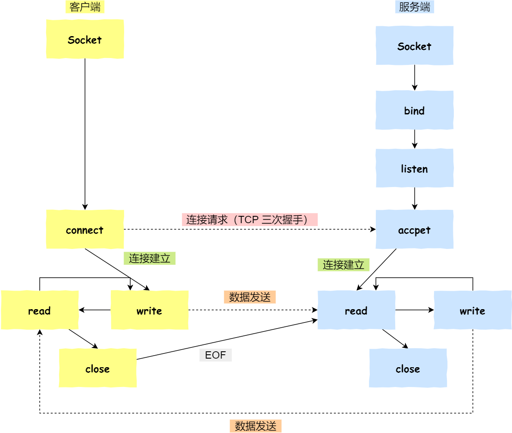

* 服务端和客户端初始化`socket`，得到文件描述符；
* 服务端调用`bind`，将socket绑定在指定的IP地址和端口；
* 服务端调用`listen`，进行监听；
* 服务端调用`accept`，等待客户端连接；
* 客户端调用`connect`，向服务端的地址和端口发起连接请求；
* 服务端`accept`返回用于传输的`socket`的文件描述符；
* 服务端调用`write`写入数据；服务端调用`read`读取数据；
* 客户端断开连接时，会调用`close`，那么服务端`read`读取数据的时候，就会读取到`EOF`，待处理完数据后，服务端调用`close`，表示连接关闭。

服务端调用`accept`时，连接成功了会返回一个已完成连接的socket，后续用来传输数据。所以，监听的socket和真正用来传送数据的socket是两个socket，一个叫做**监听socket**，一个叫做**已完成连接socket**。 

#### 3.4.2 listen时backlog的意义

Linux内核维护两个队列：

* 半连接队列（SYN队列）：接收到SYN建立连接请求，处于SYN_RCVD状态；
* 全连接队列（Accept队列）：已完成TCP三次握手过程，处于ESTABLISHED状态；


早期backlog是SYN队列大小的意思，也就是未完成的队列大小。

在Linux 2.2之后，backlog变成了accept队列长度。

上限值是内核参数 `somaxconn` 的大小，也就说 `accpet 队列长度 = min(backlog, somaxconn)`。

#### 3.4.3 accept发生在哪一步

**客户端 connect 成功返回是在第二次握手，服务端 accept 成功返回是在三次握手成功之后。**


* 客户端的协议栈向服务端发送SYN包，并告诉服务端当前发送序列号`client_isn`，客户端进入`SYN_SENT`状态。
* 服务端的协议栈收到这个包之后，和客户端进行`ACK`应答，应答的值为`client_isn + 1`，表示对`SYN`包的`client_isn`的确认，同时服务端也发送一个`SYN`包，告诉客户端当前的发送序列号为`server_isn`，服务端进入`SYN_RCVD`状态。
* 客户端协议栈收到`ACK`之后，使得应用程序从`connect`调用返回，表示客户端到服务端的单向连接建立成功，客户端的状态为`ESTABLISHED`，同时客户端协议栈也会对服务端的`SYN`包进行应答，应答数据为`server_isn + 1`。
* `ACK`应答包到达服务端后，服务端的TCP连接进入`ESTABLISHED`状态，同时服务端协议栈使得`accept`阻塞调用返回，这个时候服务端到客户端的单向连接也建立成功。

#### 3.4.4 客户端调用close的断开流程


* 客户端调用 `close`，此时会向服务端发送 FIN 报文，进入 `FIN_WAIT_1` 状态；
* 服务端接收到了 `FIN` 报文，TCP 协议栈会为 `FIN` 包插入一个文件结束符 `EOF` 到接收缓冲区中，应用程序可以通过 `read` 调用来感知这个 `FIN` 包。这个 `EOF` 会被**放在已排队等候的其他已接收的数据之后**，这就意味着服务端需要处理这种异常情况，因为 `EOF` 表示在该连接上再无额外数据到达。此时，服务端进入 `CLOSE_WAIT` 状态；
* 接着，当处理完数据后，自然就会读到 `EOF`，于是也调用 `close` 关闭它的套接字，这会使得服务端发出一个 `FIN` 包，之后处于 `LAST_ACK` 状态；
* 客户端接收到服务端的 `FIN` 包，并发送 `ACK` 确认包给服务端，此时客户端将进入 `TIME_WAIT` 状态；
* 服务端收到 `ACK` 确认包后，就进入了最后的 `CLOSE` 状态；
* 客户端经过`2MSL`之后，也进入`CLOSE`状态。

#### 3.4.5 没有accept怎么建立连接


TCP连接已经建立，没有accept只是不能接收消息。

#### 3.4.6 没有listen怎么建立连接

两个客户端之间可以同时发起tcp连接。没有服务端参与，自然不需要listen。

### 3.5 TCP机制


#### 3.5.1 重传机制

**超时重传**

在以下情况触发：

* 数据包丢失
* 确认应答丢失


考虑超时时间的因素：`RTT`（Round-Trip Time 往返时延）


可以看到`RTO` （Retransmission Timeout 超时重传时间）太快或太慢都不好：


* RT0太大：网络效率变低。
* RT0太小：没有丢就重发了。

得到结论：**超时重传时间 RTO 的值应该略大于报文往返 RTT 的值**。

而这个时间应当是一个**动态**的值：网络也是时常变化的所以「报文往返 RTT 的值」 是经常波动变化的。

Linux计算RT0的方法：

* 需要 TCP 通过采样 RTT 的时间，然后进行加权平均，算出一个平滑 RTT 的值，而且这个值还是要不断变化的，因为网络状况不断地变化。
* 除了采样 RTT，还要采样 RTT 的波动范围，这样就避免如果 RTT 有一个大的波动的话，很难被发现的情况。

RFC6289建议计算方式：


 `SRTT` 是计算平滑的RTT ，`DevRTR` 是计算平滑的RTT 与 最新 RTT 的差距。

**α = 0.125，β = 0.25， μ = 1，∂ = 4**

**每当遇到一次超时重传的时候，都会将下一次超时时间间隔设为先前值的两倍。两次超时，就说明网络环境差，不宜频繁反复发送**。


**快速重传**

收到三个相同的ACK的时候看，会在定时器过期之前，重传丢失的报文。


问题：**重传一个还是重传全部**。

解决：SACK方法。


**SACK**

`SACK`（ Selective Acknowledgment）， **选择性确认**。

在头部加上SACK部分，将已收到的数据的信息发送给发送方，这样发送方就可以值重传丢失的数据了。


如果要支持SACK，必须双方都支持，可以通过`net.ipv4.tcp_sack`参数打开，Linux 2.4后默认打开。


**D-SACK**

Duplicate SACK 又称 `D-SACK`，其主要**使用了 SACK 来告诉「发送方」有哪些数据被重复接收了。**


SACK表示3000~3500被重复接收了。


可以表示SACK的数据重复了，DSACK的好处：

* 可以让发送方知道，是发出去的包丢了，还是接收方回应的ACK包丢了（若触发超时重传立即收到DSACK=ACK丢了，否则为未发出去丢了）。
* 可以知道是不是发送方的数据包被网络延迟了（超时重传后，收到ack，后面延迟的到来，延迟收到dsack）。
* 可以知道网络中是不是把发送方的数据包复制了（未重传收到dsack）。


#### 3.5.2 滑动窗口

TCP是每发送一个数据，都要进行一次确认的，但若每个报文都要回复，则通信效率会极大的收到RTT的影响。所以引入了窗口的概念。


窗口大小就是无需确认应答，而可以继续发送数据的最大值。

实际上就是一个缓存，收到应答之前，要在缓存中一直保留已发送的数据。如果按期收到确认应答，则数据可以从缓存区清除。


这个模式称为累计确认或累计应答。

**窗口大小确认**：接收端通过TCP头中的Window字段通知发送端自己的接收缓存大小，发送方通过这个信息来发送数据，使得接收端不会处理不过来。这个窗口由**接收端决定**。

发送方的滑动窗口：


发送方发送满窗口的滑动窗口：


被接收一部分的窗口：


TCP通过三个指针来表示每一个类别中的字节：

* `SND.WND`：发送窗口的大小；
* `SND.UNA`：*Send Unacknowleged*，绝对指针，指向已发送但未收到确认的第一个字节的序列号。
* `SND.NEXT`：绝对指针，指向未发送但可发送范围的第一个字节的序列号。
* `SND.UNA + SND.WND`：相对指针，指向第四部分的第一个字节。

可用窗口大小：`SND.WND - (SND.NEXT - SND.UNA)`

接收方的滑动窗口：


包括三个部分：

* `RCV.WND`：接收窗口的大小；
* `RCV.NXT`：期望发送方发来的下一个字节的数据的序列号。
* `RCV.NXT + RCV.WND`：不可以收到的数据。

**发送窗口和接收窗口并不一定完全相等**。当接收的速度太快，滑动窗口总是可以快速空出来的话，接收方可以通过Window字段告诉发送方可以调整窗口大小，而这个过程是存在时延的，所以接收窗口与发送窗口是约等于关系。

#### 3.5.3 流量控制

流量控制：让发送方根据接收方的实际接收能力控制发送的数据量。


在这里发送窗口和接收窗口是不变的，而发送窗口与接收窗口都是在操作系统的缓存区内，而**操作系统的缓存区会被操作系统所调整**。


由于操作系统一直没有时间接收，导致窗口最后变为0。但是即使是到0了，发送端仍然会发送窗口探知报文。


若操作系统直接减少接收缓存区的大小，甚至可能出现数据包丢失的情况。

**为了防止这种情况发生，TCP 规定是不允许同时减少缓存又收缩窗口的，而是采用先收缩窗口，过段时间再减少缓存，这样就可以避免了丢包情况**。

TCP通过让接收端发送自己的窗口大小的方式进行流量控制，而窗口大小为0时，窗口就关闭了。

窗口关闭结束后，接收方会发送一个窗口非0的ACK报文，若丢失了该报文，则会造成**死锁**。


TCP为每个TCP连接设定一个**持续定时器**，只要TCP连接一方收到对方的零窗口通知，就启动持续计时器。

若持续计时器超时，就发送**窗口探测报文（Window probe）**，对方在确认这个探测报文时，会给出自己现在的窗口大小。


* 若接收窗口任为0，重新启动计时器。
* 非0，死锁局面打破。

若窗口探测3次之后接收窗口仍为0，有的TCP实现会发送RST报文中断连接。

**糊涂窗口综合征**：如果接收方腾出几个字节就发送现在有几个字节的窗口，则发送方还是会发送这几个字节。

为了几个字节发送数据非常不经济。


糊涂窗口综合征可以发生在发送方与接收方：

* 接收方可以通告小窗口。
* 发送方可以发送小数据。

接收方策略：当窗口大小小于`min(MSS, 缓存空间/2)`，时，会向发送方通告窗口为0，避免发送数据过来。

发送方策略：使用Nagle算法。

需要满足下面两个条件其一：

* `窗口 >= MSS and 数据 >= MSS`；
* 收到之前发送数据的`ack`回包。

若接收方不通告小窗口给发送方，且对端`ACK`回复很快，Nagle算法就不会拼接太多的数据包，仍会有小数据包的传输。所以**接收方得满足「不通告小窗口给发送方」+ 发送方开启 Nagle 算法，才能避免糊涂窗口综合症**。

而对于telnet或ssh这种交互性比较强的程序，需要关闭Nagle算法。

#### 3.5.4 拥塞控制

**在网络出现拥堵时，如果继续发送大量数据包，可能会导致数据包时延、丢失等，这时 TCP 就会重传数据，但是一重传就会导致网络的负担更重，于是会导致更大的延迟以及更多的丢包，这个情况就会进入恶性循环被不断地放大....**，拥塞控制的目的：避免发送方的数据填满整个网络。

拥塞窗口`cwnd`是发送方维护的一个状态变量，会根据网络的拥塞程度动态变化。

发送窗口值`swnd = min(cwnd, rwnd)`。

拥塞窗口`cwnd`变化规则：

* 只要网络没有出现拥塞，`cwnd`增大。
* 出现了拥塞，`cwnd`减少。

拥塞控制的四个算法：慢启动、拥塞避免、拥塞发生、快速恢复。

##### 慢启动

当发送方每收到一个ACK（多个确认合一算多个），拥塞窗口`cwnd`的大小加一。


慢启动从轮次上看是指数型增长。

慢启动存在门限`ssthresh`（slow start threshold）状态变量。

* `cwnd < ssthres`，使用慢启动算法；
* `cwnd >= ssthres`，使用拥塞避免算法。

##### 拥塞避免

每收到一个`ACK`，`cwnd`增加`1/cwnd`。

若无特殊情况，则从轮次上看变成了线性增长。


一直增长慢慢会进入拥塞状态，会出现丢包情况，触发重传机制，进入拥塞发生算法。

##### 拥塞发生

当网络拥塞，导致数据包重传，重传机制主要有两种：

* 超时重传
* 快速重传

这两种导致的拥塞发生算法是不一样的。

当触发超时重传时：

* `ssthresh` 设为`cwnd / 2`;
* `cwnd`重置为10（恢复初始值）；


当触发快速重传时：

* `cwnd = cwnd / 2`；
* `ssthresh = cwnd`；
* 进入快速恢复算法。

TCP认为丢一小部分包不严重，所以快速重传更快。

##### 快速恢复

快速重传和快速恢复算法通常一起使用，快速恢复算法认为，还能收到三个重复的ACK说明网络不差，没必要像RTO超时那么强烈。

进入快速恢复之前，`cwnd`和`ssthresh`已经被更新了。

快速恢复算法如下：

- 拥塞窗口 `cwnd = ssthresh + 3` （ 3 的意思是确认有 3 个数据包被收到了）；
- 重传丢失的数据包；
- 如果再收到重复的 ACK，那么 `cwnd` 增加 1；
- 如果收到新数据的 ACK 后，把 `cwnd` 设置为第一步中的 `ssthresh` 的值，原因是该 ACK 确认了新的数据，说明从 duplicated ACK 时的数据都已收到，该恢复过程已经结束，可以回到恢复之前的状态了，也即再次进入拥塞避免状态；


为何快速重传后`cwnd`要减小：网络可能拥堵了，减小`cwnd`以避免拥堵。

为何快速恢复时收到重复`ack`要增大`cwnd`：要尽快将接收方没收到的报文发送出去。

最后收到新的`ack`，过程结束，`cwnd`设置为`ssthresh`中的值（拥塞避免）。

### 3.6 TCP连接队列


* 半连接队列：SYN队列，收到客户端SYN请求但还未完成握手的队列
* 全连接队列：accept队列，已经收到ACK报文但还没有完成连接的队列。


不管是半连接队列还是全连接队列，都有最大长度限制，超过限制时，内核会直接丢弃，或返回RST包。

#### 3.6.1 全连接队列溢出

在LISTEN状态时：

* `Recv-Q`：当前全连接队列的大小，即完成三次握手并等待服务端`accept()`的`tcp`连接。
* `Send-Q`：当前全连接最大队列长度。

在非LISTEN状态时：

* `Recv-Q`：已收到但未被应用进程读取的字节数。
* `Send-Q`：已发送但未收到确认的字节数。

当服务端并发处理大量请求时，如果 TCP 全连接队列过小，就容易溢出。发生 TCP 全连接队溢出的时候，后续的请求就会被丢弃，这样就会出现服务端请求数量上不去的现象。


`tcp_abort_on_overflow` 共有两个值分别是 0 和 1，其分别表示：

- 0 ：如果全连接队列满了，那么 server 扔掉 client 发过来的 `ack` ；
- 1 ：如果全连接队列满了，server 发送一个 `reset` 包给 client，表示废掉这个握手过程和这个连接；

这个参数应该被设置为0，这样就可以在繁忙结束后收到客户端的重发的请求，当客户端再次发来请求时由于第一个请求里有ack，连接仍然可以成功建立。

除非确定TCP全连接队列会长期溢出，才能设置为1。

TCP全连接队列的最大值为：`min(somaxconn, backlog)`。

`backlog`是应用层参数，`somaxconn`是内核给定的全连接队列最大长度。

**如果持续不断地有连接因为 TCP 全连接队列溢出被丢弃，就应该调大 `backlog` 以及 `somaxconn` 参数**。

#### 3.6.2 半连接队列溢出

SYN洪泛（SYN攻击、DDos攻击）：一直发送`SYN`包，但不回`ACK`，使得`SYN`队列溢出，导致后续的`SYN`请求无法被回应。

可以通过`netstat -s`观察半连接队列溢出的情况，会输出溢出累计值，若有上升的趋势，则说明存在半连接队列溢出的情况。

半连接队列的最大长度不一定由`tcp_max_syn_backlog`决定。而是：

1. 如果半连接队列满了，并且没有开启 `tcp_syncookies`，则会丢弃；
2. 若全连接队列满了，且没有重传 `SYN`+`ACK` 包的连接请求多于 1 个，则会丢弃；
3. 如果没有开启 `tcp_syncookies`，并且 `max_syn_backlog` 减去 当前半连接队列长度小于 `(max_syn_backlog >> 2)`，则会丢弃；


- **全**连接队列的最大值是 `sk_max_ack_backlog` 变量，`sk_max_ack_backlog` 实际上是在 `listen()` 源码里指定的，也就是 **`min(somaxconn, backlog)`**；
- **半**连接队列的最大值是 `max_qlen_log` 变量；


- 当 `max_syn_backlog > min(somaxconn, backlog)` 时， 半连接队列最大值 `max_qlen_log = min(somaxconn, backlog) * 2`。
- 当 `max_syn_backlog < min(somaxconn, backlog)` 时， 半连接队列最大值 `max_qlen_log = max_syn_backlog * 2`;

即半连接队列最大值 `max_qlen_log`为`max_syn_backlog`参数与全连接队列最大长度中最小者的两倍。


`max_qlen_log` 是**理论**半连接队列最大值，并不一定代表服务端处于 `SYN_RECV` 状态的最大个数。


如果当前半连接队列的长度 「没有超过」理论半连接队列最大值 `max_qlen_log`，那么如果条件 3 成立，则依然会丢弃 SYN 包，也就会使得服务端处于 `SYN_RECV` 状态的最大个数不会是理论值 `max_qlen_log`。


- 如果「当前半连接队列」**没超过**「理论半连接队列最大值」，但是**超过** `max_syn_backlog - (max_syn_backlog >> 2)`，那么处于 `SYN_RECV` 状态的最大个数就是 `max_syn_backlog - (max_syn_backlog >> 2)`；
- 如果「当前半连接队列」**超过**「理论半连接队列最大值」，那么处于 `SYN_RECV` 状态的最大个数就是「理论半连接队列最大值」；


如果SYN半连接队列满了，开启`syncookies`依然可以在不适用SYN半连接队列的情况下建立连接。

`syncookies` 参数主要有以下三个值：

- 0 值，表示关闭该功能；
- 1 值，表示仅当 SYN 半连接队列放不下时，再启用它；
- 2 值，表示无条件开启功能；

几种防御 SYN 攻击的方法：

- 增大半连接队列；

  同时增大`tcp_max_syn_backlog`、`somaxconn`和`backlog`，即增大全连接队列。改变之后，由于半连接队列和全连接队列都是在`listen()`初始化的，所以要重启`Nginx`服务。

- 开启 `tcp_syncookies` 功能

- 减少 `SYN+ACK` 重传次数


### 3.7 优化TCP


#### 3.7.1 三次握手优化

##### 客户端优化

三次握手建立连接的首要目的是同步序列号。TCP的许多特性都依赖于序列号实现，如：流量控制、丢包重传等。

* `SYN_SENT`优化

  根据网络的稳定性以及目标服务器的繁忙程度修改SYN的重传次数，尽快把错误暴露给应用程序。

  该项由`tcp_syn_retries`控制，默认重发5次，每次超时时间为上次的两倍。

##### 服务端优化

如果三次连接的过程中，服务端的连接队列溢出了，会照成一定的影响。有以下优化方法：

* 增大半连接队列

  通过增大`tcp_max_syn_backlog`、`somaxconn`、`backlog`的值增大半连接队列的长度。

* 开启`syncookies`功能

  开启该功能后，就算半连接队列满了也还能进行连接。

* `SYN_RCV`优化

  当网络繁忙、不稳定时，报文丢失严重，应该调大重发次数，否则应该调小重发次数。可以通过`tcp_synack_retries`参数调整，默认为5次。

* 调整`tcp_abort_overflow`参数

  为了应对突发流量，可以调整该参数为0，直接丢弃该`ack`，当客户端超时重发`ack`的时候，可能可以被接收，继续通信。若该参数为1，则直接回复RST断开连接。

* 调整全连接队列长度

  通过增大`somaxconn`、`backlog`参数可以增大全连接队列长度。

##### 绕过三次握手

开启TCP Fast Open功能：


通过使用cookie来节省第一次连接之后三次握手的1个RTT时间。

开启了TFO功能，cookie的值存放到TCP option字段里。


客户端在请求并存储了 Fast Open Cookie 之后，可以不断重复 TCP Fast Open 直至服务器认为 Cookie 无效（通常为过期）。

通过设置`tcp_fastopn`参数打开。

* 0 关闭；
* 1 作为客户端使用Fast Open功能；
* 2 作为服务端使用Fast Open功能；
* 3 作为任何端都可以使用Fast Open功能。

#### 3.7.2 四次挥手优化

##### 主动方优化

关闭连接的两种方式：RST报文关闭、FIN报文关闭。

安全关闭连接的方式必须通过四次挥手，由进程调用`close`和`shutdown`函数发起FIN报文（`shutdown`参数必须传入`SHUT_WR`或者`SHUT_RDWR`才会发送FIN）。

调用close函数和shutdown函数的区别：调用了 close 函数意味着完全断开连接，**完全断开不仅指无法传输数据，而且也不能发送数据。 此时，调用了 close 函数的一方的连接叫做「孤儿连接」，使用 `netstat -p` 命令，会发现连接对应的进程名为空。**

使用 close 函数关闭连接是不优雅的。于是，就出现了一种优雅关闭连接的 `shutdown` 函数，**它可以控制只关闭一个方向的连接**。


第二参数决定断开连接的方式：

* `SHUT_RD(0)`：关闭连接的读方向，如果接收缓冲区有已接受的数据，则将会被丢弃，兵器在后续收到新的数据时，会对数据回复ACK并丢弃。对端还是会接收到ACK，但不知道报文已经被丢弃了。
* `SHUT_WR(1)`：关闭连接的写方向，即半关闭的连接。如果发送缓冲区还有未发送的数据，将被立即发送出去，并发送一个FIN报文给对端。
* `SHUT_RDWR(2)`：相当于`SHUT_RD`和`SHUT_WR`各一次，关闭套接字的读和写两个方向。

主动方可以对以下方向进行优化：

* `FIN_WAIT1`状态优化

  当发送完FIN报文后，如果一直收不到ACK报文，则一直重发FIN报文，而重发次数由`tcp_orphan_retries`参数控制（不止对孤儿连接有效，对`FIN_WAIT1`也有效），默认为0（特指8次）。

  如果`FIN_WAIT1`状态连接很多，则考虑降低`tcp_orphan_retries`的值。

  当遭遇**恶意攻击**时，FIN报文根本**发不出去**，原因：

  * TCP报文发送有序，当缓冲区还有数据，后续的数据也不能提前发送。
  * TCP有流量控制，当对方的窗口大小为0，发送方无法发送数据。如攻击者下载大文件将接收窗口设为0。

  则需要调整`tcp_max_orphans`参数。若孤儿连接数量大于该值，则新增的孤儿连接将不走四次握手，而是发送RST复位报文强制关闭。

* `FIN_WAIT2`状态优化

  当主动方收到ACK报文后，会处于FIN_WAIT2状态，表示主动方发送通道已关闭，等待对方发送FIN报文关闭对方的发送通道。

  如果连接是用 **shutdown 函数**关闭的，连接可以一直处于 `FIN_WAIT2` 状态，因为它可能还可以发送或接收数据。但对于 **close 函数**关闭的孤儿连接，由于无法再发送和接收数据，所以这个状态不可以持续太久，而 `tcp_fin_timeout` 控制了这个状态下连接的持续时长，默认值是 60 秒（**到时间未收到FIN直接关闭连接，和TIME_WAIT时间相同**）。

* `TIME_WAIT`状态优化

  * 通过调整`tcp_max_tw_buckets`参数，当TIME_WAIT连接数量超过该参数时，新关闭的连接就不再经历TIME_WAIT而直接关闭。

    当服务器的并发连接增多时，处于TIME_WAIT状态的连接也会增多，此时应该调大`tcp_max_tw_buckets`，减少不同连接间数据错乱的概率。

  * 有一种方式可以在建立新连接时，复用处于 TIME_WAIT 状态的连接，那就是打开 `tcp_tw_reuse` 参数。但是需要注意，该参数是**只用于客户端**（建立连接的发起方），因为是在调用 `connect()` 时起作用的，而对于**服务端（被动连接方）是没有用**的。

  * 在程序中设置socket选项，设置调用close关闭连接行为。

    如果 `l_onoff` 为非 0， 且 `l_linger` 值为 0，**那么调用 close 后，会立该发送一个 RST 标志给对端，该 TCP 连接将跳过四次挥手，也就跳过了 TIME_WAIT 状态，直接关闭**。

    这种方式只推荐在**客户端**使用，**服务端**千万**不要使用**。因为服务端一调用 close，就发送 RST 报文的话，客户端就总是看到 TCP 连接错误 “`connnection reset by peer`”。

TIME_WAIT的作用：

* 防止历史连接中的数据被后面相同四元组的连接错误的接收（2MSL足以让两个方向上的数据包都被丢弃，在网络中自然消失，再出现的数据包一定是新连接产生的）。
* 保证被动关闭连接的一方可以正确的关闭（保证FIN报文在TIME_WAIT时间内才能收到，若在CLOSE时间内被收到，则会发送RST，会被服务端解释为错误）。

MSL：**`Maximum Segment Lifetime`，它定义了一个报文在网络中的最长生存时间**，2MSL时间可以保证两次丢失内可以到达，如果不能，则说明网络太差了，不再理会。

tcp_tw_reuse是安全可控的：

* 只适用与连接发起方，即C/S模型中的客户端；
* 对应的TIME_WAIT状态的连接创建时间超过1秒才可以被复用。
* 必须双方打开TCP时间戳支持。

时间戳的好处：

* 重复的数据包会因为时间戳过期被自然丢弃；
* 防止序列号绕回，重复的数据包会由于时间戳过期被自然丢弃；


`tcp_tw_recycle`参数：允许TIME_WAIT状态连接被快速回收，但是开启`tcp_tw_recycle`和timestamp后，会开启per-host的PAWS机制（判断时间戳是否历史报文），**per-host 是对「对端 IP 做 PAWS 检查」**，而非对「IP + 端口」四元组做 PAWS 检查。导致不同机器通过同一NAT网关后，可能会丢弃其中某些机器的报文（时间有先后，丢弃最新报文前面的报文）。建议关闭。

##### 被动方优化

* 出现大量CLOSE_WAIT状态的时候，从应用程序找问题。
* 发送FIN报文后，未等到ACK，会在`tcp_orphan_retries`参数控制下继续重发报文。

当用 `netstat` 命令发现大量 CLOSE_WAIT 状态。就需要排查你的应用程序，因为可能因为应用程序出现了 Bug，read 函数返回 0 时，没有调用 close 函数。

如果被动方迅速调用 close 函数，那么被动方的 ACK 和 FIN 有可能在一个报文中发送，这样看起来，四次挥手会变成三次挥手。

两方同时关闭连接：


想收到ACK，但是收到了FIN，则进入发送ACK并进入CLOSING状态。

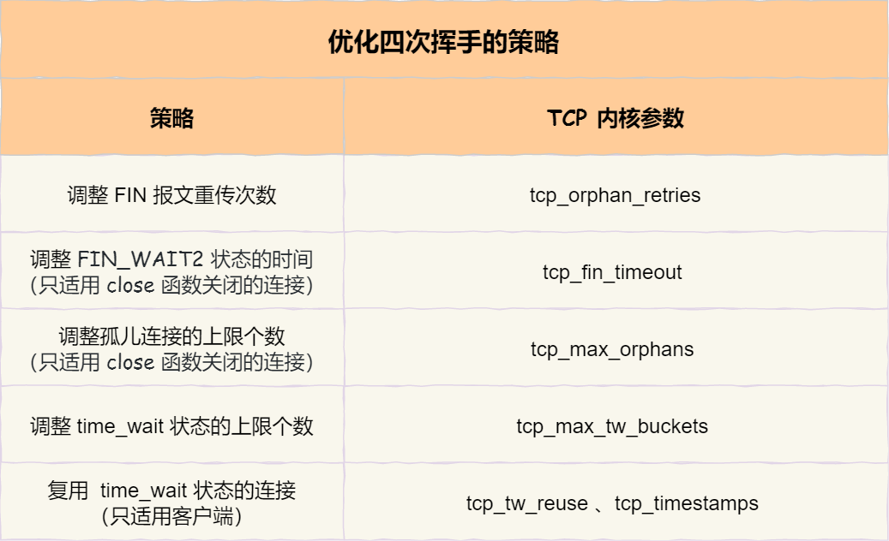

#### 3.7.3 数据传输优化

TCP连接由内核维护，内核会为每个连接建立内存缓冲区：

* 如果连接的内存配置过小，就无法充分使用网络带宽，TCP传输效率就会降低；
* 如果连接的内存配置过大，就容易把服务器资源耗尽，导致新连接无法建立。

##### 滑动窗口如何影响传输速度

TCP将报文发出后，并不会将其从内存中删除，因为重传还需要用到。


16位只能表示64KB大小，可能会不够，所以：

在 TCP 选项字段定义了**窗口扩大因子**，用于扩大 TCP 通告窗口，其值大小是 2^14，这样就使 TCP 的窗口大小从 16 位扩大为 30 位（2^16 \* 2^ 14 = 2^30），所以此时窗口的最大值可以达到 1GB。


Linux中可由`tcp_window_scaling`配置设为1打开（默认）。

- 主动建立连接的一方在 SYN 报文中发送这个选项；
- 而被动建立连接的一方只有在收到带窗口扩大选项的 SYN 报文之后才能发送这个选项。

而并不是接收缓冲区越大，进程及时取出了数据，接收窗口就可以无限放大。还应该要考虑网络传输能力的影响。发送超过**网络传输能力**的报文时，路由器会直接丢弃这些报文。因此，**缓冲区并不是越大越好**。

##### 如何确定最大传输速度

TCP 的传输速度，受制于发送窗口与接收窗口，以及网络设备传输能力。如果窗口大小和网络传输能力匹配，那么缓冲区的利用率就达到了最大化。

- 带宽是单位时间内的流量，表达是「速度」，比如常见的带宽 100 MB/s；
- 缓冲区单位是字节，当网络速度乘以时间才能得到字节数；

带宽时延积（BDP，Bandwidth Delay Product）：


如果飞行报文超过了 BDP，就会导致网络过载，容易丢包。

**由于发送缓冲区大小决定了发送窗口的上限，而发送窗口又决定了「已发送未确认」的飞行报文的上限。因此，发送缓冲区不能超过「带宽时延积」。**

##### 如何调整缓冲区大小

发送缓冲区，通过`tcp_wmem`参数调节。


- 第一个数值是动态范围的最小值，4096 byte = 4K；
- 第二个数值是初始默认值，16384 byte ≈ 16K；
- 第三个数值是动态范围的最大值，4194304 byte = 4096 K（4 M）；

发送缓冲区是自行调节的。

接收缓冲区，通过先设定`tcp_moderate_rcvbuf`参数为1，再调整`tcp_rmem`参数调节。

**接收缓冲区可以根据系统空闲内存的大小来调节接收窗口：**

- 如果系统的空闲内存很多，就可以自动把缓冲区增大一些，这样传给对方的接收窗口也会变大，因而提升发送方发送的传输数据数量；
- 反之，如果系统的内存很紧张，就会减少缓冲区，这虽然会降低传输效率，可以保证更多的并发连接正常工作；

通过`tcp_mem`配置可以调整TCP内存范围


上面三个数字单位不是字节，而是「页面大小」，1 页表示 4KB，它们分别表示：

- 当 TCP 内存小于第 1 个值时，不需要进行自动调节；
- 在第 1 和第 2 个值之间时，内核开始调节接收缓冲区的大小；
- 大于第 3 个值时，内核不再为 TCP 分配新内存，此时新连接是无法建立的；

如果超过`(177120 * 4) / 1024 K = 692 M`时，系统将无法为新的TCP连接分配内存，即将被拒绝。 

* 兼顾网速与大量并发连接：缓冲区动态调整最大范围达到带宽时延积，最小范围保持默认4k；
* 内存紧张：降低默认值，提高并发度；

调大`tcp_mem`上限可以让TCP连接使用更多系统内存，提升并发能力。

设置`SO_SNDBUF`或者`SO_RCVBUF`将会直接关闭缓冲区。


### 3.8 TCP面向字节流如何理解

#### 3.8.1 面向字节流与面向报文

UDP：用户消息不会被拆分，一个元素就是一个报文，队列中取一个报文就是一个完整消息。

TCP：消息可能被操作系统分组成多个TCP报文，如果不知道长度，就无法知道边界。

不能认为一个用户消息对应一个TCP报文，所以TCP是面向字节流协议。要解决边界问题，需要将问题交给应用程序。

#### 3.8.2 粘包问题

* 固定长度的消息：不灵活
* 特殊字符作为边界：注意特殊字符转义
* 自定义消息结构：考虑加入消息长度等。

### 3.9 TCP序列号为什么要不一样

原因：防止历史报文被下一个相同四元组连接接收。如果一样，大概率会进入接收方的接收窗口内，导致被接收。

序列号`SEQ`：32位无符号整数，到达4 G后会循环回去。

初始序列号`ISN`：32位计数器，每4微秒加一，循环一次4.55小时。

序列号和初始化序列号并不是无限递增的，会发生**回绕为初始值**的情况，这意味着**无法**根据序列号来**判断新老数据**。

时间戳`tcp_timestamps`：便于计算RTT，防止序列号回绕（PAWS）。

PAWS会记录最近收到数据包时间戳Recent TSval，每读到一个新的数据包都会比较是不是递增的，若是过期的，则表示该数据包是过期的并丢弃这个数据包。

时间戳也是可能会回绕的，毕竟只有32bit：

* 如果是1 ms加1，需要24.8天；
* 如果是1 us加1，需要71分钟；
* 如果是0.1 us加1，需要7分钟；

Linux在PAWS检测时做了一个处理，若一个TCP连接连续24天不收发数据，则接收第一个包时PAWS会失效。

解决方法：

1. 增加时间戳的大小
2. 将一个与时钟频率无关的值作为时间戳。

### 3.10 SYN报文什么情况下会被抛弃

* 开启`tcp_tw_recycle`参数，在NAT环境下，多机器的TCP连接中，时间戳较小的机器的SYN报文可能会被丢弃；
* TCP两个队列满了（半连接队列和全连接队列）。

#### 开启`tcp_tw_recycle`参数

tcp中有两个参数可以快速回收处于TIME_WAIT状态连接，都是默认关闭的：

* `net.ipv4.tcp_tw_reuse`：内核选择到的端口被相同四元组连接占用时，判断是否处于TIME_WAIT状态，若是且状态持续时间超过了1秒，则重用连接。只适用于连接发起端。
* `net.ipv4.tcp_tw_recycle`：允许处于TIME_WAIT状态的连接被快速回收。

要使这两个选项生效，前提是打开了TCP时间戳功能。

**`tcp_tw_recycle`不安全**

`tcp_tw_recycle`会开启per-host的PAWS机制，对**IP**进行PAWS检测，而不是对【**IP + 端口四元组**】检查。

该参数已在Linux 4.12版本后取消。

#### 队列满了

TCP半连接队列满了且未开启`syncookies`功能，则后面的SYN包都会被丢弃。

syncookies 参数主要有以下三个值：

- 0 值，表示关闭该功能；
- 1 值，表示仅当 SYN 半连接队列放不下时，再启用它；
- 2 值，表示无条件开启功能；

防御 SYN 攻击的方法：

- 增大半连接队列（`tcp_max_syn_backlog`、`backlog`、`somaxconn`）；
- 开启 `tcp_syncookies` 功能
- 减少 SYN+ACK 重传次数(`tcp_syn_retries`)

全连接队列满：accept队列满了，应用程序调用accept()不及时。

ss查看accept队列大小：

* Recv-Q：当前全连接队列长度。
* Send-Q：全连接队列最大长度。

### 3.11 连接中的TCP遇到SYN会怎么样

1. 端口号和历史连接不同

   服务端会认为有新的TCP连接要建立

   旧连接：

   * 服务端发消息：客户端内核回复RST，连接关闭
   * 一直没消息：服务端触发保活机制，检测到客户端没存活了，释放连接。

2. 相同

   回复`challenge ACK`，告诉对方自己期望的序列号与自己现在的序列号。

   若客户端认为服务端回复的序列号不对，会回复RST断开连接。

两个工具：

* killcx：利用SYN报文获取序列号断开连接，活跃与不活跃连接都可以断开；
* tcpkill：被动获取报文从而获取序列号，只能断开活跃的连接。

### 3.12 收到乱序FIN包会怎么样

不会读取：如果 FIN 报文比数据包先抵达客户端，此时 FIN 报文其实是一个**乱序**的报文，此时客户端的 TCP 连接并**不会**从 `FIN_WAIT_2` 状态转换到 `TIME_WAIT` 状态。

过程：

1. IP层处理完消息，回调`tcp_v4_rcv`函数将消息转给TCP层；
2. `FIN_WAIT_2`状态下客户端收到消息，调用`tcp_v4_do_rcv`函数；
3. `tcp_v4_do_rcv`方法调用`tcp_rcv_state_process`，然后根据TCP状态处理；
4. 若关闭读方向，则回复RST报文，若关闭写方向，则调用`tcp_data_queue`函数；
   1. 判断报文有没有FIN标志，若有则调用`tcp_fin`函数，将`FIN_WAIT_2`状态转换为`TIME_WAIT`。
   2. 查看乱序队列中有无数据，若有则调用`tcp_ofo_queue`函数，检查有没有与当前数据包保持连续的数据包。

当然，根本不会进入`tcp_fin`，因为乱序FIN被`tcp_data_queue_ofo`函数加入到乱序队列了。

`tcp_ofo_queue`函数找到与当前报文保持顺序的报文后，会拿出并检查是否有FIN标志，若有，才会调用`tcp_fin()`函数。然后检查状态是否为`TCP_FIN_WAIT2`，发送第四次挥手`ack`，转换状态为`TIME_WAIT`，并启动定时器。

### 3.13 在TIME_WAIT状态收到SYN会怎么样

若双方开启了时间戳机制：

* 客户端SYN序列号比服务端期望收到序列号大，并且SYN时间戳比服务端最后收到报文的时间戳大，则重用该四元组连接，跳过2MSL，转为SYN_RECV状态，继续进行连接。
* 客户端SYN序列号比服务端期望收到序列号小，并且SYN时间戳比服务端最后收到报文的时间戳小，**再回复一个第四次挥手的 ACK 报文，客户端收到后，发现并不是自己期望收到确认号，就回 RST 报文给服务端**。

过程：

1. 调用`tcp_v4_rcv`函数接收报文。
2. 调用`__inet_lookup_skb()`函数查找对应sock结构；
3. 如果连接的状态是`TIME_WAIT`，会跳转到`do_time_wait`处理；
4. 由`tcp_timewait_state_process()`函数处理收到的报文，根据返回值做相应的处理。
5. 如果SYN合法，调用`TCP_TW_SYN`，若非法，调用`TCP_TW_ACK`。

TIME_WAIT状态收到RST会断开连接吗？

* `net.ipv4.tcp_rfc1337`状态为0，提前结束TIME_WAIT状态，释放连接。
* `net.ipv4.tcp_rfc1337`状态为1，会丢掉该RST报文。

TIME_WAIT 状态之所以要持续 2MSL 时间，主要有两个目的：

- 防止历史连接中的数据，被后面相同四元组的连接错误的接收；
- 保证「被动关闭连接」的一方，能被正确的关闭；

设置TIME_WAIT可以避免各种奇怪的事。

### 3.14 TCP连接一端断电和进程崩溃有什么区别

#### TCP keepalive

`tcp_keepalive_time`：7200s

`tcp_keepalive_intvl`：75s

`tcp_keepalive_probes`：9

若`tcp_keepalive_time`时间内没有数据交流，则每隔`tcp_keepalive_intvl`时间对方会发送一个探测报文，共发送`tcp_keepalive_probes`次，若都没有响应，则认为当前TCP连接死亡。

共计：7200 + (75 * 9) = 7875秒 （2小时11分15秒）

当触发保活机制时：

* 若对端正常工作，则对端正常响应探测报文，TCP保活时间被重置，等待下一个TCP保活时间到来。
* 若对端主机崩溃，则无法响应探测报文，到达时限后，TCP报告该TCP连接已死亡。

只有通过socket接口设置`SO_KEEPALIVE`选项时，保活机制才会生效。

#### 主机崩溃且无保活

客户端主机崩溃了，服务器无法感知，且没有keepalive机制，服务端的TCP连接将一直处于ESTABLISHED状态，直到服务端重启进程。

在没有使用 TCP 保活机制且双方不传输数据的情况下，一方的 TCP 连接处在 ESTABLISHED 状态，并不代表另一方的连接还一定正常。

#### 进程崩溃且无保活

进程崩溃可以被内核感知，在进程崩溃后，内核制动释放资源，则会自动发起四次挥手。

#### 主机崩溃但迅速重启

客户端主机崩溃后，服务端若发送了报文，会触发超时重传机制。

若客户端重启后收到报文：

* 主机**没有绑定**TCP报文的目标端口号，内核回复RST报文，**重置该TCP连接**。
* 主机**绑定**了该TCP报文的目标端口号，但客户端内核协议栈找不到该TCP连接的socket结构体，回复RST报文，**重置该TCP连接**。

#### 客户端主机宕机，一直没有重启，但有消息

服务端超时重传报文次数达到限制后，内核判定TCP有问题，通过socket接口告诉应用程序TCP连接出问题了，于是断开该连接。

**超时重传最大次数**由`tcp_retries`控制，默认15，最大重传次数由`tcp_retries`计算的**timeout**得到（15对应924600 ms），如果重传时间超过了这个timeout，则认为超过了阈值，停止重传并断开连接。

超时时间（RTO）基于包往返时间（RTT）计算得到，且每轮超时时间都是**倍数增长**的。

例：若RTT比较小，RTO等于下限200 ms，刚好重传15次（`200 + 400 + 800 + ... = 924600 ms`）超过了timeout值，断开TCP连接。

最小RTO ： HZ / 5

最大RTO ：120 * HZ

Linux 2.6+ 使用1000 ms的HZ。

### 3.15 拔掉网线后TCP连接还存在吗

#### 拔掉网线后，有数据传输

由于拔掉网线不影响TCP连接的数据结构，TCP会一直保持ESTABLISH状态：

* 若在超时重传时间**内**插回去了，则TCP连接不断。
* 若在超时重传时间**后**插回去了，则TCP连接断开，后续服务器发送的消息会直接被回复RST报文。

#### 拔掉网线后，没有数据传输

* 若开启了TCP keepalive，则在探测次数内回复连接还存在，否则服务器断开连接。
* 若未开启TCP keepalive，则一直保持连接。

TCP keepalive在TCP层（内核态）实现的，也可以在应用层实现一套探测机制，快速检测是否断开。

### 3.16 `tcp_tw_reuse`为什么默认关闭

`net.ipv4.tcp_tw_reuse`：**调用`connect()`函数**时，如果内核选择到的端口，已经被**相同四元组**的连接占用的时候，就会判断该连接是否处于 **TIME_WAIT 状态**，如果该连接处于 TIME_WAIT 状态并且 TIME_WAIT 状态持续的时间**超过了 1 秒**，那么就会重用这个连接，然后就可以正常使用该端口了。

要使该参数生效，前提是开启`tcp_timestamps`参数，优点：

* 防止序列号回绕（PAWS）
* 精准计算RTT

#### 问题一

RST报文即使过期了，只要还在对方的窗口内，仍然可以起作用。如果跳过了TIME_WAIT，则这个报文仍然可以作用于下一个连接，导致出错。

高速网络下序列号用得很快，发生回绕的可能是存在的，且一个HTTP请求很快，远小于MSL，延迟RST报文存活也有可能。

#### 问题二

若第三次握手丢失了，而TIME_WAIT被跳过了，则服务端回复FIN的时候，客户端会回复RST，导致连接断开。

### 3.17 HTTPS中TLS和TCP可以同时握手吗

在TCP FAST OPEN和TLS 1.3的双重作用下，在第二次以后的通信中可以达到。而且HTTP请求也可以同时完成。

首次连接：


正常通信，第三次握手可以附带数据。

第二次连接：


可以直接携带数据。

如果服务器接收了SYN报文中的cookie，则可以减少握手带来的1 RTT的时间消耗。

如果没有接收，只收到了SYN + ACK，则最后一次ACK重发data。

TCP第三次连接可以附带数据，若附带的是TLS数据，也不算同时进行，因为是先完成了三次握手，再进行TLS握手的。

但还可以利用TLS v1.3中的会话恢复机制，重连只需要0-RTT。

用`pre_shared_key`和`early-data`扩展，在TCP连接后立即就建立安全连接发送加密消息。


### 3.18 Keepalive和Keep-Alive

#### HTTP Keep-Alive

- HTTP 的 Keep-Alive，是由**应用层（用户态）** 实现的，称为 HTTP 长连接；
- TCP 的 Keepalive，是由 **TCP 层（内核态）** 实现的，称为 TCP 保活机制；

HTTP短连接：建立 TCP -> 请求资源 -> 响应资源 -> 释放连接

HTTP长连接：同一个 TCP 连接来发送和接收多个 HTTP 请求/应答

**作用**：减少HTTP短连接带来的多次TCP连接建立和释放的开销。

只要在响应头中加入`Connection: Keep-Alive`，并收到同样回应时，连接就不会中断了。

**从 HTTP 1.1 开始， 就默认是开启了 Keep-Alive**，使用`Connection: close`可以关闭长连接。

HTTP流水线技术：发送一批连接，收到一批回复。

问题：队头阻塞，还是按顺序解决，前面未解决后面请求无法处理。

web服务软件提供`keepalive_timeout`参数，指定HTTP长连接的超时时间。到了超时时间，web服务软件启动一个定时器，定时器的时间一到，就会触发回调函数释放该连接。

#### TCP Keepalive

**作用**：检测对方是否在线。

如果两端一直没有数据交互，那么协议栈就会发送探测报文。

* 若正常相应，则保活时间重置。
* 若无法响应到达次数，TCP向应用程序报告TCP连接已死亡。

通过`SO_KEEPALIVE`选项激活。

### 3.19 TCP缺陷

#### 升级TCP的工作很困难

TCP在内核中实现，应用程序无法修改，升级内核很麻烦，很难兼容。

#### TCP建立连接的延迟

基于TCP实现的应用协议必须先三次握手建立连接才能进行传输。

加上TLS四次握手，雪上加霜。


TCP Fast Open解决了这个问题。

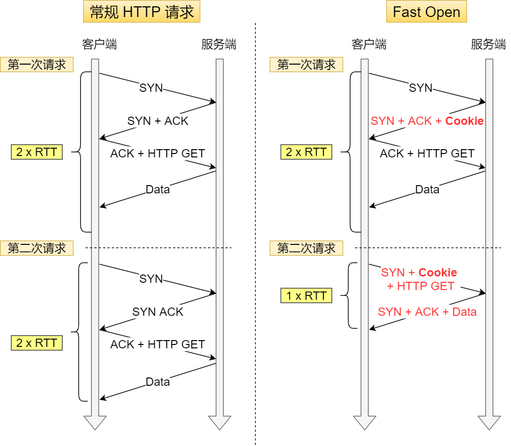

但是黑客可以通过伪造RST报文关闭TCP连接，因为TCP报文没有被加密。


#### TCP存在队头阻塞的问题

TCP是字节流协议，TCP层必须保证收到的字节数据必须是完整且有序的。若数据不完整，则应用程序无法从内核中获取这部分数据。

HTTP/2 多个请求是跑在一个 TCP 连接中的，那么当 TCP 丢包时，整个 TCP 都要等待重传，那么就会阻塞该 TCP 连接中的所有请求，所以 **HTTP/2 队头阻塞**问题就是因为 **TCP 协议导致**的。

#### 网络迁移需要重新建立TCP连接

基于TCP连接的HTTP协议，通过四元组（源IP、端口，目的IP、端口）唯一确定一条连接：


同一设备网络从 4G 切换到 WIFI 时，意味着 IP 地址变化了，那么就必须要断开连接，然后重新建立 TCP 连接。

### 3.20 QUIC


UDP协议 + 应用层实现可靠传输可以解决TCP协议的许多痛点，而TCP升级有许多痛点，所以QUIC是有必要的。


#### 3.20.1 可靠传输

在HTTP消息和UDP头部之间还有三层头部：


整体视角：


##### Packet Header


Packet Header 首次建立连接时和日常传输数据时使用的 Header 是不同的。

Packet Header 细分这两种：

- Long Packet Header 用于首次建立连接。
- Short Packet Header 用于日常传输数据。

QUIC也需要三次握手来建立连接，主要为了协商连接ID。协商出连接ID后，后续传输时，双方只需要固定住连接ID，从而实现连接迁移功能。所以日常传输数据的Short Packet Header不需要在传输Source Connection ID字段，只需要传输Destination Connection ID。

Short Packet Header 中的Packet Number 是每个报文独一无二的编号，是**严格递增**的，就算Packet N丢失了，重传的Packet N的Packet Number已经不是N，而是一个比N大的值。


TCP由于重传报文的ack是一致的，导致无法判断是原始报文的响应还是重传报文的响应，计算RTT时：

* 算原始请求响应，实际上是重传报文响应，导致RTT变大。
* 算重传报文响应，实际上是原始报文响应，导致RTT变小。

RTO（超时时间）是根据RTT计算的，RTT不精准会导致RTO不精准。

而QUIC严格递增，能更精准计算RTT。没有**歧义性**问题。


且QUIC的Packet Number单调递增，数据包**无需有序确认**，当数据包Packet N丢失后，只要有新的已接收数据包确认，当前窗口会继续向右滑动。（难道不是UDP面向报文的特性吗？也有，只是窗口不会卡住了）

Packet Number单调递增的两个好处：

* 更加精确计算RTT，没有TCP重传的歧义性
* 支持乱序确认，避免队头阻塞。

##### QUIC Frame Header

一个Packet报文中可以存放多个QUIC Frame。


每一个 Frame 都有明确的类型，针对类型的不同，功能也不同，自然格式也不同。

 Stream 类型的 Frame 格式:


* Stream ID：多个并发传输的HTTP消息，通过不同的Stream ID加以区别，类似于HTTP2的Stream ID；
* Offset作用：类似于TCP协议中的Seq序号，**保证数据的顺序性和可靠性**。
* Length作用：指明了Frame数据的长度。

引入Frame Header这一层，**通过Stream ID + Offset字段信息实现数据的有序性**，通过比较两个数据包的Stream ID和Stream Offset，如果一致，说明两个数据包的内容一致。

比如数据包Packet N丢失了，重传数据包Packet N + 2，检查两者Stream ID 和 Offset发现一致，说明，两个数据包的内容一致。这些数据包到达接收端后，接收端可以根据Stream ID和Offset字段将Stream x 和Stream x + y按顺序组织起来，然后交给应用程序处理。


QUIC，通过单向递增的**Packet Number**，配合**Stream ID**与**Offset**字段信息，可以支持乱序确认而不影响数据包的正确组装。拜托了TCP必须按顺序确认应答ACK的限制，解决了TCP因某个数据包重传而阻塞后续所有待发送数据包的问题。

#### 3.20.2 没有队头阻塞

TCP问题：

* 窗口外数据丢弃
* **当接收窗口收到的数据不是有序的**，无法被应用层读取。

**TCP 必须按序处理数据**，也就是 TCP 层为了保证数据的**有序性**，只有在处理完有序的数据后，滑动窗口才能往前滑动，否则就停留。

##### HTTP/2队头阻塞

在 HTTP/2 连接上，不同 Stream 的帧是可以乱序发送的（因此可以并发不同的 Stream ），因为每个帧的头部会携带 Stream ID 信息，所以接收端可以通过 Stream ID 有序组装成 HTTP 消息，而同一 Stream 内部的帧必须是**严格有序**的。

但是 HTTP/2 多个 Stream 请求都是在一条 TCP 连接上传输，这意味着多个 Stream 共用同一个 TCP 滑动窗口，那么当发生数据丢失，滑动窗口是无法往前移动的，此时就会阻塞住**所有**的 HTTP 请求，这属于 **TCP 层队头阻塞**。

##### QUIC没有队头阻塞

QUIC 给**每一个 Stream** 都分配了一个**独立的滑动窗口**，这样使得一个连接上的多个 Stream 之间没有依赖关系，都是相互独立的，各自控制的滑动窗口。

#### 3.20.3 流量控制

QUIC 实现流量控制的方式：

- 通过 `window_update` 帧告诉对端自己可以接收的字节数，这样发送方就不会发送超过这个数量的数据。
- 通过 `BlockFrame` 告诉对端由于流量控制被阻塞了，无法发送数据。

QUIC里同一个 Stream 的数据包丢失了，也会造成窗口无法滑动，否则无法保证可靠性。

QUIC 的 每个 Stream 都有各自的滑动窗口，**不同 Stream 互相独立**，队头的 Stream A 被阻塞后，不妨碍 Stream B、C的读取。而HTTP/2阻塞后其它Stream必须等待。

QUIC的两个级别的流量控制：

- **Stream 级别的流量控制**：Stream 可以认为就是一条 HTTP 请求，每个 Stream 都有独立的滑动窗口，所以每个 Stream 都可以做流量控制，**防止单个 Stream 消耗连接（Connection）的全部接收缓冲**。
- **Connection 流量控制**：限制连接中所有 Stream 相加起来的总字节数，**防止发送方超过连接的缓冲容量**。

##### Stream 级别的流量控制

初始状态：


中间状态：


接收窗口的左边界取决于接收到的最大偏移字节数。接收窗口 = 最大窗口数 - 接收到的最大偏移数。

和TCP的区别：

- TCP 的接收窗口只有在前面所有的 Segment **都接收**的情况下才会移动左边界，当在前面还有字节未接收但收到后面字节的情况下，窗口也不会移动。
- QUIC 的接收窗口的左边界滑动条件取决于接收到的**最大偏移字节数**。

绿色部分数据超过**最大接收窗口的一半**后，**最大接收窗口**向右移动，**接收窗口**的右边界也向右扩展，同时给对端发送「**窗口更新帧**」，当发送方收到接收方的窗口更新帧后，**发送窗口**的右边界也会往右扩展，以此达到窗口滑动的效果。

**如果中途丢失了数据包，导致绿色部分的数据没有超过最大接收窗口的一半，那接收窗口就无法滑动了**。这样这个Stream就阻塞了，但不会影响其它Stream。

##### 乱序确认

过程示例：


接收窗口移动：


超时：


重新编号并接收：


唯一限制为**最大绝对字节偏移量**，由接收方基于提交的偏移量和发送方协商得出。

##### Connection 流量控制


```text
可用窗口 = Stream 1 可用窗口 + Stream 2 可用窗口 + Stream 3 可用窗口 + ...
```

#### 3.20.4 拥塞控制

默认使用了 TCP 的 Cubic 拥塞控制算法（我们熟知的慢开始、拥塞避免、快重传、快恢复策略）,同时也支持 CubicBytes、Reno、RenoBytes、BBR、PCC 等拥塞控制算法，相当于将 TCP 的拥塞控制算法照搬过来了。

QUIC 是处于应用层的，应用程序层面就能实现不同的拥塞控制算法，不需要操作系统，不需要**内核支持**。这是一个飞跃，因为传统的 TCP 拥塞控制，必须要端到端的网络协议栈支持，才能实现控制效果。而内核和操作系统的部署成本非常高，升级周期很长，所以 TCP 拥塞控制算法迭代速度是很慢的。而 **QUIC 可以随浏览器更新，QUIC 的拥塞控制算法就可以有较快的迭代速度**。

TCP 更改拥塞控制算法是对系统中所有应用都生效，无法根据不同应用设定不同的拥塞控制策略。但是因为 QUIC 处于应用层，所以就**可以针对不同的应用设置不同的拥塞控制算法**，这样灵活性就很高了。

#### 3.20.5 更快建立连接

HTTP/1和HTTP/2协议中，TCP和TLS分层，分别属于内核中的传输层、openssl库实现的表示层，难以合并。

HTTP/3 在传输数据前虽然需要 QUIC 协议握手，这个握手过程只需要 **1 RTT**，握手的目的是为确认双方的「连接 ID」，**连接迁移**就是基于**连接 ID** 实现的。且并不是与TLS分层，在**QUIC内部包含了TLS**，在自己的帧里添加TLS的记录，且QUIC使用**TLS 1.3**，仅需一个RTT就可以实现建立连接与密钥协商。甚至第二次连接的时候，**应用数据包**可以和**QUIC握手信息（连接信息+TLS信息）**一起发送，达到**0-RTT**效果。


#### 3.20.3 连接迁移

HTTP：


网络切换需要断开重连。成本高。

QUIC使用连接ID标记通信的两个端点，客户端和服务器各选择一组ID标记自己，这样网络变化后，只要上下文信息（QUIC**连接ID**、**TLS密钥**）还在，就可以无缝衔接，实现**连接迁移**。

### 3.21 TCP和UDP可以用一个端口吗

TCP网络编程流程：


UDP网络编程流程：


在网络层中，通过IP来确定主机或路由器。

在传输层中，通过端口号来确定主机上的不同应用程序。

而传输层的两个不同协议绑定同意主机的同一端口时，使用不同的**协议号**来区分使用的协议。


如果两个 TCP 服务进程同时绑定的 IP 地址和端口都相同，那么执行 **`bind()` 时候就会出错**，错误是“Address already in use”。

0.0.0.0 地址比较特殊，代表任意地址，意味着**绑定了 0.0.0.0 地址**，**相当于把主机上的所有 IP 地址都绑定了**。

设置`SO_REUSEPORT`属性可以让多个进程绑定相同的IP和端口。

当 TCP 服务进程重启时，服务端会出现 `TIME_WAIT` 状态的连接，**`TIME_WAIT` 状态的连接**使用的 IP+PORT 仍然被认为是一个**有效**的 IP+PORT 组合，相同机器上不能够在该 IP+PORT 组合上进行绑定，那么执行 `bind()` 函数的时候，就会返回了 Address already in use 的错误。

可以在调用 bind 前，对 socket 设置 `SO_REUSEADDR` 属性，从而避免重启错误。

`SO_REUSEADDR` 作用是：

* 如果当前启动进程绑定的 **IP+PORT** 与处于**TIME_WAIT** 状态的连接占用的 IP+PORT 存在冲突，但是新启动的进程使用了 **`SO_REUSEADDR` 选项**，那么该进程就可以绑定成功。
* 绑定IP地址+端口时，只要IP地址不是正好相同，那么允许绑定。

**端口重用**：只需要连接四元组中某一个项的属性不一样，则连接成立。

**bind()**：通过bind可以指定应用程序绑定某个端口，但是如果某IP下的某端口被占用了，则绑定会失败。

只要和客户端连接的服务器不同，端口资源就是可以重复使用的，发起再多连接都行（当然要考虑其它资源，如：文件描述符、内存、CPU等）。

实例：


### 3.22 服务端没有listen，客户端发起连接会怎么样

服务端如果只 bind 了 IP 地址和端口，而没有调用 listen 的话，然后客户端对服务端发起了连接建立，服务端会回 RST 报文。

* 服务器内核调用tcp_v4_rcv收到报文
* 调用`__inet_lookup_skb`函数找到TCP报文所属socket。
* 查找连接建立状态的socket（`__inet_lookup_established`）
* 查找监听套接口（`__inet_lookup_listener`），即根据目的地址和目的端口算出一个哈希值，然后在哈希表找到对应监听该端口的socket。
* 找不到对应socket，跳转`no_tcp_socket`。
* 调用`tcp_v4_send_reset`发送RST中止连接。

##### 不用listen，可以建立TCP连接吗？

可以自连接，客户端之间同时向对方发起连接（TCP同时打开）。特点，**没有listen**。

虽然客户端没有全连接队列和半连接队列，但是内核中有全局hash表，可以存放socket信息，当TCP自连接的时候，客户端调用connect方法，会将自己的连接信息放入到这个全局hash表中，消息经过回环地址回到TCP传输层，并根据 IP + 端口信息，再一次从全局hash取出socket信息并成功建立连接。

### 3.23 没有accept，能建立TCP连接吗

服务端监听伪代码：

~~~c++
int main()
{
    /*Step 1: 创建服务器端监听socket描述符listen_fd*/    
    listen_fd = socket(AF_INET, SOCK_STREAM, 0);

    /*Step 2: bind绑定服务器端的IP和端口，所有客户端都向这个IP和端口发送和请求数据*/    
    bind(listen_fd, xxx);

    /*Step 3: 服务端开启监听*/    
    listen(listen_fd, 128);

    /*Step 4: 服务器等待客户端的链接，返回值cfd为客户端的socket描述符*/    
    cfd = accept(listen_fd, xxx);

    /*Step 5: 读取客户端发来的数据*/
    n = read(cfd, buf, sizeof(buf));
}
~~~

客户端伪代码：

~~~c++
int main()
{
    /*Step 1: 创建客户端端socket描述符cfd*/    
    cfd = socket(AF_INET, SOCK_STREAM, 0);

    /*Step 2: connect方法,对服务器端的IP和端口号发起连接*/    
    ret = connect(cfd, xxxx);

    /*Step 4: 向服务器端写数据*/
    write(cfd, buf, strlen(buf));
}
~~~

如果没有accept()方法，三次握手是正常进行的，并顺利建立连接。

且再服务端执行accept()前，如果客户端发送消息给服务端，服务端可以正常回复ack确认包。


可以看到，accept()方法只是会从全连接队列里拿出一条连接，实际上这些连接都是处于ESTABLISHED状态的。

半连接队列（SYN队列）：收到第一次握手后加入，实际为哈希表。

全连接队列（accept队列）：收到第三次握手后，会将半连接队列中的socket取出，队列里的sock都处于ESTABLISHED状态，这里的连接就等着服务端执行accept()后被取出。实际为链表。

**SYN队列**等到第三次握手到来时，要能快速从队列中取出，所以设计成**哈希表**。

**accept队列**都在等待被取出，并不关心是哪个连接，所以设计成**链表**。

观察全连接队列大小`ss -lnt`

* Send-Q：全连接队列最大值
* Recv-Q：当前全连接队列值

当两者数值接近时队列可能满了，通过`netstat -s`查看是否发生过队列溢出（历史）。

通过`watch -d`没隔两秒执行相同命令，若一直增加，说明正在溢出。

全连接队列满了后可以通过`tcp_abort_on_overflow`参数触发行为：0丢弃、1回复RST。

如果重传超过一定次数，会将半连接队伍中的连接删掉。

若为1，客户端收到RST后，不知道是服务端未监听端口还是全连接队列满了。

半连接队列满了一般会丢弃，可以通过`tcp_syncookies`参数控制，0丢弃，1生成cookie发送给客户端。

当服务端收到客户端发来的第三次握手包时，会通过seq还原出**通信双方的IP地址端口、时间戳、MSS**，验证通过则建立连接。

开启`tcp_syncookies`后可能会收到ack攻击，因为cookies是通过双方的**IP地址、端口、时间戳、MSS**实时计算的，虽然不用内存保存，但若黑客**伪造第三次握手ack的cookie**，CPU就要进行计算，大量攻击可能导致CPU耗尽，无法处理其它请求。

且开启`tcp_syncookies`后，客户端发来第一次握手后**不会**将其加入到半连接队列，服务端**不会**保存连接信息，如果传输过程冲数据包丢了，也**不会重发第二次握手的信息**。

### 3.24 TCP协议数据一定不会丢吗

正常聊天软件通信：


简化模型：


1. 聊天框发送消息
2. 消息从聊天软件所在用户空间拷贝到内核空间的发送缓冲区（send buffer）
3. 数据包进入传输层->网络层->数据链路层，经过流控(qdisc)，再通过RingBuffer发送到物理层的网卡。
4. 经过n多个路由器和交换机跳转，到达目的机器的网卡处。
5. 网卡通知DMA将数据包信息放到RingBuffer中，并促发一个软中断给CPU。
6. CPU触发软中断让`ksoftirqd`去RingBuffer收包，然后经过物理层、数据链路层、网络层、传输层到达应用软件。


#### 建立连接丢包

半连接队列满了，没有开启`syncookies`，遇到下一个SYN请求会直接丢弃。

全连接队列满了，收到新的第三次握手ack报文会直接丢弃。

#### 流量控制丢包

应用层能发网络数据包的软件很多，如果不加控制都加入到网卡，网卡会溢出，所以有qdisc（Queuing Disciplines，排队规则），即流量控制机制。

排队队列长度可以通过`ipconfig eth0` 命令查看，里面涉及的`txququelen`后面的数字就是流量控制队列的长度。

当发送数据过快，流控队列长度`txqueuelen`不够大时，就容易出现丢包现象。

~~~
# ifconfig eth0
eth0: flags=4163<UP,BROADCAST,RUNNING,MULTICAST>  mtu 1500
        inet 172.21.66.69  netmask 255.255.240.0  broadcast 172.21.79.255
        inet6 fe80::216:3eff:fe25:269f  prefixlen 64  scopeid 0x20<link>
        ether 00:16:3e:25:26:9f  txqueuelen 1000  (Ethernet)
        RX packets 6962682  bytes 1119047079 (1.0 GiB)
        RX errors 0  dropped 0  overruns 0  frame 0
        TX packets 9688919  bytes 2072511384 (1.9 GiB)
        TX errors 0  dropped 0 overruns 0  carrier 0  collisions 0
~~~

当遇到dropped字段大于0时，可能发生了丢包现象，可以通过`# ifconfig eth0 txqueuelen 1500`指令提升长度。

#### 网卡丢包

##### RingBuffer过小导致丢包

收到数据时，会暂存到RingBuffer接收缓冲区中，等待内核触发软中断收走。若这个缓冲区过小，发送的数据过快，可能就会发生溢出，产生丢包。

可以通过`ethtool`命令查看丢包情况：`# ethtool -S eth0|grep rx_queue_0_drops`。

可以通过`ethtool -G eth1 rx 4096 tx 4096`命令将发送和接收RingBuffer长度改为4096。

##### 网卡性能不足

网卡作为硬件，传输速度有上限，当网络传输速度过大，达到网卡上限时，就会发生丢包。

可以通过`ethtool`加网卡名，获得当前网卡支持的最大速度。

通过`sar`命令，可以从网络接口层面分析数据包的收发情况。

txkB/s是指当前每秒发送的字节（byte）总数，rxkB/s是指每秒接收的字节（byte）总数。

#### 接收缓冲区丢包

使用TCP socket编程时，内核会分配发送缓冲区和接收缓冲区。当想发包时，执行`send(msg)`后，只会把数据拷贝到发送缓冲区，数据的发送由内核做决定。

接收缓冲区也类似，等待用户应用程序将数据包取走。

两个缓冲区有大小限制，通过下面命令查看：

* `# sysctl net.ipv4.tcp_rmem`
* `# sysctl net.ipv4.tcp_wmem`

发送缓冲区满了，执行send：

* 阻塞调用：等待缓冲区有空位可以发数据。
* 非阻塞调用：立刻返回一个`EAGAIN`错误，意思是 Try again。不会丢包。

接收缓冲区满了后，TCP窗口会变成0，若发送端仍发送消息，则发生丢包。

可以通过`TCPRcvQDrop`查看有没有发生这种丢包现象。（Linux 5.9）

#### 两端之间的网络丢包

两端之间那么长的一条链路都属于外部网络，这中间有各种路由器和交换机还有光缆啥的，丢包也是很经常发生的。

##### ping命令查看丢包

比如 `ping baidu.com`：

倒数第二行里有个`100% packet loss`，意思是丢包率100%。

但这样其实你只能知道**你的机器和目的机器之间有没有丢包。**

##### mtr命令查看丢包

使用`mtr -r baidu.com`，查看本地机器和目的机器之间每个节点的丢包情况。


`mtr`默认使用ICMP包，有的节点限制使用ICMP包，导致不能正常展示。可以加入`-u`参数，使用udp包查看。

如果最后一行是0，则前面的100%等都是节点限制导致的虚报。

**最后一行是20%，再往前几行都是20%左右**，那说明丢包就是从最接近的那一行开始产生的。

#### TCP一定不丢包吗

TCP保证的可靠性，是**传输层的可靠性**。也就是说，**TCP只保证数据从A机器的传输层可靠地发到B机器的传输层**。

TCP任务结束时，聊天软件还需要将数据从TCP的接收缓冲区读出来，但这个过程也可能失败（内存不足、进程崩溃）。

**TCP只保证传输层的消息可靠性，并不保证应用层的消息可靠性。如果我们还想保证应用层的消息可靠性，就需要应用层自己去实现逻辑做保证**。

应用程序可以拿自己的消息和接收方去对比，就会知道哪条数据发送失败，哪条接收失败。

而引入服务器有三个原因：

* 只需要建立一个连接就可以进行多个通信；
* 安全问题，防止别人将聊天记录同步过去；
* 软件版本问题，版本不一样有兼容问题。

### 3.25 TCP四次挥手可以变三次吗

#### 为什么需要四次挥手

为什么需要四次：服务端可能还需要发送消息。ACK是默认回应的，而FIN报文是处理完数据后，调用关闭连接函数的时候发送的。所以是四次。

两个关闭连接函数：

* shutdown：可以指定socket只关闭发送方向而不关闭读取方向，若多线程共享一个socket，shutdown函数会直接使该socket不可用，同时不会发出FIN报文，只有引用计数变成0时，才会发出FIN报文。
* close：同时关闭发送方向和读取方向，但不会导致socket不可用，其它进程还是可以正常读取该socket，引用计数变成0时，才会发出FIN报文。

如果客户端**调用close函数**关闭连接，则TCP四次挥手过程中，若收到服务端消息，客户端的内核会回复RST报文给服务端，**不会经历完整的四次挥手**。


当服务端再发起读或者写的时候，就能感知到连接已经被释放了：

* 读：返回RST报错，即Connection reset by peer
* 写：产生`SIGPIP`信号，应用层代码可以捕获并处理信号，如果不处理，则进程中止，异常退出。

若调用shutdown，则四次挥手正常运行：


shutdown 函数也可以指定「只关闭读取方向，而不关闭发送方向」，但是这时候内核是不会发送 FIN 报文的，因为发送 **FIN 报文是意味着我方将不再发送任何数据**，而 shutdown 如果指定「不关闭发送方向」，就意味着 socket 还有发送数据的能力，所以内核就不会发送 FIN。

#### 什么时候不需要四次挥手

「**没有数据要发送**」并且「开启了 **TCP 延迟确认机制**」（默认开启），那么第二和第三次挥手就会合并传输，这样就出现了三次挥手。

TCP延迟确认机制：由于ACK包不携带数据，所以网络效率很低。

* 有相应数据要发送，ACK随着响应数据一起发送给对方；
* 没有响应数据发送，ACK会延迟一段时间，等待响应数据一起发送；
* 延迟发送ACK期间，对方的第二个数据报文到达了，则立即发送ACK。


延迟等待时间在Linux内核中定义了：


即：

- 最大延迟确认时间是 200 ms （1000/5）
- 最短延迟确认时间是 40 ms （1000/25）

可以通过在Socket设置里启用`TCP_QUICKACK`关闭。

### 3.26 TCP序列号和确认号如何变化的

公式：

* 序列号 = 上一次发送的序列号 + len（数据长度）。若为SYN或FIN报文，则len为1。
* 确认号 = 上一次收到的报文中的序列号 + len（数据长度）。若为SYN或FIN，则len为1。

三个字段的作用：

* 序列号：解决网络包乱序的问题。
* 确认号：解决丢包问题。
* 控制位：标识TCP报文的类型（SYN报文、数据报文、ACK报文、FIN报文等）。

#### 握手阶段

TCP将SYN认为是1字节的数据：

* 告诉对方，已经收到SYN报文
* 告诉对方，下次期望收到报文的序列号为此确认号。


#### 数据传输阶段


发起方发送的第一个报文的第一个数据的序列号与第三次握手的序列号一样。（上次报文没变）

发送10字节数据，则确认号为客户端发送的序列号 + 10。

#### 四次挥手阶段

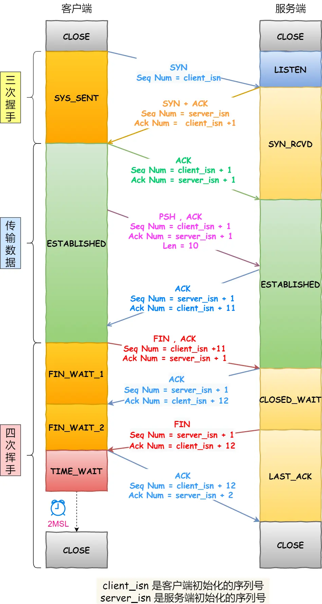

ACK报文不携带用户数据，所以len = 0。

## 四、IP


### 4.1 IP基本认识

#### IP的作用

 IP在TCP/IP参考模型中处于第三层，也就是网络层

网络层作用：实现主机与主机之间的通信，也叫点对点（end to end）通信。


#### IP与MAC的关系

MAC作用：在实现直连的两个设备之间通信

IP作用：在没有直连的两个网络之间进行通信传输


源IP和目标IP地址在传输过程中是不会变化的（没有使用NAT网络），只有源MAC地址和目标MAC一直在变化。

### 4.2 IP地址基础知识

IP地址格式（点分十进制方便记忆）：


IP地址最大值为：


一台设备可能有多个IP：


#### 4.2.1 IP地址的分类

IP地址共分为5类：A类、B类、C类、D类、E类。


A、B、C类地址最大主机号计算：$2^{主机号位数} - 2$


IP地址中两个特殊的地址：全0地址，全1地址。

* 主机号全0指定某个网络。
* 主机号全1指定某个网络下的全部主机，用于广播。

**广播地址**用于在**同一个链路中相互连接**的主机之间发送数据包。

* 在本网络内广播的叫做**本地广播**：网络地址为192.168.0.0/24情况下，广播地址为192.168.0.255。这个广播地址的IP包会被路由器屏蔽，不会到达这个网络之外的其它链路上。
* 在不同网络之间的广播叫做**直接广播**：例如网络地址为 192.168.0.0/24 的主机向 192.168.1.255/24 的目标地址发送 IP 包。收到这个包的路由器，将数据转发给192.168.1.0/24，从而使得所有192.168.1.1~192.168.1.254的主机都能收到这个包（存在安全问题，多数情况路由器设置不转发）。

D、E类地址：没有主机号，不可用于主机IP


多播地址：可以将包发送给特定组内的全部主机。

从 224.0.0.0 ~ 239.255.255.255 都是多播的可用范围，其划分为以下三类：

- 224.0.0.0 ~ 224.0.0.255 为预留的组播地址，只能在局域网中，路由器是不会进行转发的。
- 224.0.1.0 ~ 238.255.255.255 为用户可用的组播地址，可以用于 Internet 上。
- 239.0.0.0 ~ 239.255.255.255 为本地管理组播地址，可供内部网在内部使用，仅在特定的本地范围内有效。

##### 优点


属于什么分组一目了然。

##### 缺点

* 同一网络下没有地址层次，不能根据各种需求进行地址划分，缺少地址的灵活性。
* A、B、C类地址主机数和现实不匹配，C类主机数太少，B类主机数太多。

#### 4.2.2 无分类地址CIDR

CIDR没有分类地址的概念，32位地址划分为网络号与主机号两部分。

表现形式：`a.b.c.d/x`，表示前x位为网络号，后面为主机号。

子网掩码：掩码表示掩盖主机号，剩余的就是网络号。


**为什么要区分网络号与主机号**：判断是否处于一个广播域，若在一个广播域，则表示接收方在本网络上，就可以直接把数据包发送到目标主机。**路由器寻址**工作中，也是通过这样的方式找到对应的网络号的，进而把数据包发送到相应网络内。


**子网划分**：

* 未作子网划分的IP地址：网络地址 + 主机地址；
* 做子网划分的IP地址：网络地址 + （子网网络地址 + 子网主机地址）；


#### 4.2.3 公有IP与私有IP

在A、B、C类地址中都有私有地址：


私网地址由自己分配，可以和别人配置的私网地址重复，但公网地址不能重复。


共有地址由ICANN组织（互联网名称与数字地址分配机构）管理。

私有地址由内部IT人员管理。

#### 4.2.4 IP地址与路由控制

路由器发送IP包：

* 确定IP首部目标地址
* 找相同网络地址记录
* 若有多条相同网络地址的记录，选择相同位数最多的网络地址，即**最长匹配**。

**环回地址**：再同一台计算机上的程序之间进行网络通信时所使用的一个默认地址。

即**127.0.0.1**，等同于**localhost**的主机名。使用这个IP或主机名时，数据包不会流向网络。

#### 4.2.5 IP分片与重组

MTU（最大传输单元）：以太网（1500字节）、FDDI（4352字节）。

不同类型的数据链路的使用目的不同，可承载的MTU也不同。

当IP数据包的大小大于MTU时，IP数据包就会被分片。经过分片的数据包在被重组时，只能在目标主机进行，路由器不会进行重组。


在分片运输中，一旦某个分片丢失，则会造成**整个IP数据报作废**，所以TCP引入了**MSS**，也就是在TCP层进行分片而不由IP层分片，所以对于USP，尽量**不要**发送一个**大于MTU**的数据报文。

#### 4.2.6 IPv6基本认识

IPv6是128位的，除了由更多的地址，还有更好的安全性和拓展性。但IPv4和IPv6不能相互兼容，需要对现有的设备进行升级。

##### 亮点

* IPv6可自动配置，即使没有DHCP服务器也可以实现自动分配IP地址；
* IPv6包头首部长度采用固定的值40字节，去掉了包头检验和，简化了首部结构，减轻了路由器负荷，大大提高了传输的性能。
* IPv6有应对伪造IP地址的网络安全功能以及防止线路窃听的功能，大大提升了安全性。

标识方法：128位，每16位为一组，用冒号隔开。


如果出现连续的0时，可以将其省略，用两个冒号隔开【::】，一个IP地址中只允许出现一次两个连续的冒号。

地址结构：

IPv6类似IPv4，用IP地址的前几位标识IP地址的种类，主要类型有：

* 单播地址，用于一对一的通信
* 组播地址，用于一对多的通信
* 任播地址，用于通信最近的节点，由路由协议决定


单播地址被划分为三类：

* 在同一链路单播通信，不经过路由器，可以使用链路本地单播地址
* 在内网单播通信，可以使用唯一本地地址，相当于IPv4的私有IP
* 在互联网通信，可以使用全局单播地址，相当于IPv4的公有IP


#### 4.2.7 IPv4首部与IPv6首部

头部差异：


IPv6相对于IPv4的首部改进：

* 取消了首部校验和字段。因为在数据链路层和传输层都会校验，因此IPv6直接取消了IP的校验。
* 取消了分片/重新组装相关字段。分片与重组时耗时的过程，IPv6只允许在源主机与目标主机进行分片与重组。
* 取消选项字段：选项字段被取消，取而代之的是下一个首部选项，所以IPv6首部长度为固定40字节。

### 4.3 IP协议相关技术

#### DNS

DNS域名解析：DNS可以将域名网址解析成具体的IP地址。

域名层级关系：

* 根DNS服务器
* 顶级域DNS服务器(com)
* 权威DNS服务器(server.com)


根域的DNS服务器信息保存在互联网中**所有**的DNS服务器中。客户端只要能够找到**任意**一台DNS服务器，就可以通过它找到根域DNS服务器，然后找到位于下层的某台目标DNS服务器。

域名解析过程：

1. 客户端首先发出一个DNS请求，询问www.server.com的IP是什么，并发给本地DNS服务器（TCP/IP设置中填写的DNS服务器地址）。
2. 本地域名服务器收到客户端的请求后，如果能直接找到www.server.com，则直接返回IP地址，如果没有，DNS会去讯问它的根域名服务器。根域名服务器是最高层次的，不直接用于域名解析，但能指明一条道路。
3. 根域名服务器收到本地DNS的请求后，发现后置是.com，于是给出.com顶级域名服务器地址。
4. 本地DNS向顶级域名服务器请求，得到www.server.com区域的权威DNS的地址。
5. 本地DNS请求www.server.com的权威服务器，权威服务器将IP地址转发给本地DNS。
6. 本地DNS将IP地址返回客户端，客户端和目标建立连接。


域名解析只指路不带路。

#### ARP

通过ARP协议，在知道下一跳的IP地址的情况下，可以获取下一跳的MAC地址，从而实现数据链路层的数据传输。

ARP协议获取MAC地址过程。


* 主机通过广播发送ARP请求，这个包中包含了想知道的MAC地址的主机IP地址。
* 当同个链路的所有设备收到ARP请求时，会拆开ARP包里的内容，如果ARP请求包中的目标IP地址和自己的IP地址一致，则这个设备就将自己的MAC地址塞入ARP相应包返回给主机。

操作系统通常会把**第一次**通过ARP获取的MAC地址**缓存**起来，以便下次直接从缓存中找到对应IP地址的MAC地址。不过MAC地址的**缓存有一定期限**，超过这个期限，缓存的内容将被清除。

**RARP协议**：通过MAC地址获取IP地址的协议。对打印机等小型嵌入式设备经常用到。

需要架设一台RARP服务器，然后在服务器上注册设备的MAC地址以及IP地址，然后将这个设备接入到网络：

* 设备发送请求IP地址的请求，其中包含自己的MAC地址；
* RARP设备收到这个消息后返回该设备的IP地址。

设备根据所得信息设置自己的IP地址。


#### DHCP

通过DHCP协议可以动态获取IP地址。

电脑通过DHCP获取IP地址的四个步骤：


1. 客户端发起**DHCP发现报文**（DHCP DISCOVER）的IP数据报，由于客户端没有IP地址，也不知道DHCP服务器的地址，所以使用UDP广播通信，使用广播地址为255.255.255.255（端口67）并且使用0.0.0.0（端口68）作为源IP地址。DHCP客户端将该IP数据包传递给链路层，链路层将帧广播到所有的网络中设备。
2. DHCP服务器收到DHCP发现报文时，用**DHCP提供报文**（DHCP OFFER）向客户端做出相应。该报文仍使用IP广播地址255.255.255.255，该报文信息携带服务器提供**可租约的IP地址**、**子网掩码**、**默认网关**、**DNS服务器**以及**IP地址租用期**。
3. 客户端收到一个或多个服务器的DHCP提供报文后，从中选择一个服务器，并向选中的服务器发送**DHCP请求报文**（DHCP REQUEST）进行响应，回显配置的参数。
4. 服务端用**DHCP ACK报文**对DHCP请求报文进行相应，应答所要求的参数。

一旦客户端收到DHCP ACK后，交互便完成了，并且客户端可以在使用期限内租用DHCP服务器分配的IP地址。

如果租约的DHCP IP地址过期后，客户端会向服务器发送DHCP请求报文：

* 服务器同意继续租用，则回复DHCP ACK报文，客户端延长租期；
* 服务器拒绝继续租用，回复DHCP NACK报文，客户端停用租约的IP地址。

DHCP交互中，**全程使用UDP广播通信**。

DHCP中继代理：对不同网段的IP地址分配也可以由一个DHCP服务器统一进行管理。


* DHCP客户端向DHCP中继代理发送DHCP请求包，而DHCP中继代理在收到这个广播包后，再以**单播**的形式发给DHCP服务器。
* 服务端收到该包后再向DHCP中继代理返回应答，由DHCP中继代理将此包广播给DHCP客户端。

#### NAT

将私有地址转化为公有地址：


网络地址与端口转换NAPT：将IP + 端口号一起进行转换：


两个主机以相同的端口号与同一服务器通信，会转换成**相同公有地址**，但**端口号不一样**。

生成一个NAPT路由器转换表，正确转换地址和端口的组合，令客户端A、B可以同时与服务器进行通信。

这种转换再NAT路由器上自动生成。如建立TCP连接时，SYN包一发出，表就生成了。随着FIN包的确认应答，生成项从表中删除。

##### 缺点

* 外部无法主动和NAT内部服务器建立连接，因为NAPT表没有转换记录。
* 转换表的生成与转换操作都会产生性能开销。
* 如果NAT路由器重启了，所有的TCP连接将被重置。

##### 解决方法

1. 使用IPv6，为每台设备配置一个公有IP地址。
2. 使用NAT穿透技术：客户端主动从NAT设备获取公有IP地址，自己建立端口映射条目，用这个条目对外通信。

#### ICMP

ICMP全称Internet Control Message Protocol，即互联网控制报文协议。

主要功能包括：**确认IP包是否成功送达目标地址**，**报告发送过程中IP包被废弃的原因**和**改善网络设备**等。

在IP通信中如果某个IP包因为某种原因**未能到达目标地址**，那么这个具体的原因将**由ICMP负责通知**。

例：


ICMP的通知消息使用IP进行发送。

##### 类型

大致两大类：

* 用于诊断的查询消息，即**查询报文类型**；
* 用于通知出错原因的错误消息，也就是**差错报文类型**。


#### IGMP

IGMP，因特网组管理协议，工作在主机（组播成员），和最后一跳路由之间。


* IGMP报文向路由器申请加入和退出组播组，默认情况下路由器不会转发组播包到连接中的主机，除非主机通过IGMP加入到组播组，主机申请加入到组播组时，路由器就会记录IGMP路由器表，路由器后续就会转发组播包到对应的主机了。
* IGMP报文采用IP封装，IP头部的协议号为2，而且TTL字段通常为1，因为IGMP时工作在主机与连接的路由器之间。

组播地址不是用于IP地址的，组播没有网络号和主机号，所以跟DHCP没有关系。组播地址一般用于UDP协议，机器发送UDP组播数据时，目标地址填的时组播地址，所有在组播组内的机器都可以收到数据包。

##### IGMP工作机制

IGMP分为三个版本：IGMPv1、IGMPv2、IGMPv3。

下面例子使用IGMPv2。

**常规查询与响应工作机制**：


1. 路由器周期性发送目的地址为224.0.0.1（表示同一网段内所有主机和服务器）TGMP常规查询报文。
2. 主机1和主机3收到这个查询，启动报告延迟计时器，时间随机，通常为0~10秒，随后主机发送IGMP成员关系报告报文（源IP为自己主机的IP地址，目的IP地址为组播地址）。如果在定时器超时之前，收到同一个组内其它主机发送的成员关系报告报文，则自己不再发送，减少网络中多余的IGMP报文数量。
3. 路由器收到主机的成员关系报文后，就会在IGMP路由表中加入该组播组，后续网络中一旦该组播地址数据到达路由器，他就把数据包转发出去。

离开组播组工作机制：

情况一：


1. 主机 1 要离开组 224.1.1.1，发送 IGMPv2 离组报文，报文的目的地址是 224.0.0.2（表示发向网段内的所有路由器）
2. 路由器 收到该报文后，以 1 秒为间隔连续发送 IGMP 特定组查询报文（共计发送 2 个），以便确认该网络是否还有 224.1.1.1 组的其他成员。
3. 主机 3 仍然是组 224.1.1.1 的成员，因此它立即响应这个特定组查询。路由器知道该网络中仍然存在该组播组的成员，于是继续向该网络转发 224.1.1.1 的组播数据包。

情况二：


1. 主机 1 要离开组播组 224.1.1.1，发送 IGMP 离组报文。
2. 路由器收到该报文后，以 1 秒为间隔连续发送 IGMP 特定组查询报文（共计发送 2 个）。此时在该网段内，组 224.1.1.1 已经没有其他成员了，因此没有主机响应这个查询。
3. 一定时间后，路由器认为该网段中已经没有 224.1.1.1 组播组成员了，将不会再向这个网段转发该组播地址的数据包。

### 4.4 ping

#### 工作原理

ping基于ICMP协议工作。

ICMP主要功能：确认IP包是否成功送达目标地址、报告发送过程中IP包被废弃的原因和改善网络设置。

ICMP包头格式：


ICMP包直接封装在IP包里，工作在网络层。

##### 查询报文类型

类型0、8。

回送消息用于进行通信的主机或路由器之间，判断所发送的数据包是否已经成功到达对端的一种消息，ping就是利用这个消息实现的。

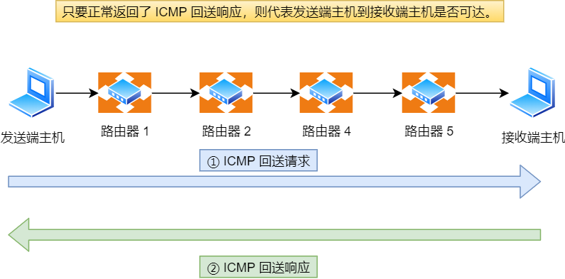

可以向对端主机发送回送请求的消息（ICMP Echo Request Message，类型8），也可以接收对端主机发回来的回送应答消息（ICMP Echo Reply Message，类型0）。


* **标识符**：用以区分是哪个应用程序发ICMP包，比如用进程`PID`作为标识符；
* **序号**：序列号从0开始，每发送一次新的回送请求就会加一，用来确认网络包是否有丢失。

在**选项数据**中，ping还会存放发送请求的时间值，用来计算往返时间，说明路程的长短。

##### 差错报文类型

* 目标不可达-----类型为3
* 原点抑制消息--类型为4
* 重定向消息-----类型为5
* 超时消息---------类型为11

**目标不可达**

IP路由器无法将IP数据包发送给目标地址时，会给发送端主机返回一个目标不可达的ICMP消息，并在这个消息中显示不可达的具体原因，记录在ICMP包头的代码字段。


* 网络不可达0：匹配不到接收方IP的网络号
* 网络不可达1：主机没有连接到网络，或路由表中没有该主机信息。
* 网络不可达2：使用TCP协议访问对端主机时，对端禁用了TCP协议访问。
* 网络不可达3：对端端口没有监听我要访问的端口。
* 网络不可达4：设置了禁止分片，但是中间超过了某网络的MTU，导致分片被丢弃。

**源点抑制消息**

当路由器向低速线路中发送数据时，发送队列的缓存变成零而无法发送出去时，可以向IP包的源地址发送一个ICMP源点抑制消息。

主机收到该消息后了解线路拥堵，增大IP包传输间隔，减少网络拥堵情况。

但是可能会引起不公平通信，一般不使用。

**重定向消息**

路由器发现发送端主机使用了不是最优路径发送数据，会返回ICMP重定向消息，包含最合适路由信息和源数据。

**超时消息**

IP包中有一个字段为TTL（Time to live，生存周期），它的值随着每次经过路由器减一，直到减到零时该IP包被丢弃，同时，路由器会发送一个ICMP超时消息给发送端主机，通知该包被丢弃。

可以避免IP包无休止的在网络中被转发。

有时候可以用TTL控制包的到达范围。

##### ping的使用

ping执行时，源主机构建一个ICMP回送请求消息数据包。

包含多个字段，其中最重要的两个：

* 类型，对于回送消息而言该字段为8；
* 序号，区分连续ping时发出的多个数据包；

每发送一个请求数据包，序号就自动加一。为了方便计算RTT，在报文数据部分插入了发送时间。


然后，ICMP协议将这个数据包连同地址一起交给IP层。IP层以该地址作为目的地址，本机IP作为源地址，协议字段设置为1，表示ICMP协议，加上其它控制信息，构建一个IP数据包。


然后加上MAC头，如果有目的IP对应MAC地址，直接附上，否则使用ARP协议查询。获得MAC地址后，由数据链路层构建一个数据帧，目的地址是IP层传来的MAC地址，源地址为本机MAC地址；附加一些控制信息。根据以太网的介质访问规则，将其发送出去。


送达后，比较IP层，IP层将有效信息提取后交给ICMP协议。

主机B构建一个ICMP回送响应数据包，回送响应数据包的类型字段为0，序号为接收数据包中的序号，然后发送出去给主机A。


如果规定时间内没收到应答包，说明主机不可达，然后检查时间。


可以看出 ping 这个程序是**使用了 ICMP 里面的 ECHO REQUEST（类型为 8 ） 和 ECHO REPLY （类型为 0）**。

##### traceroute----差错报文类型的使用

作用一：故意设置特殊TTL，追踪沿途经过的路由器。可以按**递增顺序发送UDP包**，不过有的路由器不会返回这个ICMP，所以看不到。

traceroute发送UDP包时，会**填入不可能的端口号**作为UDP目标端口号，然后会收到ICMP差错报文端口不可达，说明到达了目的主机。

作用二：故意设置不分片，从而确定路径的MTU，实现MTU发现。


原理：设置分片禁止标志位为1，如果被丢弃，则通过ICMP不可达消息将链路MTU的值一起发送给主机，从而定位一个合适的MTU值。

#### ping本地地址

##### 127.0.0.1是什么

127开头的是回环地址，127.0.0.1是其中一个

在IPv6中，这个命令为ping6 ::1

##### ping是什么

ping是一个应用层命令，尝试发送一个小小的消息到目标机器上，判断机器是否可达。

##### TCP发数据和ping的区别


socket的参数不一样：

* TCP：`socket(AF_INET, SOCK_STREAM, 0)`，使用`host:port`方式解析网络地址，`SOCK_STREAM`指使用面向字节流的TCP协议。工作在传输层。
* ping：`socket(AF_INET,SOCK_RAW,IPPROTO_ICMP)`，`SOCK_RAW`指使用原始套接字，工作在网络层，其它一样。

##### 为什么断网了还能ping通127.0.0.1


在网络层时，系统根据目的IP获取对应路由信息，包含选择哪个网卡：

* 目标IP是外网IP：从真网卡发出
* 目标IP是回环地址：从本地网卡发出

本地网卡，其实就是个**"假网卡"**，它不像"真网卡"那样有个`ring buffer`什么的，"假网卡"会把数据推到一个叫 `input_pkt_queue` 的 \**链表\** 中。这个链表，其实是所有网卡共享的，上面挂着发给本机的各种消息。消息被发送到这个链表后，会再触发一个**软中断**。

专门处理软中断的`ksoftirqd`内核线程收到软中断后立马到链表把消息取出，顺着数据链路层、网络层等传递给应用程序。

ping 回环地址和**通过TCP等各种协议发送数据到回环地址**都是走这条路径。

##### ping回环地址和ping本机地址的区别

都是走lo0回环地址，没有区别。

##### 127.0.0.1和localhost和0.0.0.0有区别吗？

localhost是一个域名，默认解析为127.0.0.1

0.0.0.0在IPv4中是无效地址，ping 0.0.0.0无效。

但是在listen的时候很有用

connect的时候不可用使用0.0.0.0，必须指明连接哪个服务器IP。

（完）


# 操作系统

## 1. 硬件结构

### 1.1 CPU如何执行程序

#### 1.1.1 图灵机

图灵机通过纸带、读写头、存储单元、控制单元、运算单元可以完成一些运算：

* 纸带：类似内存，纸带上的格子好比内存中的数据或程序。
* 读写头：读取纸带上的字符，也可以将字符写入到纸带。
* 存储单元：存放数据。
* 控制单元：识别字符是数据还是指令，控制程序的流程。
* 运算单元：用于执行运算指令。

#### 1.1.2 冯诺伊曼模型

定义了计算机基本结构：运算器、控制器、存储器、输入设备、输出设备。也被称为冯诺依曼模型。


各个单元之间通信还需要总线，关系如图：


##### 内存

程序和数据都存储在内存，存储的区域是线性的。

存储数据的基本单位为字节，一字节等于8比特，每一个字节对应一个内存地址。

内存地址从0开始编号，自增排序，最后一个地址为内存总字节数-1。内存读写任何一个数据的速度是一样的。

##### 中央处理器

CPU，区别在于一次可以计算多少字节数据：

* 32位CPU，一次可以计算四个字节；
* 64位CPU，一次可以计算八个字节；

设计多位CPU的原因：可以一次完成大数的运算，CPU位宽越大，计算的数值越大，32位CPU能计算的最大整数为`42'9496'7295`。

寄存器：在CPU里，紧挨着控制单元和逻辑运算单元，计算速度快

* 通用寄存器：用来存放需要进行计算的数据。
* 程序计数器：用来存储CPU要执行的下一条指令所在的**内存地址**（指令此时还在内存中）。
* 指令寄存器：用来存放当前正在执行的指令，也就是指令本身，指令在被执行完成之前，都存储在这里。

##### 总线

用于CPU和内存以及其它设备之间的通信：

* 地址总线：指定CPU将要操作的内存地址
* 数据总线：用于读写内存的数据
* 控制总线：用于发送和接收信号，如中断、设别复位等信号，CPU收到信号后自然进行响应也需要使用控制总线。

CPU读写内存数据的时候：

1. 通过**地址总线**来指定**内存的地址**；
2. 通过**控制总线**控制**读**或**写**命令；
3. 通过**数据总线**来**传输数据**；

##### 输入输出设备

输入设备向计算机输入数据，经过计算机计算，将数据输出到输出设备。

#### 1.1.3 线路位宽与CPU位宽

数据通过电压实现在线路上运输：

* 0：低电压
* 1：高电压

为了避免低效率的串行运输的方式，线路位宽被设计为一次能访问到所有的内存地址。

CPU通过地址总线访问内存地址，如果有32条地址总线，则CPU可以操作4 G大的内存。

**CPU位宽最好不低于线路位宽**，否则工作起来非常复杂且麻烦。

如果计算的**数额不超过32位数字**，则**32和64位区别不大**，只有计算大于32位数字时，64位的优势才能体现出来。

32位CPU只能寻址4 GB内存，就算装了8 GB内存条也没用。(**64位优势在于可以有更大的寻址空间**)

#### 1.1.4 程序执行的基本过程

1. CPU读取程序计数器的值，若这个值为指令的内存地址。CPU的**控制单元**操作**地址总线**指定需要访问的内存地址，然后通知内存设备准备数据，数据准备好后通过**数据总线**将指令数据传给CPU，CPU收到内存传来的数据后，将这个指令数据存入到**指令寄存器**。
2. **程序计数器自增**，指向下一条指令。自增的大小由CPU的位宽决定，若为32位CPU，指令是4个字节，需要4个内存地址存放，程序计数器的值会自增4。
3. **CPU分析**指令寄存器中的指令，确定指令的类型和参数，如果是**计算类型**，则交给**逻辑运算单元**处理；如果是**存储类型**的指令，则交给**控制单元**执行。

这个取指、执指的循环称为CPU的指令周期。

#### 1.1.5 指令执行的具体过程

例：`a = 1 + 2`

1. CPU不认识这个字符串，所以需要将程序编译成汇编语言。编译过程中，编译器将属于数据的1和2存放到数据段中。将指令放到正文段中。
2. 使用汇编器将汇编代码翻译成机器码，即一系列计算机指令。使CPU可读。
3. 将程序计数器设为`0x100`地址，依次执行指令。


由于上面的过程在32位CPU执行，所以每条指令间隔4个字节。

即**指令的大小**由**CPU位数**决定。

而**数据的大小**由指定的**变量类型**决定，如`int`占4个字节，`char`占一个字节。

##### 指令

不同的CPU由不同的指令集，对应不同的汇编语言和不同的机器码，下面使用的例子为MIPS指令集。

MIPS指令为32为整数，高6位标识操作码，表示指令是一条什么样的指令，剩下26条指令主要有三种类型：R、I、J。


* R指令：用于算术和逻辑操作，里面有读取和写入数据的寄存器地址。如果是逻辑位移操作，后面还有位移操作的**位移量**，而最后的**功能码**则是在前面的操作码不够的时候，**拓展操作码**对应的具体指令的；
* I指令，用在数据传输、条件分支等。这个类型的指令，没有了位移量和功能码，也没有了第三个寄存器，将三个部分直接合并为一个**地址值**或一个**常数**。
* J指令，用在跳转，高6位之外的26位都是一个**跳转后的地址**。

a = 1 + 2 ==> 【add 指令将 R0寄存器和R1寄存器值相加，放入R2】


加和运算add属于R指令：

* add对应`000000`，功能码`100000`。
* rs表示第一个寄存器`R0`编号，即`00000`
* rt表示第二个寄存器`R1`编号，即`00001`
* rd表示第三个寄存器`R2`编号，即`00010`
* 不是位移操作，所以位移量`00000`；

拼在一起就是32位MIPS加法指令`0x00011020`。

编译器编译程序会构造指令，称为指令的编码，CPU执行程序的时候会解析指令，称为指令的解码。

现代CPU通常会将整个过程使用流水线的方式来执行指令，分为4个部分，称为4级流水线：


具体含义：

* CPU通过程序计数器读取对应内存地址的指令，称为Fetch（取指）；
* CPU对指令进行解码，称为Decode（译指）；
* CPU执行指令，称为Execution（执指）；
* CPU将计算结果存回寄存器或者将寄存器的值存入内存，称为Store（回写）；

这四个阶段被称为指令周期（Instruction Cycle），不同阶段由计算机不同组件完成。

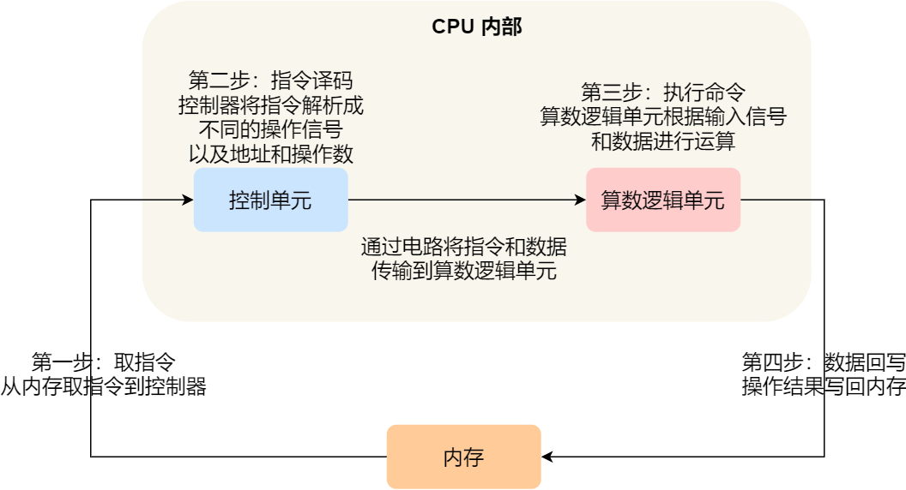

* 取值阶段，指令存放在存储器里，通过程序计数器和指令寄存器取指的过程是由**控制器**操作的。
* 指令的译码阶段，也是由**控制器**进行的；
* 指令执行过程，**算术操作**、**逻辑操作**、**数据传输**、**条件分支操作**都是**算术逻辑单元**操作的，即由运算器处理的。但**简单的无条件地址跳转**，是直接在**控制器**里完成的，不需要用到运算器。

##### 指令类型

从功能角度，可以分为5类：

* **数据传输**类型的指令：如`store`/`load`是寄存器与内存间进行数据传输的指令，`mov`是将一个内存地址的数据移动到另一个内存地址的指令；
* **运算类型**的指令：如加减乘除、位运算、比较大小等，最多只能处理两个寄存器中的数据。
* **跳转类型**的指令：通过修改程序计数器的值来跳转执行指令，如`if-else`、`switch-case`、函数调用等。
* **信号类型**的指令：如发生中断的指令`trap`；
* **闲置类型**的指令：比如指令`nop`，执行后CPU会空转一个周期；

##### 指令执行速度

CPU时钟周期：一个时钟周期内，CPU可以完成一个最基本动作，时钟频率越高，时钟周期越短，工作速度越快。

一个指令可能需要多个周期才能完成。

程序执行速度越快，耗费的CPU时间越少：CPU执行时间为CPU时钟周期数（CPU Cycles）和时钟周期时间（Clock Cycle Time）的乘积。


**周期数**与**周期时间**是降低CPU执行时间的两个因素。

**CPU时钟周期数 = 指令数 * 每条指令的平均时钟周期数**（Cycles Per Instruction，CPI）：


所以优化程序的三个方面：

* **指令数**：表示执行程序需要多少指令，以及哪些指令。这个层面基本靠编译器优化。
* **CPI**：现代CPU通过流水线技术（Pipline）使指令需要的CPU时钟周期数尽可能少；
* **时钟周期时间**：计算机主频，取决于硬件，有的CPU支持超频，但是是有代价的。

### 1.2 磁盘速度比内存慢几万倍？


#### 1.2.1 存储器的层次结构


##### 寄存器

寄存器的数量通常在几十到几百之间，每个寄存器可以用来存储一定的字节的数据：

* 32位CPU中大部分寄存器可以存储4个字节；
* 64位CPU中大部分寄存器可以存储8个字节；

寄存器的速度可以达到在**半个CPU时钟周期**内完成读写。如2 G主频的CPU，时钟周期1/2 G = 0.5 ns。

CPU处理一条指令的时候，除了读写寄存器，还要解码指令、控制指令执行和计算。如果寄存器的速度太慢，会拉长指令的处理速度，给用户卡的感觉。

##### CPU Cache

CPU Cache使用SRAM（Static Random-Access Memory，静态随机存储器）的芯片。需要有电才能保持数据。

SRAM里一个bit需要六个晶体管，所以存储密度不高，当时电路简单，访问速度非常快。

CPU高速缓存可以分为L1、L2、L3三层高速缓存。


* L1高速缓存

  几乎和寄存器一样快（**2~4个时钟周期**），大小在几十KB到几百KB不等。

  每个CPU核心有一块独立L1高速缓存，指令和数据在L1分开存放，分为指令缓存和数据缓存。

* L2高速缓存

  每个CPU核心都有，但是距离CPU更远，大小更大。

  访问速度（**10~20时钟周期**），大小在几百KB到几MB不等。

* L3高速缓存

  几个CPU共用，位置比L2更远，大小通常在几MB到几十MB。访问速度（**20~60时钟周期**）。

##### 内存

内存使用DRAM（Synamic Random Access Memory，动态随机存取存储器）芯片。

DRAM密度更高，功耗更低，容量更大，造价比SRAM便宜。

DRAM存储一个数据需要一个晶体管和一个电容，但电容会漏电，所以需要定时刷新电容，保证数据不会被丢失。所以被称为动态存储器。

DRAM数据访问和刷新电路都比SRAM更复杂，所以访问速度更慢，速度大概在**200~300**时钟周期之间。

##### SSD/HDD硬盘

SSD（Solid-state disk），即固态硬盘，断电后数据还存在，**内存读写速度比SSD快大约10~1000倍**。

HDD（Hard Disk Drive），即机械硬盘，物理读写数据，**速度比内存慢10 w倍左右**。

#### 1.2.2 存储器的层次关系

CPU并不会直接和每一种设备接触，而是每一种存储器设备只和它相邻的存储器设备打交道。


CPU需要访问某个数据时，会一直往下查。


存储器结构形成了缓存体系。

#### 1.2.3 存储器的差异


CPU贵，高速缓存占很大一部分。

### 1.3 如何写出让CPU跑更快的代码

利用CPU cache机制，可能可以使有内存读写的代码跑得更快。


#### 1.3.1 CPU Cache到底有多快

* 一次内存访问的时间：200~300多个时钟周期。

* L1 Cache ：2~4个时钟周期

* L2 Cache ：10~20个时钟周期

* L3 Cache ：20~60个时钟周期

CPU从L1 Cache读取数据的时间，会比从内存读取数据的时间快100多倍。

其中**L1 Cache**通常会分为**数据缓存**和**指令缓存**。

L1 Cache 和 L2 Cache是每个CPU核心独有的，而L3 Cache 是多个CPU核心共享的。

程序执行时，会将内存中的数据加载到L3 Cache中，然后再加载到每个核心独有的L2 Cache，最后进入最快的L1 Cache，最后被CPU读取。

#### 1.3.2 CPU Cache 的数据结构和读取过程

##### 数据结构

CPU Cache的结构：


CPU Cache由Cache Line组成，Cache Line是内存读取数据的基本单位，由各种标志（Tag）和数据块（Data Block）组成。

CPU Cache读取数据并不是按照元素读取的，而是按块读取的，称为Cache Line（缓存块）。在Linux中，L1 Cache Line大小为64字节，即**L1 Cache 一次载入数据大小为64字节**。

当CPU读取数据时，无论数据在不在Cache中，CPU都会先访问Cache，找不到再去内存，并把内存中的数据读入到Cache中，CPU再从CPU Cache 读取数据。


这和**内存作为硬盘的缓存**逻辑一样。


假设Cache有32行，则这32行的位置可以作为一个信息，从而缩短Cache Line的长度。

将内存地址按Cache块分组后，将内存块的地址对Cache行数进行取余，得到索引号，剩余的长度作为组标记。


所以CPU Cache Line有三个信息：

* 有效位，标记数据是否有效；
* 组标记，标记内存块组号；
* 从内存中加载过来的实际存放数据。

通过行号，组标记，内存块偏移量三个因素，就可以找到内存中某个字对应CPU Cache Line中的位置。


##### 读取过程（直接映射Cache）

内存数据与Cache数据的映射流程：

1. 根据内存地址中索引信息，计算出CPU Cache中的索引，即找到对应的CPU Cache Line的地址。
2. 找到对应CPU Cache Line，判断CPU Cache Line的有效位，确认CPU Cache Line中数据是否是有效的，如果是无效的，CPU会直接访问内存，并重新加载数据，如果数据有效，则往下执行。
3. 对比内存地址中组标记和CPU Cache Line中的组标记，确认CPU Cache Line中的数据是要访问的内存数据，如果不是，CPU会直接访问内存，并重新加载数据，如果是，则继续往下执行；
4. 根据内存地址中的偏移量信息，从CPU Cache Line中读取对应的字。

除了直接映射Cache外，还有通过内存地址找到CPU Cache中的数据的策略，如：

* 全相连Cache（Fully Associative Cache）
* 组相连Cache（Set Associative Cache）

#### 1.3.3 如何写出更快的代码

这个问题可以转化为：如何**写出提高CPU缓存命中率的代码**？

L1 Cache可以分为数据缓存和指令缓存，因此可以分开看数据缓存和指令缓存的缓存命中率。

##### 提升数据缓存命中率

在进行数据访问的时候，尽量**按照内存布局访问**，使得缓存机制被尽可能的利用起来。

##### 提升指令缓存的命中率

CPU分支预测器：对于分支语句，CPU可以预测跳到哪个分支，可以提前将预测的指令放到CPU Cache中，执行速度就会变快。

例：对于随机成立的分支，CPU的预测性能较差，但是对于可预测的分支，CPU动态根据历史命中数据进行预测，命中率就会很高。也可以使用`likely`和`unlikely`宏，标识预测哪个分支可能性更大。

实际上，CPU自身的动态分支预测已经比较准了，除非非常确信CPU预测不准，并且知道实际的概率情况时，才建议使用这两种宏。

##### 如何提升多核CPU缓存命中率

对于单核CPU，虽然每次只能执行一个线程，但每个线程有时间片，各个线程按时间片交替占用CPU，宏观上看各个线程同时在执行（并行）。

对于多核CPU，线程可能在不同CPU核心之间来回切换，这样可能导致各个核心的缓存命中率收到影响。我们可以把**线程绑定到某一个CPU核心**上，使性能得到非常可观的提升。

Linux提供了`sched_setaffinity`方法，实现将线程绑定到某个CPU核心这一功能。

### 1.4 CPU缓存一致性

#### 1.4.1 CPU Cache 的数据写入

在考虑Cache的情况下，有两种将数据写入操作：写直达（Write Through）、写回（Write Back）。

##### 写直达

保持内存与Cache一致性的最简单方法：将数据同时写入内存与Cache中。


这种做法很直观，但也问题明显：无论数据是否在Cache里，**每次写操作都会写回内存**，这样会花费大量时间，性能会受到很大的影响。

##### 写回

当发生写操作时，新的数据总是**只被写入到Cache Block**中，只有当修改过的Cache Block被替换时才需要写到内存中，减少了数据写回内存的频率，提高了系统的性能。


只有在缓存不命中，且对应Cache Block为脏的情况下，才会将数据写到内存中，而在缓存命中后，只需把该数据对应的Cache Block标记为脏即可，而不用写到内存里。

这样的好处在于，如果大量操作都能命中缓存，则大部分时间里CPU都不需要读写内存，自然比写直达性能高很多。

综合读写的流程：


#### 1.4.2 缓存一致性问题

现在CPU都是多核的，由于L1/L2 Cache是多个核心各自独有的，会带来多核心的缓存一致性问题（Cache Coherence）。如果不能保证缓存一致性问题，可能导致结果错误。

可以通过保证以下两点保证缓存一致：

* 写传播（Write Propagation）：当某个CPU核心里的Cache数据更新时，必须要传播到其他核心的Cache；
* 事务的串行化（Transaction Serialization）：某个CPU核心里对数据的操作顺序，必须在其他核心看起来顺序是一样的。

要实现事务的串行化，要做到：

* CPU核心对于Cache中数据的操作，需要同步到其他CPU核心。
* 如果两个CPU核心中有相同数据的Cache，对于这个Cache数据的更新，只有拿到了锁，才能进行对应数据的更新。（串行，不可以同时发生修改）

#### 1.4.3 总线嗅探

实现缓存一致的方法。即CPU时刻关注总线上的Cache更新广播，并检查自己是否有相同的数据在L1 Cache里。修改的时候也需要通过总线将这个事件通知到所有CPU核心。

总线嗅探（Bus Snooping）实现方式简单，但是需要CPU时刻监听总线上的一切活动。且经常需要在总线广播修改事件，加重总线负载。

且总线嗅探只能保证写传播，**不能保证事务串行化**。

#### 1.4.4 MESI协议

MESI协议通过四个状态标记Cache Line。

* Modified，已修改。
* Exclusive，独占
* Shared，共享
* Invalidated，已失效

已修改：标识Cache Block上的数据已经被更新过，但是还没有写到内存里。

已失效：表示这个Cache Block上的数据已经失效了，不可以读取该状态的数据。

独占：Cache Block里的数据是干净的，但只在一个CPU的Cache里。

共享：Cache Block里的数据是干净的，且在其它CPU的Cache里。

独占状态的数据可以直接修改，不需要通知其它CPU。若独占状态的数据被其它CPU核心也缓存了，需要将所有缓存的该数据修改为共享状态。

共享状态的数据需要更新的时候，需要广播一个请求，将其它CPU核心里的数据标记为失效状态，同时将自己的数据修改为已修改状态，然后更新自己Cache里的数据。

当Cache Line是已修改或者独占状态的时候，修改更新数据不需要发送广播给其它CPU核心，在一定程度上减少了总线带宽压力。

这些转化可以通过一个有限状态机表示：


总结：


注意，不同核心的Cache之间不能直接读取对方的数据。

### 1.5 CPU是如何执行任务的

#### 1.5.1 CPU是如何执行任务的

##### CPU伪共享

当两个不同CPU核心所读取的两个不同变量位于一个Cache Line时，处于伪共享状态。

* 两个CPU核心读取了同一个Cache Line，这时Cache Line被标记为S状态。
* CPU核心1修改了其中的变量a，这时，CPU核心1 Cache Line状态变为M状态，CPU核心2 Cache Line状态被标记为I状态。
* CPU核心2想要修改其中的变量b，但是Cache Line状态为I，所以需要将CPU核心1的Cache Line数据写回内存，然后再从内存中读取数据，然后做出修改。此时CPU核心1 Cache Line状态变成I，CPU核心2 Cache Line状态变为M。

此时，Cache Line缓存等同于失效了。

##### 解决伪共享

对于多个线程共享的热点数据，即经常会修改的数据，应该尽量避免这些数据刚好在同一个Cache Line上，否则就会出现伪共享的问题。

在Linux内核中存在`__cacheline_aligned_in_smp`宏定义，通过该宏可以解决伪共享问题。

从宏定义可以看到：

* 在多核系统（MP）里，该宏定义为`__cacheline_aligned`，即Cache Line的大小。
* 在单核系统里，该宏定义为空。

因此，针对在同一个Cache Line中共享的数据，如果多核之间的竞争比较严重，为了防止伪共享现象的发生，可以采用上面的宏定义使得变量在Cache Line里是对齐的。

如：


a和b不会在同一个Cache Line里了。


所以避免伪共享是利用了空间换事件的思想，浪费一部分Cache空间，换来性能的提升。

在应用层方面，有一个Java并发框架Disruptor使用字节填充+继承的方式，避免伪共享的问题。


在64位系统上，7个long数据可以填充56个字节，保证`RingBufferPad`两端的数据肯定不会在同一个Cache Line里。且`RingBufferFields`里定义的变量都是用final修饰的，意味着第一次加载后就不会再修改。

#### 1.5.2 CPU是如何选择线程的

在Linux内核中，进程和线程都是用`task_struct`结构体表示的，区别在于线程的`task_struct`结构体里部分资源是共享了进程已创建的资源，如**内存地址空间**、**代码段**、**文件描述符**等，所以Linux中的线程也被称为轻量级进程。


根据任务优先级及响应要求，分为：

* 实时任务，对系统的响应时间要求很高，优先级在0~99范围内；
* 普通任务，响应时间没有很高的要求，优先级在100~139范围内。

##### 调度类

Linux为了保障高优先级任务能够尽可能早的被执行，分为了这几种调度类：

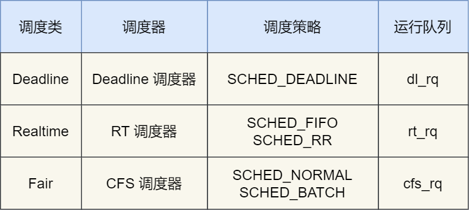

Deadline和Realtime这两个调度类都是应用于实时任务的，这两个调度类的调度策略合起来共有三种：

* `SCHED_DEADLINE`：按照deadline来进行调度，**距离当前时间点最近的deadline任务**会被优先调度；
* `SCHED_FIFO`：对于相同优先级的任务，按**先来先服务**的原则，但是**优先级高**的任务**可以抢占**低优先级的任务，也就是优先级高的可以插队；
* `SCHED_RR`：对于相同优先级的任务，**轮流运行**，每个任务都有一定的时间片，当用完时间片的任务会被放到队列尾部，以保证相同优先级任务的公平性，但是高优先级的任务依然**可以抢占**低优先级的任务。

而Fair调度类是应用于普通任务，都是由CFS调度器管理的，分为两种调度策略：

* `SCHED_NORMAL`：**普通任务**使用的调度策略；
* `SCHED_BATCH`：**后台任务**的调度策略，不和终端进行交互，因此不影响其它需要交互的任务，可以适当降**低**它的**优先级**。

##### 完全公平调度

对于普通任务而言，公平性最重要，所以在Linux里实现了一个基于CFS算法，即完全公平调度（Completely Fair Scheduling）。

理念：给每个任务安排一个虚拟运行时间vruntime，如果一个任务在运行，其运行得越久，该任务的vruntime自然会越大，而没有被运行的任务，vruntime是不会变化的。在CFS算法调度的时候，会**优先选择vruntime少的任务**，保证每个任务的公平性。

再考虑优先级，计算虚拟时间vruntime还考虑普通任务的权重值：


内核中有一个nice级别与权重值转化的表，nice级别越低的权重值越大，权重越大vruntime越小，所以在同样的实际运行时间里，低优先级的任务比高优先级的任务虚拟运行时间更少，即**高权重的任务更优先被调度，获得的实际运行时间更多**。

##### CPU运行队列

一个系统通常会运行很多任务，多任务的数量级别都是远超CPU核心数量，这时需要排队。

实际上，每个CPU都有自己的运行队列（Run Queue，rq），用于描述CPU上运行的所有进程，其队列包含三个运行队列，Deadline运行队列`dl_rq`，实时任务运行队列`rt_rq`和CFS运行队列`cfs_rq`，其中`cfs_rq`是用红黑树描述的，按vruntime大小排序，最左侧的叶子节点，就是下次会被调度的任务。


调度也是有优先级的：Deadline > Realtime > Fair，Linux在选择下一个任务执行的时候，会按照此优先级顺序来进行选择，即先从`dl_rq`选择任务，然后从`rt_rq`选择任务，最后从`cfs_rq`选择任务，因此，**实时任务总是会比普通任务优先被执行**。

##### 调整优先级

如果启动任务的时候没有指定优先级，则默认情况下都是普通任务。如果想让某个普通任务有更多的执行时间，可以调整任务的nice值，从而让优先级高一些的任务执行更多时间。nice值能设置的范围是-20 ~ 19，值越低优先级越高，默认为20。

nice值表示的不是优先级，而是优先级的修正数值：priority(new) = priority(old) + nice，nice映射值为100 ~139，因此，nice值调整的是普通任务的优先级。


可以在启动任务时指定nice值，如：


也可以修改已经在运行中任务的优先级：


也可以将改变任务的调度策略使其变成实时任务：

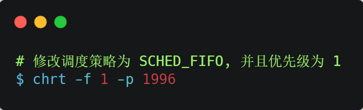

### 1.6 什么是软中断

#### 1.6.1 中断是什么

中断时用来响应硬件设备请求的一种机制，操作系统受到硬件的中断请求，会打断正在执行的进程，然后调用内核中的中断处理程序来响应请求。

中断请求的响应程序，即中断处理程序，要尽可能快的执行完，以减少对正常进程运行调度的影响。

#### 1.6.2 什么是软中断

Linux系统为了解决中断处理程序执行过长和中断丢失的问题，将中断分成了两个阶段，分别是上半部和下半部分。

* 上半部用来**快速处理中断**，一般会暂时关闭中断请求，主要负责处理跟硬件紧密相关活时间敏感的事情。
* 下半部用来延迟处理**上半部未完成的工作**，一般以内核线程的方式运行。

例：网卡接收网络包：

* 网卡收到网络包，通过DMA方式将接收到的数据写入内存，接着通过硬件中断通知内核有新的数据到了。
* 【上半部】内核调用对应中断处理程序，禁止网卡中断，避免频繁中断，降低内核工作效率，并触发软中断。
* 【下半部】**软中断**将一些比较复杂且耗时的工作交给软中断处理程序去做，主要是从内存中找到网络数据，再按照网络协议，对网络数据进行逐层解析和处理，最后把数据送给应用程序。

硬件中断会打断CPU正在执行的任务，然后立即执行中断处理程序，而软中断以内核线程方式执行，每一个CPU对应一个软中断内核线程，名字通常为[`ksoftirqd/CPU编号`]，如`ksoftirqd/0`。

软中断不止包括处理硬件设备中断的下半部，一些内核自定义事件也属于软中断，如**内核调度**、**RCU锁**（内核里常用的一种锁）等。

##### 系统中有哪些软中断

可以通过`/proc/softirqs`的内容来知晓软中断的运行情况，以及`/proc/interrupts`的内容来知晓硬中断的运行情况。


第一列中内容代表软中断的类型：`NET_RX`表示网络接收中断，`NET_TX`表示网络发送中断、`TIMER`表示定时器中断、`RCU`表示RCU锁中断、`SCHED`表示内核调度中断。

需要注意同一种中断在不同CPU里的分布情况，正常情况下，同一种中断在不同CPU里累计次数相差不多。

系统的中断次数变化速率需要特别关注，可以使用`watch -d cat /proc/softirqs`命令查看中断次数的变化速率。

软中断以内核线程的方式执行，可以用ps命令查到：


内核线程的名字外面都有中括号，说明ps无法获取它们的命令行参数，所以一般来说，名字在中括号里的都可以认为时内核线程。

#### 1.6.3 如何定位软中断CPU使用率过高问题

可以通过top命令查看系统软中断的情况。


si是CPU在软中断上的使用率。

如果要知道是哪种软中断导致的，可以使用`watch -d cat /proc/softirqs`查看每个软中断类型的中断次数的变化速率。

一般对于I/O比较高的Web服务器，NET_RX网络接收中断的变化速率相比于其它中断类型快很多。

如果发现NET_RX网络接收中断次数的变化速率过快，接下来就可以使用sar -n DEV查看网卡的网络包接收速率情况，分析是哪个网卡有大量的网络包进来。


然后通过`tcpdump`抓包，分析这些包的来源，如果是非法的地址，可以考虑加防火墙，如果是正常流量，则要考虑硬件升级等。

### 1.7 浮点数

#### 1.7.1 为什么负数要用补码表示

如果不用补码，则相加的时候还需要额外判断是否是负数，如果是负数，还得把加法反转成减法，或者把减法反转成加法。如果采用补码，则直接加减就行了。

#### 1.7.2 进制转换

二进制转十进制：乘二相加

十进制转二进制：除二取余

而取余可能取不尽，所以可能会造成精度缺失。

#### 1.7.3 计算机如何存小数

采用浮点数来存储：


* 符号位：表示数字是正数还是负数
* 指数位：指定小数点在数据中的位置，可正可负，指数位越长则数值表达范围越大。
* 尾数位：小数点右侧的数值，位数部分长度决定了数的精度，如果要表示精度高的小数，要提高数位长度。

32位单精度浮点数与64位双精度浮点数：

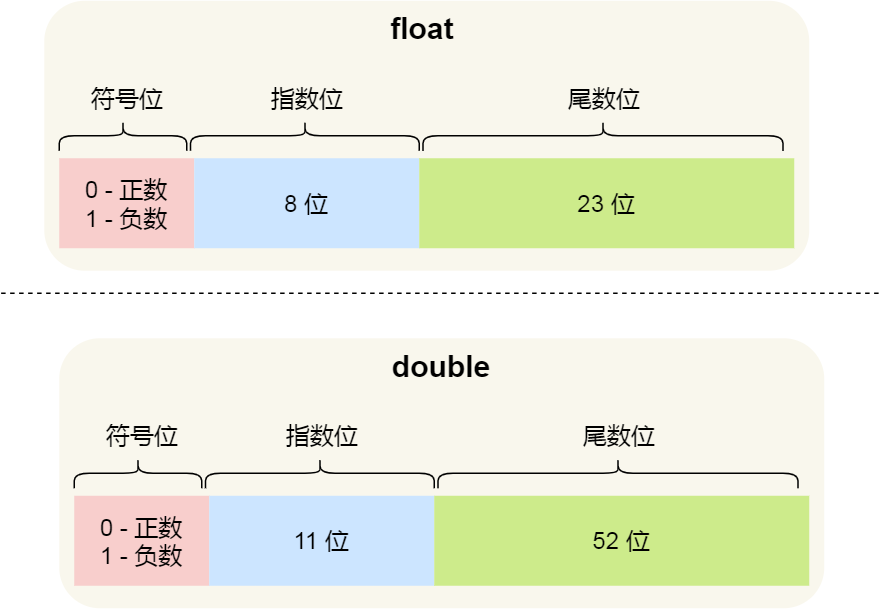

转化规则：


指数只能是正数，而正常允许范围为126~-127，所以指数为数右移位数 + 127。

## 2. 操作系统结构

### 2.1 Linux内核与Windows内核

#### 2.1.1 内核

内核是软件与硬件交通的桥梁，通过内核与计算机硬件设备对接通信协议，应用可以使用电脑的硬件。


内核的基本能力：

* 管理**进程、线程**，决定哪个进程、线程使用CPU，也就是进程调度的能力；
* 管理**内存**，决定内存的分配与回收，也就是内存管理的能力；
* 管理**硬件设备**，为进程与硬件设备之间提供通信能力，即硬件通信能力
* 提供**系统调用**，如果应用程序需要运行更高权限运行的服务，那么就需要有系统调用，它是用户程序与操作系统之间的接口。

内核工作原理：内核具有很高的权限，可以控制cpu、内存、硬盘等硬件，而应用程序具有的权限很小，因此大多数操作系统把内存分成了两个区域：

* 内核空间：这个内存空间只有内核程序可以访问；
* 用户空间：这个内存空间专门给应用程序使用。

**用户空间的代码**只能访问一个**局部的内存空间**，**内核空间的代码**可以访问**所有的内存空间**。当程序使用用户空间时，即程序在**用户态**执行，当程序使用内核空间时，程序在**内核态**执行。

应用若需要进入内核空间，需要通过**系统调用**：


当应用程序使用系统调用时，会产生中断，发生中断后，CPU会中断当前执行的用户程序，跳转到中断处理程序，也就是开始执行内核程序。内核处理完后，主动触发中断，把CPU执行权限交回给用户程序，回到用户态继续工作。

#### 2.1.2 Linux设计

##### MultiTask

多任务，指多个任务同时执行，可以是并发或者并行：

* **并发**：对于单核CPU，可以让每个任务执行一小段事件，时间到了就切换另外一个任务，从宏观角度看，一段时间执行了多个任务，被称为并发。
* **并行**：对于多核CPU，多个任务可以同时被不同核心的CPU同时执行，被称为并行。

##### SMP

SMP：**对称多处理**，代表每个CPU的地位是相等的，对资源的使用权限也是相同的，多个CPU共享同一个内存，每个CPU都可以访问完整的内存和硬件资源。

这个特点决定了Linux操作系统不会有某个CPU单独服务应用程序或内核程序，而是每个程序都可以被分配到任意一个CPU上被执行。

##### ELF

ELF：可执行文件链接格式，它是Linux操作系统中可执行文件的存储格式：


ELF把文件分成了一个个分段，每一个分段都有自己的作用。

ELF文件有两种索引，Program header table中记录了运行时所需的段，而Section header table记录了二进制文件中各个段的首地址。

ELF文件生成过程：

* 编译器将代码编译成汇编代码
* 汇编器将汇编代码变成目标代码，即目标文件.obj
* 链接器将多个目标文件以及调用的各种函数库链接起来，形成一个可执行文件，也就是ELF文件。

ELF文件执行过程：执行ELF文件时，通过装载器把ELF文件装载到内存里，CPU读取内存中的指令和数据，于是程序就被执行起来了。

##### Monolithic Kernel

Monolithic Kernel：**宏内核**，意味着Linux的内核是一个完整的可执行程序，且拥有最高的权限。

宏内核的特征是系统内核的所有模块，如进程调度、内存管理、文件系统、设备驱动等，都运行在内核态。

Linux也实现了动态加载内核模块的功能，如大部分设备驱动是以可加载模块的形式存在的，与内核其它模块解耦，让驱动开发和驱动加载更为方便、灵活。

**微内核**：内核只保留最基本的功能，如进程调度、虚拟机内存、中断等，把一些应用程序放到了用户空间，如驱动程序、文件系统等。这样服务与服务之间是隔离的，单个服务出现故障或完全攻击，也不会导致整个操作系统挂掉，提高了操作系统的稳定性和可靠性。

微内核功能少，可移植性高，缺点在于驱动程序不在内核中，而驱动程序需要频繁调用底层能力，于是驱动和硬件设备交互就需要频繁切换到内核态，带来性能损耗。

**混合类型内核**：内核里有一个最小版本的内核，其它模块在此基础上搭建。实现与宏内核类似，即将整个内核做成一个完整的程序，大部分服务在内核中。

#### 2.1.3 Window设计

Windows使用内核为Windows NT


Windows同样支持MultiTask和SMP，不同的是Windows的内核设计是混合型内核。内核中的MicroKernel就是最小版本的内核。

Windows可执行文件的格式与Linux不同，其格式为PE，称为可移植执行文件，拓展名通常为：`.exe`、`.dll`、`.sys`等。

PE的结构与ELF类似：


## 3. 内存管理

### 3.1 虚拟内存


#### 3.1.1 虚拟内存

单片机直接操作内存物理地址，两个程序之间互相不知道对方的地址，容易改变对方的数据，所以多程序同时运行很难。

虚拟内存作用：

* 可以使进程的**运行内存超过物理内存**大小。（程序运行的局部性原理 + 内存交换）；
* 每个进程有自己的页表，虚拟内存空间独立，解决了**多进程地址冲突**的问题；
* 页表中有设置状态的比特位，标记页是否存在、控制读写权限等。提供了更好的**安全性**。

操作系统为进程分配虚拟地址，使得程序之间不会互相冲突。

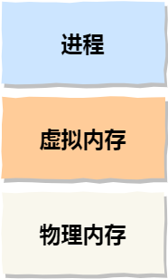

操作系统提供一种机制，使得不同进程的虚拟地址和不同内存的物理地址映射起来。

* 虚拟内存地址（virtual memory address）：程序使用的内存地址。
* 物理内存地址（physical memory address）：实际在硬件里面的空间地址。

操作系统引入虚拟内存，使虚拟地址通过CPU中的内存管理单元（MMU）的映射关系转变为物理地址，然后通过物理地址访问内存。


内存可以通过内存分段和内存分页两种方式管理两种地址之间的关系。

#### 3.1.2 内存分段

程序由若干个逻辑分段组成，可由代码分段、数据分段、栈段、堆段组成。不同的段有不同的属性，所以用分段的形式将这些段分离出来。

分段机制下虚拟地址由**段选择因子**和**段内偏移量**组成。

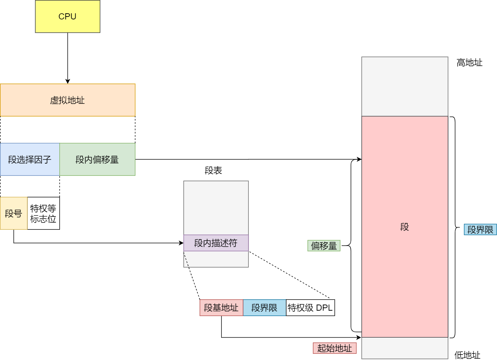

段选择因子和段内偏移量：

* 段选择因子保存在段寄存器内，段选择因子中最重要的是段号，用作段表的索引。段表里保存段的基地址、段的界限和特权等级等。
* 虚拟地址中的段内偏移量位于0和段界限之间，若合法，则可以得到物理内存地址。

虚拟地址通过段表与物理地址进行映射，分段机制将程序分为4个段，每个段在段表中有一项，通过这项获取段的基地址，加上偏移量就能找到物理内存中的地址。


缺点：

* 内存碎片
* 内存交换效率低

**内存碎片**：内存不连续，无法被分配出去


内存碎片分为**内部碎片**与**外部碎片**：

* 分段管理按需分配，需要多少分配多少，不会出现内部碎片
* 每个段长度不固定，多个段未必能使用全部空间，会产生不连续的小物理内存，导致新程序无法被装载。

外部碎片解决方法：**内存交换**，将数据写回硬盘，然后再从硬盘中读回来。

内存交换空间即硬盘中的swap空间，用于内存与硬盘的空间交换。

**内存交换效率低**：外部碎片多，写磁盘操作满，若交换一个内存大的程序，整个机器都会卡顿。

#### 3.1.3 内存分页

分页：将整个虚拟和物理内存空间切成一段段固定尺寸的大小，即页，在Linux下，每一页的大小为4 KB

页表：虚拟地址和物理地址的映射列表。


当进程访问的虚拟地址在页表中查不到时，系统产生**缺页异常**，进入系统内核空间分配物理内存、更新进程页表，最后再返回用户空间，恢复进程的运行。

进程通过分页方式分配内存**不会产生外部碎片**，因为页就是分配的基本单位，就算只有一页的间隙，系统也是可以分配出去的。但分页**会出现内部碎片**，因为即使程序不足一页大小，系统也只能分配一页，因为页就是基本单位。

内存交换效率高：内存不够时，系统会将其它进程最近没被使用的页**换出**（swap out），需要的时候再**换入**（swap in），一次性只会写入或写出几个页，效率较高。

分页允许在加载程序时**不一次性把全部页加载到内存空间里**，而是先进行虚拟内存与物理内存的映射，然后在程序运行中，需要用到对应虚拟内存页里的指令和数据时，再加载到物理内存里面去。

映射：虚拟地址分为两部分：页号和页内偏移


转换步骤：

* 虚拟地址切分成页号和偏移量；
* 根据页号从页表中查询对应物理页号；
* 直接拿物理页号，加上偏移量，得到物理内存地址；

分页的缺陷：页表占内存空间太大了。在32位系统下，一个进程使用4 GB的虚拟空间地址（每个进程都感觉自己在用整个虚拟内存空间），即2^20个页，每个页表项使用4个字节大小来存储页表，则需要4 MB内存存储页表。若有100个进程，则需要400 MB内存存页表。若为64位系统，则更大。

##### 多级页表

将页表项的单级页表再分页，每个一级页表项包含1024个二级页表项，形成二级分页：


由于局部性原理，需要用到的数据一般都是相邻的，所以有一级页表的页表项没有被用到，此时就不需要创建该项的二级页表，可以在有需要的时候创建二级页表，这样4MB的二级页表就可以不用满了，可以节省许多空间（相比于必须寻址整个虚拟内存空间的单级页表）。（一级页表已近寻址到整个内存空间了，二级页表有需要再创建）

将二级页表推广到多级页表，内存就可以省更多了，对于64位页表，两级分页也不够，变成了四级分页：

* 全局页目录项PGD（Page Global Directory）;
* 上层页目录项PUD（Page Upper Directory）；
* 中间页目录项PMD（Page Middle Directory）；
* 页表项PTE（Page Table Entry）；


（对于一个超大型的程序，能用几MB完成整个虚拟空间的映射，从而只加载需要的部分，太划算了）

##### TLB

TLB（Translation Lookaside Buffer）：专门存放程序最常访问的页表项的Cache，称为页表缓存、转址旁路缓存、快表等。


有了TLB后，CPU寻址时会先查TLB，没找到再查常规页表。

TLB命中率很高，因为程序经常访问的页就那么几个。

#### 3.1.4 段页式内存管理

内存分段和内存分页并不是对立的，而是可以组合使用。


实现方式：

* 先将程序分为有多个逻辑意义的段；
* 再将每个段分为多个页

这样，地址就由段号、段内页号和页内位移三部分组成。

段页变换数据结构：每个程序一张段表，每个段表建立一张页表，段表中的地址是页表的起始地址，页表中的地址位某页的物理页号：


段页式地址变换中要得到物理地址必须经过三次内存访问：

* 第一次访问段表，得到页表起始地址；
* 第二次访问页表，得到物理页号；
* 第三次将物理页号与页内位移组合，得到物理地址。

与多级页表类似，多级页表的顶级页表可以保证寻址到整个虚拟地址空间，其它页表只有在需要时创建；而段页内存管理中段可以确定哪些页是需要用的，避免浪费空间。虽然这两种方式增加了硬件成本和系统开销，但提高了内存的利用率。

#### 3.1.5 Linux内存布局

Linux内存主要采用页式内存管理，但也涉及到了段机制。因为Intel x86 CPU一律对程序中使用的地址进行段式映射，然后才进行页式映射。

但Linux中每个段都是从0地址开始的整个4 GB虚拟空间地址（32位），所有段的起始地址都是一样的，相当于屏蔽了处理器中的逻辑地址概念，段只被用于访问控制和内存保护中。

Linux操作系统中，虚拟空间被分为内核空间和用户空间两部分：


虽然每个进程都有各自独立的虚拟内存，但每个虚拟内存中的内核空间都是关联的相同的物理地址。这样程序在切换到内核态后可以方便的访问内核内存空间了。


用户空间又分为：


* 代码段，包括二进制可执行代码
* 数据段，包括已初始化的静态常量和全局变量
* BSS段，包括未初始化的静态变量和全局变量
* 堆段，包括动态分配的内存，从低地址向上增长
* 文件映射段，包括动态库、共享内存等，从低地址向上增长
* 栈段，包括局部变量和函数调用的上下文等，栈的大小是固定的，一般是8 MB。可以通过系统参数自定义
* 保留区，不可访问的内存保留区，表示非法地址。

7个内存段中，堆和文件映射区内存是动态分配的，可以用`malloc()`和`mmap()`分别在堆和文件映射段动态分配内存。

### 3.2 malloc


### 3.3 内存满了会发生声明


### 3.4 4GB物理内存的机器上申请8GB内存会怎么样


### 3.5 如何避免预读失效和缓存污染问题


### 3.6 Linux虚拟内存管理


### 3.7 Linux物理内存管理


## 4. 进程管理


## 5. 调度算法


## 6. 文件系统


## 7. 设备管理


## 8. 网络系统


## 9. Linux命令


# 数据库


# Redis


# 语言

# 
