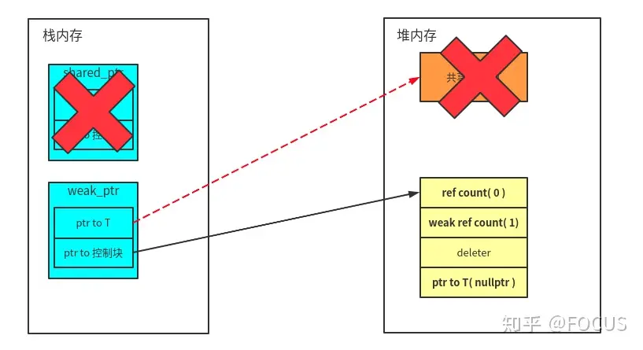
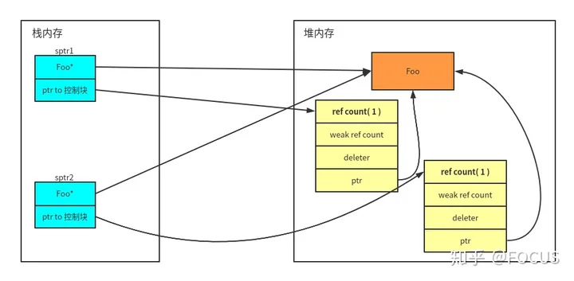
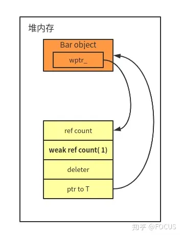

# 智能指针

* shared_pointer

* unique_pointer

  在某一时刻，只能有一个unique_pointer指向被管理的对象，可以直接使用对象进行初始化，也可以使用move函数进行初始化

  * reset：重新绑定对象，原对象被释放
  * release：释放指针所指对象并返回一个对象
  * swap：交换两个指针对象所指对象

* weak_pointer

## 原理RAII

构造的时候分配和创建被管理对象

析构的时候销毁和释放被管理对象

## 构造函数

* 拷贝构造：创建一个新的对象，并使用已有对象的值进行复制。使用深拷贝，对于指针对象会为其申请新的空间并复制已有对象的数据到新的空间中。

* 移动构造：创建一个新的对象，并从已有对象中“窃取”资源。它的参数通常是（&&），用于指定要移动的对象。移动构造函数通常在以下情况下会被调用：

  * 将一个临时对象转移到另一个对象时
  * 将一个对象作为返回值返回时

  移动构造执行的是浅拷贝，它会直接接管已有对象的资源（如指针），而不会进行数据的复制。这样可以避免不必要的内存分配和数据复制操作，提高性能。对于指针成员，同样执行浅拷贝，将指针内容复制过来，但是会将就指针赋值为nullptr，避免临时对象被析构时将数据释放。

## unique_ptr

`std:unique_ptr<T>`：独占资源所有权的指针。

**`unique_ptr`和普通指针的区别：**

1. 使用裸指针，需要释放内存：

   ```c++
   {
       int *p = new int(100);
       // ...
       delete p;
   }
   ```

2. 使用`unique_ptr`自动管理内存：

   ```c++
   {
       std::unique_ptr<int> uptr = std::make_unique<int> (200);
       // ...
       // 离开作用域自动释放
   }
   ```

**使用`unique_ptr`时的注意事项**：

1. `unique_ptr`是move-only的

   ```c++
   {
       std::unique_ptr<int> uptr = std::make_unique<int> (200);
       std::unique_ptr<int> uptr2 = uptr; // 编译错误
       std::unique_ptr<int> uptr3 = std::move(uptr);
       assert(uptr == nullptr);
   }
   ```

**技巧：**

1. `std::unique_ptr`可以指向一个数组。

   ```c++
   {
       std::unique_ptr<int[]> uptr = std::make_unique<int[]>(10);
       for (int i = 0; i < 10; i++){
           uptr[i] = i * i;
       }
       for (int i = 0; i < 10; i++){
           std::cout << uptr[i] << std::endl;
       }
   }
   ```

2. 自定义删除器deleter：

   ```c++
   {
       struct FileCloser{
           void operator()(FILE* fp) const{
               if (fp != nullptr) fclose(fp);
           }
       };
       std::unique_ptr<FILE, FileCloser> uptr(fopen("test_file.txt", "w"));
   }
   ```

   `unique_ptr`的第二个模板参数为deleter，默认为`delete()`。

3. 使用lambda的deleter：

   ```c++
   {
       std::unique_ptr<FILE, std::function<void(FILE*)>> uptr(
           fopen("test_file.txt", "w"), [](FILE* fp){
               fclose(fp);
           });
   }
   ```

   

## shared_ptr

`std::shared_ptr<T>`：共享资源所有权的指针。即对资源做引用计数，当计数为0时，自动释放资源。

```c++
{
    std::shared_ptr<int> sptr = std::make_shared<int> (200);
    assert(sptr.use_count() == 1);
    {
        std::shared_ptr<int> sptr1 = sptr;
        assert(sptr.get() == sptr1.get());
        assert(sptr.use_count() == 2);
    }
    assert(sptr.use_count() == 1);
}
```

和unique_ptr一样，shared_ptr可以指向数组与自定义deleter。

```c++
{
    // c++20才支持std::make_shared<int[]>
    // std::shared_ptr<int[]> sptr = std::make_shared<int[]>(100)
    std::shared_ptr<int[]> sptr(new int[10]);
    for (int i = 0; i < 10; i++) {
        sptr[i] = i * i;
    }
    for (int i = 0; i < 10; i++) {
        std::cout << sptr[i] << std::endl;
    }
}

{
    std::shared_ptr<FILE> sptr(
        fopen("test_file.txt", "w"), [](FILE* fp) {
            std::cout << "close " << fp << std::endl;
            fclose(fp);
        });
}
```


## weak_ptr

`std::weak_ptr<T>`：共享资源的观察者，需要和`std::shared_ptr`一起使用，不影响资源的生命周期。

`std::weak_ptr`要与`std::shared_ptr`一起使用。一个`std::weak_ptr`对象看做是`std::shared_ptr`对象管理资源的观察者，它不影响共享资源的生命周期。

如果需要使用`weak_ptr`正在观察的资源，可以将`weak_ptr`提升为`shared_ptr`。

当`shared_ptr`管理的资源被释放时，`weak_ptr`会自动变成`nullptr`。

```c++
void Observe(std::weak_ptr<int> wptr){
    if(auto sptr = wptr.lock()){
        std::cout << "value: " << *sptr << std::endl;
    }else{
        std::cout << "wptr lock fail" << std::endl;
    }
}

std::weak_ptr<int> wptr;
{
    auto sptr = std::make_shared<int>(111);
    wptr = sptr;
    Observe(wptr);
}
Observe(wptr);
```


当 `shared_ptr` 析构并释放共享资源的时候，只要 `weak_ptr` 对象还存在，控制块就会保留，`weak_ptr` 可以通过控制块观察到对象是否存活。



## enable_shared_from_this

一个类若想获得指向自身的shared_ptr，则该类应该继承`enable_shared_from_this`

例1：一个类有两个独立的控制块：

```c++
class Foo {
 public:
  std::shared_ptr<Foo> GetSPtr() {
    return std::shared_ptr<Foo>(this);
  }
};

auto sptr1 = std::make_shared<Foo>();
assert(sptr1.use_count() == 1);
auto sptr2 = sptr1->GetSPtr();	//并没有和sptr1共享
assert(sptr1.use_count() == 1);
assert(sptr2.use_count() == 1);
```



若继承了该类，则成员变量中增加了一个指向`this`的`weak_ptr`，这个`weak_ptr`在第一次创建`shared_ptr`的时候会被初始化，指向`this`。

```c++
class Bar : public std::enable_shared_from_this<Bar> {
 public:
  std::shared_ptr<Bar> GetSPtr() {
    return shared_from_this();		// 内置的weak_ptr
  }
};

auto sptr1 = std::make_shared<Bar>();
assert(sptr1.use_count() == 1);
auto sptr2 = sptr1->GetSPtr();
assert(sptr1.use_count() == 2);
assert(sptr2.use_count() == 2);
```



